# Evaluation of regional-level forest dynamics with forest inventory data

## Introduction

### Goal

The aim of this article is to provide an assessment of the performance
of `fordyn` (using either the basic and advanced sub-model) for the
prediction of forest dynamics in Catalonia (NE of Spain). To this aim,
we simulate forest dynamics between surveys of the Spanish National
Forest Inventory and compare the model predictions of forest development
against inventory data for a set of permanent plots. The evaluation
focuses first on the growth (in diameter and height) of surviving trees,
then turning the attention to the basal area of dead trees and overall
changes in terms of basal area and density. Then, we evaluate changes in
stand leaf area index and, finally, changes in shrub cover and mean
shrub height.

### Simulation procedure

We selected permanent plots between the second (IFN2) and the fourth
(IFN4) without signs of management (i.e. the presence of stumps) and
whose basal area did not decrease more than 10% between inventory
surveys (to avoid the effect of disturbances).

Soil physical properties were drawn from SoilGrids (Hengl 2016),
complemented by rock fragment content estimates derived from surface
stoniness measurements in forest plots.

`fordyn` simulations were conducted for different periods:

- IFN2 - IFN3 (~ 10 years)
- IFN3 - IFN4 (~ 15 years)
- IFN2 - IFN4 (~ 25 years)

The actual simulated period varied depending on the sampling years of
the target plot. Daily weather data were obtained via interpolation on
plot’s coordinates using package **meteoland**.

Default species-specific parameters were modified using the results of
the [meta-modelling
exercise](https://emf-creaf.github.io/medfate/articles/parametrization/Metamodelling.html)
and the [growth calibration
exercise](https://emf-creaf.github.io/medfate/articles/parametrization/GrowthCalibration.html).
These two exercises do not provide values for all the main species
included here, so it is expected that evaluation results are worse for
those species not included in those exercises.

Simulations were done for both the **basic** (i.e. Granier) and
**advanced** (i.e. Sperry) transpiration/photosynthesis sub-models. On a
server with 20 parallel threads, computational times for the longest
simulation period (25 years) are around **4 hours** (i.e. 2.5 min/plot)
for the **basic** sub-model, versus around **6 days** (i.e. 1.5 hr/plot)
for the **advanced** submodel.

In the following sections, we provide the **bias**, **root mean squared
error** (in absolute and relative terms) and **explained variance
(R-squared)** of growth and mortality predictions at the tree-level and
stand-level obtained by simulations with both sub-models. Scatter plots
are provided for the IFN2-IFN4 simulation to represent the relationship
between predicted and observed values, as well as the factors that may
influence the direction and magnitude of prediction error (i.e. initial
values, environmental conditions, …).

Detailed results of growth evaluation by tree species are provided in
the last section.

## Growth of surviving trees

Comparison of diameter/height growth of trees (DBH \>= 7.5) that
survived between surveys.

### Annual diameter increment

Overall predictive capacity to predict diameter increase (cm/yr):

| version | period | transpirationMode | n | Obs | Pred | Bias | Biasrel | RMSE | RMSErel | R2 |
|:---|:---|:---|---:|---:|---:|---:|---:|---:|---:|---:|
| 2.9.3 | IFN23 | Granier | 25240 | 0.2410220 | 0.2510570 | 0.0100350 | 4.1635364 | 0.1767103 | 73.31710 | 0.1433847 |
| 2.9.3 | IFN23 | Sperry | 25240 | 0.2410220 | 0.2402085 | -0.0008135 | -0.3375314 | 0.1812412 | 75.19698 | 0.1141433 |
| 2.9.3 | IFN34 | Granier | 33593 | 0.1809126 | 0.2203855 | 0.0394729 | 21.8187435 | 0.1549733 | 85.66195 | 0.0916600 |
| 2.9.3 | IFN34 | Sperry | 33593 | 0.1809126 | 0.2019252 | 0.0210126 | 11.6147797 | 0.1598018 | 88.33095 | 0.0471833 |
| 2.9.3 | IFN24 | Granier | 22252 | 0.2076439 | 0.2166992 | 0.0090553 | 4.3609864 | 0.1439791 | 69.33944 | 0.1208357 |
| 2.9.3 | IFN24 | Sperry | 22252 | 0.2076439 | 0.2020704 | -0.0055735 | -2.6841817 | 0.1515521 | 72.98653 | 0.0795355 |

Predictive capacity plots (IFN2-IFN4):

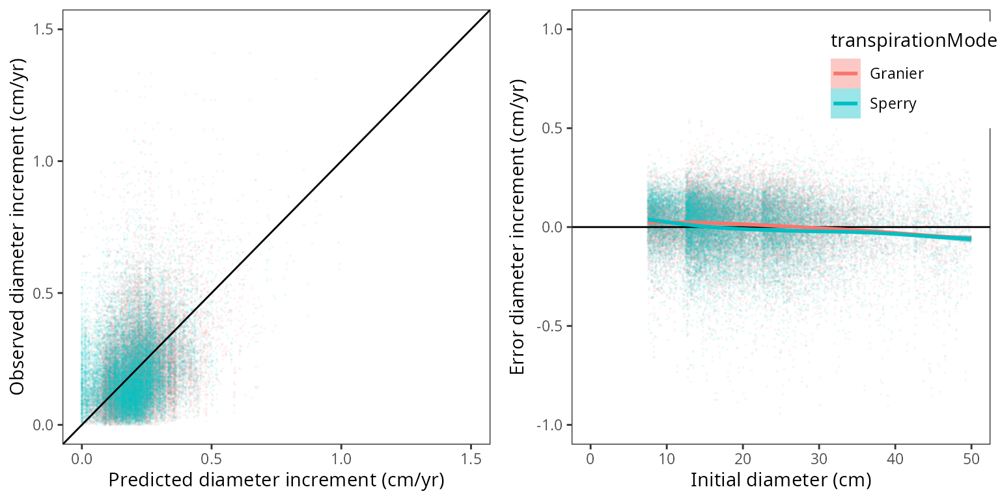

Relationship between diameter increase and climatic variables (MAT,
P/PET and available PAR; IFN2 - IFN4):

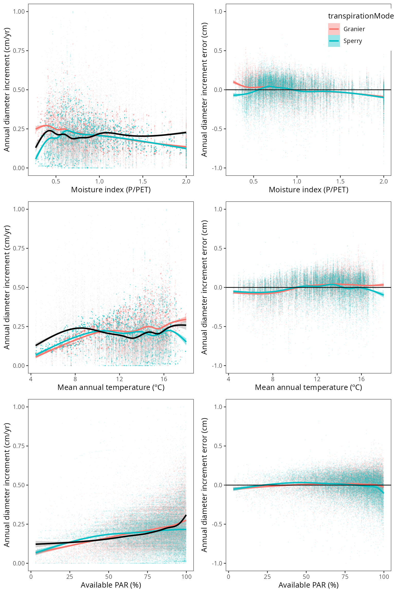

### Annual height increment

Overall predictive capacity to predict height increase (cm/yr):

| version | period | transpirationMode | n | Obs | Pred | Bias | Biasrel | RMSE | RMSErel | R2 |
|:---|:---|:---|---:|---:|---:|---:|---:|---:|---:|---:|
| 2.9.3 | IFN23 | Granier | 25240 | 11.307232 | 11.956505 | 0.6492722 | 5.7420970 | 12.870590 | 113.8262 | 0.0648013 |
| 2.9.3 | IFN23 | Sperry | 25240 | 11.307232 | 11.395532 | 0.0883002 | 0.7809175 | 12.937981 | 114.4222 | 0.0582726 |
| 2.9.3 | IFN34 | Granier | 33593 | 8.225607 | 9.805148 | 1.5795402 | 19.2027182 | 12.297555 | 149.5033 | 0.0382904 |
| 2.9.3 | IFN34 | Sperry | 33593 | 8.225607 | 8.962846 | 0.7372384 | 8.9627226 | 12.173948 | 148.0006 | 0.0383640 |
| 2.9.3 | IFN24 | Granier | 22252 | 9.448645 | 9.782408 | 0.3337628 | 3.5323879 | 9.493789 | 100.4778 | 0.0811256 |
| 2.9.3 | IFN24 | Sperry | 22252 | 9.448645 | 9.083228 | -0.3654166 | -3.8673969 | 9.510176 | 100.6512 | 0.0812991 |

Predictive capacity plots (IFN2-IFN4):

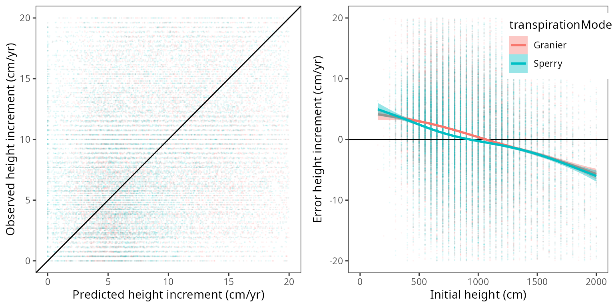

Relationship between height increase and climatic variables (MAT, P/PET
and available PAR; IFN2 - IFN4):

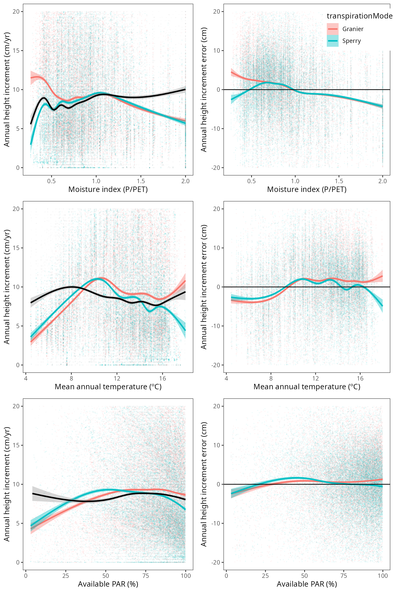

### Stand-level basal area increment

Comparison of basal area increment of surviving trees does not take into
account changes in density. In other words, densities from the first
inventory are used to calculate stand-level basal area of surviving
trees. Hence, the comparison is meant to evaluate the effect of diameter
increment of surviving trees in terms of annual stand basal area
increments (m2/ha/yr) for the period evaluated.

Predictive capacity table:

| version | period | transpirationMode | n | Obs | Pred | Bias | Biasrel | RMSE | RMSErel | R2 |
|:---|:---|:---|---:|---:|---:|---:|---:|---:|---:|---:|
| 2.9.3 | IFN23 | Granier | 1775 | 0.3374811 | 0.3527152 | 0.0152341 | 4.5140597 | 0.1968105 | 58.31751 | 0.4827320 |
| 2.9.3 | IFN23 | Sperry | 1775 | 0.3374811 | 0.3418611 | 0.0043800 | 1.2978476 | 0.2058298 | 60.99003 | 0.4693875 |
| 2.9.3 | IFN34 | Granier | 1774 | 0.3142805 | 0.3883378 | 0.0740573 | 23.5640720 | 0.2110768 | 67.16192 | 0.3651096 |
| 2.9.3 | IFN34 | Sperry | 1774 | 0.3142805 | 0.3660654 | 0.0517849 | 16.4772808 | 0.2305197 | 73.34838 | 0.3543001 |
| 2.9.3 | IFN24 | Granier | 1614 | 0.3033475 | 0.3152380 | 0.0118905 | 3.9197740 | 0.1783411 | 58.79102 | 0.4523729 |
| 2.9.3 | IFN24 | Sperry | 1614 | 0.3033475 | 0.3013088 | -0.0020387 | -0.6720638 | 0.1983854 | 65.39874 | 0.4275482 |

Predictive capacity plots (IFN2 - IFN4):

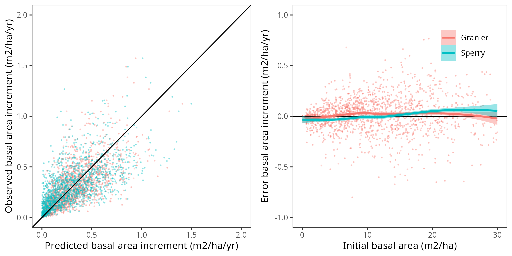

Relationship between basal area increase and climatic variables (MAT and
P/PET; IFN2 - IFN4):

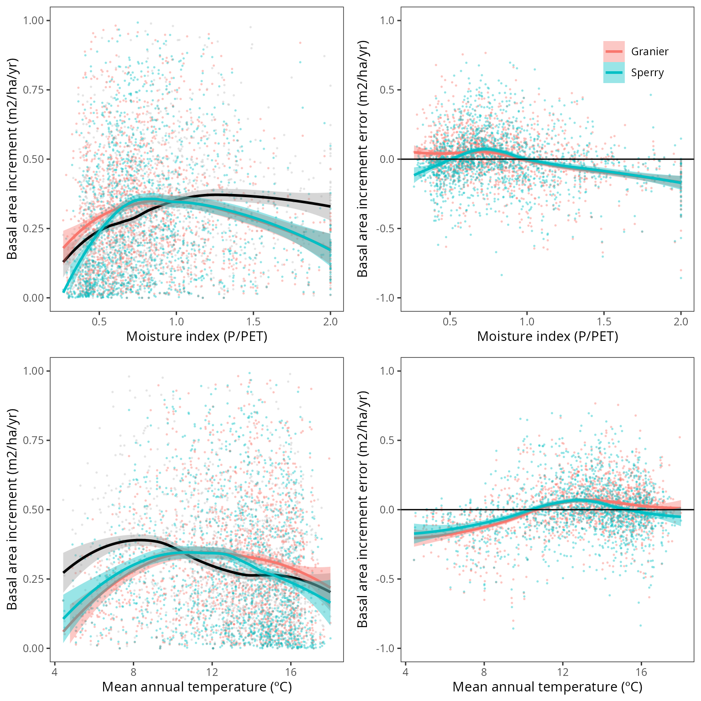

Spatial error distribution (IFN2 - IFN4):

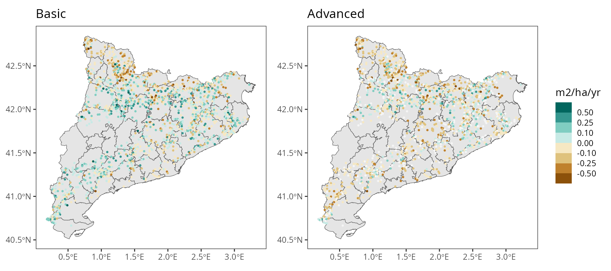

## Mortality

### Basal area reduction

Annual reduction of basal area (m2/ha/yr) due to trees (DBH \>= 7.5)
that died during the evaluation period against model’s mortality
prediction. In both cases, basal area is calculated using the initial
diameter of the trees, so that density reductions are the only
prediction that is actually evaluated (and not the possible growth of
those trees during the simulation).

Overall predictive capacity:

| version | period | transpirationMode | n | Obs | Pred | Bias | Biasrel | RMSE | RMSErel | R2 |
|:---|:---|:---|---:|---:|---:|---:|---:|---:|---:|---:|
| 2.9.3 | IFN23 | Granier | 1775 | 0.0341902 | 0.0388506 | 0.0046604 | 13.630747 | 0.0801998 | 234.5695 | 0.1189968 |
| 2.9.3 | IFN23 | Sperry | 1775 | 0.0341902 | 0.0419123 | 0.0077221 | 22.585671 | 0.0921206 | 269.4358 | 0.0576708 |
| 2.9.3 | IFN34 | Granier | 1774 | 0.0722102 | 0.0667947 | -0.0054155 | -7.499587 | 0.1278666 | 177.0757 | 0.0498639 |
| 2.9.3 | IFN34 | Sperry | 1774 | 0.0722102 | 0.0561260 | -0.0160842 | -22.274097 | 0.1082715 | 149.9393 | 0.1219296 |
| 2.9.3 | IFN24 | Granier | 1614 | 0.0473227 | 0.0478036 | 0.0004809 | 1.016222 | 0.0783685 | 165.6045 | 0.1397359 |
| 2.9.3 | IFN24 | Sperry | 1614 | 0.0473227 | 0.0411657 | -0.0061570 | -13.010688 | 0.0700971 | 148.1257 | 0.2017773 |

Predictive capacity plots (IFN2 - IFN4):

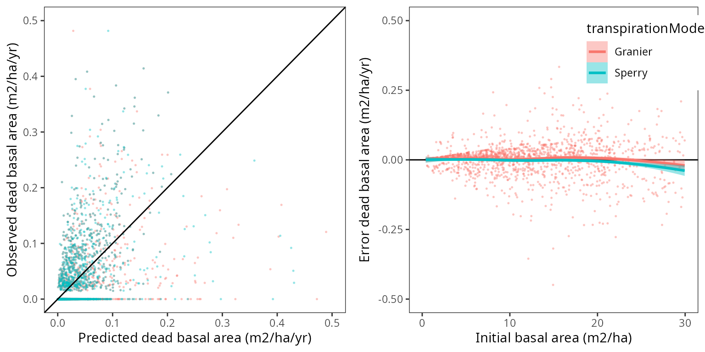

Relationship between dead basal area and climatic variables (MAT and
P/PET; IFN2 - IFN4):

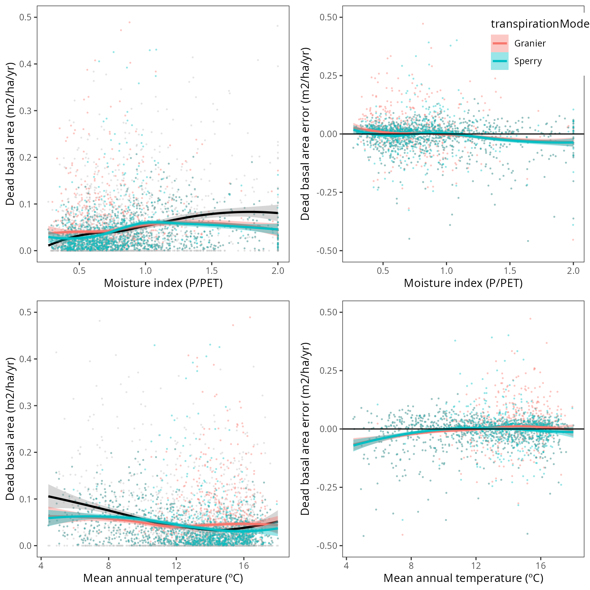

Spatial distribution of errors (IFN2 - IFN4):

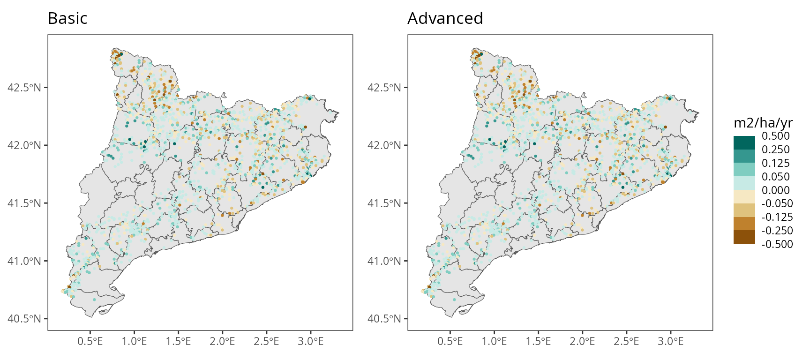

### Density reduction

Annual reduction of density (ind/ha/yr) due to trees (DBH \>= 7.5) that
died during the evaluation period against model’s mortality prediction.
This is very similar to evaluating the reduction in basal area

Overall predictive capacity:

| version | period | transpirationMode | n | Obs | Pred | Bias | Biasrel | RMSE | RMSErel | R2 |
|:---|:---|:---|---:|---:|---:|---:|---:|---:|---:|---:|
| 2.9.3 | IFN23 | Granier | 1775 | 2.054616 | 2.166542 | 0.1119253 | 5.447503 | 6.504228 | 316.5665 | 0.0331148 |
| 2.9.3 | IFN23 | Sperry | 1775 | 2.054616 | 2.247157 | 0.1925404 | 9.371109 | 6.805936 | 331.2509 | 0.0325920 |
| 2.9.3 | IFN34 | Granier | 1774 | 4.354772 | 3.971894 | -0.3828787 | -8.792163 | 9.760872 | 224.1420 | 0.0762814 |
| 2.9.3 | IFN34 | Sperry | 1774 | 4.354772 | 2.706162 | -1.6486106 | -37.857562 | 7.784626 | 178.7608 | 0.1248698 |
| 2.9.3 | IFN24 | Granier | 1614 | 1.636702 | 3.030250 | 1.3935474 | 85.143602 | 5.473520 | 334.4236 | 0.1094426 |
| 2.9.3 | IFN24 | Sperry | 1614 | 1.636702 | 2.128852 | 0.4921496 | 30.069585 | 3.548630 | 216.8158 | 0.1776700 |

## Ingrowth

### Basal area increase

Annual increase of basal area (m2/ha/yr) due to ingrowth of trees with
diameters between 7.5 cm and 12.5 cm during the evaluated period.

Predictive capacity:

| version | period | transpirationMode | n | Obs | Pred | Bias | Biasrel | RMSE | RMSErel | R2 |
|:---|:---|:---|---:|---:|---:|---:|---:|---:|---:|---:|
| 2.9.3 | IFN23 | Granier | 1775 | 0.0960568 | 0.0659898 | -0.0300670 | -31.301254 | 0.1678272 | 174.7166 | 0.0041963 |
| 2.9.3 | IFN23 | Sperry | 1775 | 0.0960568 | 0.0749100 | -0.0211468 | -22.014921 | 0.1712049 | 178.2329 | 0.0019911 |
| 2.9.3 | IFN34 | Granier | 1774 | 0.0754149 | 0.0738258 | -0.0015891 | -2.107102 | 0.1431620 | 189.8326 | 0.0013542 |
| 2.9.3 | IFN34 | Sperry | 1774 | 0.0754149 | 0.0837412 | 0.0083263 | 11.040679 | 0.1472762 | 195.2880 | 0.0037749 |
| 2.9.3 | IFN24 | Granier | 1614 | 0.0850140 | 0.0654634 | -0.0195505 | -22.996862 | 0.1259979 | 148.2084 | 0.0068521 |
| 2.9.3 | IFN24 | Sperry | 1614 | 0.0850140 | 0.0748778 | -0.0101362 | -11.922960 | 0.1272278 | 149.6551 | 0.0094581 |

Predictive capacity plots (IFN2 - IFN4):

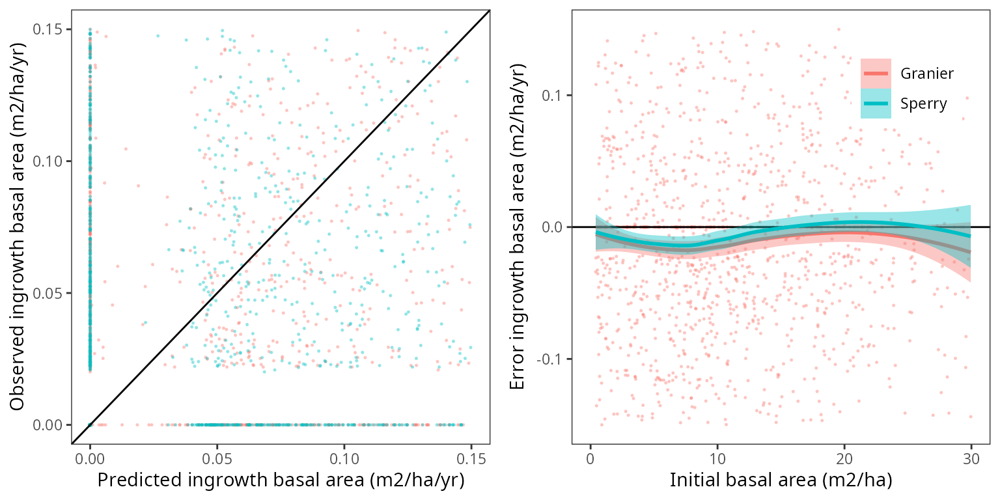

Relationship between ingrowth basal area and climatic variables (MAT and
P/PET; IFN2 - IFN4):

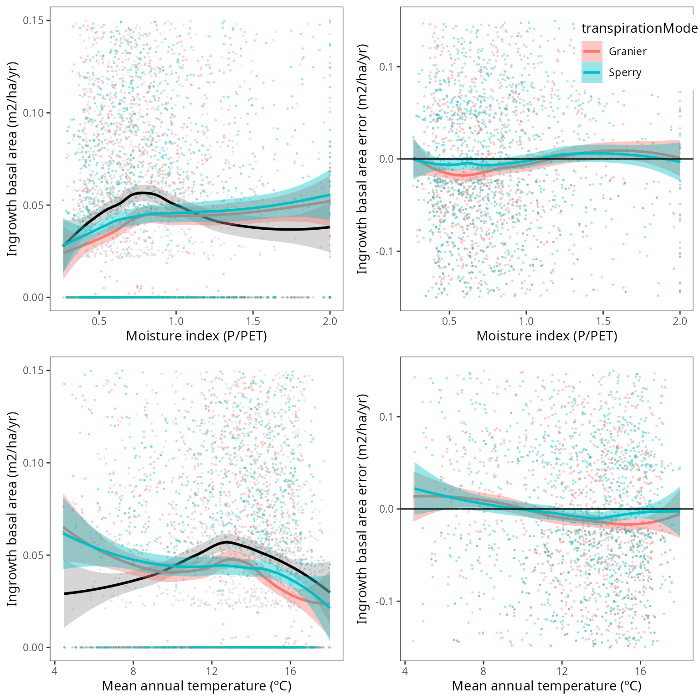

Spatial distribution of errors (IFN2 - IFN4):

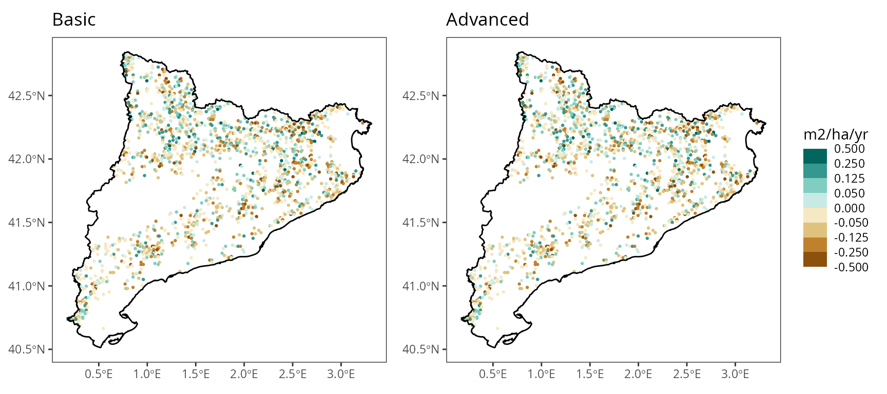

### Density increase

Annual increase of density (ind/ha/yr) due to ingrowth of trees with
diameters between 7.5 cm and 12.5 cm during the evaluated period.

Predictive capacity:

| version | period | transpirationMode | n | Obs | Pred | Bias | Biasrel | RMSE | RMSErel | R2 |
|:---|:---|:---|---:|---:|---:|---:|---:|---:|---:|---:|
| 2.9.3 | IFN23 | Granier | 1775 | 15.16134 | 11.53614 | -3.6252060 | -23.910848 | 26.95886 | 177.8132 | 0.0054853 |
| 2.9.3 | IFN23 | Sperry | 1775 | 15.16134 | 12.76076 | -2.4005872 | -15.833603 | 27.34091 | 180.3330 | 0.0024200 |
| 2.9.3 | IFN34 | Granier | 1774 | 12.06283 | 12.67282 | 0.6099882 | 5.056758 | 23.43540 | 194.2778 | 0.0031139 |
| 2.9.3 | IFN34 | Sperry | 1774 | 12.06283 | 14.26701 | 2.2041809 | 18.272502 | 23.89215 | 198.0642 | 0.0060823 |
| 2.9.3 | IFN24 | Granier | 1614 | 12.31412 | 10.09821 | -2.2159043 | -17.994826 | 18.54517 | 150.6009 | 0.0100449 |
| 2.9.3 | IFN24 | Sperry | 1614 | 12.31412 | 11.33373 | -0.9803904 | -7.961515 | 18.50525 | 150.2767 | 0.0133026 |

## Overall stand-level change

### Basal area changes

This includes annual changes in basal area (m2/ha/yr) due to growth of
surviving trees, mortality reductions and ingrowth derived from sapling
growth. In the observed data, basal area changes include also the
incorporation of trees into large diameter classes that results from the
variable-radius sampling design. Since it takes into account all
processes together, this evaluation is the most rellevant of all.

Overall predictive capacity:

| version | period | transpirationMode | n | Obs | Pred | Bias | Biasrel | RMSE | RMSErel | R2 |
|:---|:---|:---|---:|---:|---:|---:|---:|---:|---:|---:|
| 2.9.3 | IFN23 | Granier | 1775 | 0.3972023 | 0.3784107 | -0.0187915 | -4.730976 | 0.3183793 | 80.15547 | 0.1203408 |
| 2.9.3 | IFN23 | Sperry | 1775 | 0.3972023 | 0.3745223 | -0.0226800 | -5.709925 | 0.3327688 | 83.77818 | 0.1170316 |
| 2.9.3 | IFN34 | Granier | 1774 | 0.3370595 | 0.4030425 | 0.0659829 | 19.576047 | 0.3257997 | 96.65940 | 0.0382718 |
| 2.9.3 | IFN34 | Sperry | 1774 | 0.3370595 | 0.4063208 | 0.0692612 | 20.548657 | 0.3497075 | 103.75243 | 0.0610861 |
| 2.9.3 | IFN24 | Granier | 1614 | 0.3779819 | 0.3485672 | -0.0294147 | -7.782034 | 0.2809288 | 74.32335 | 0.0737416 |
| 2.9.3 | IFN24 | Sperry | 1614 | 0.3779819 | 0.3613474 | -0.0166345 | -4.400868 | 0.3087092 | 81.67301 | 0.0837204 |

Predictive capacity plot (IFN2 - IFN4):

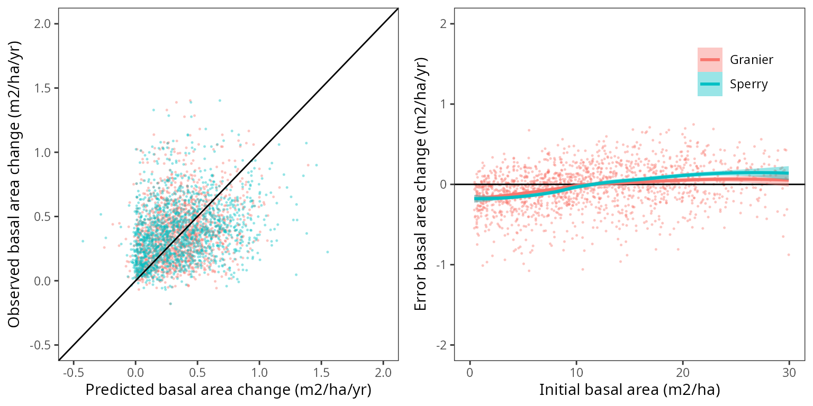

Relationship between overall basal area change and climatic variables
(MAT and P/PET; IFN2 - IFN4):

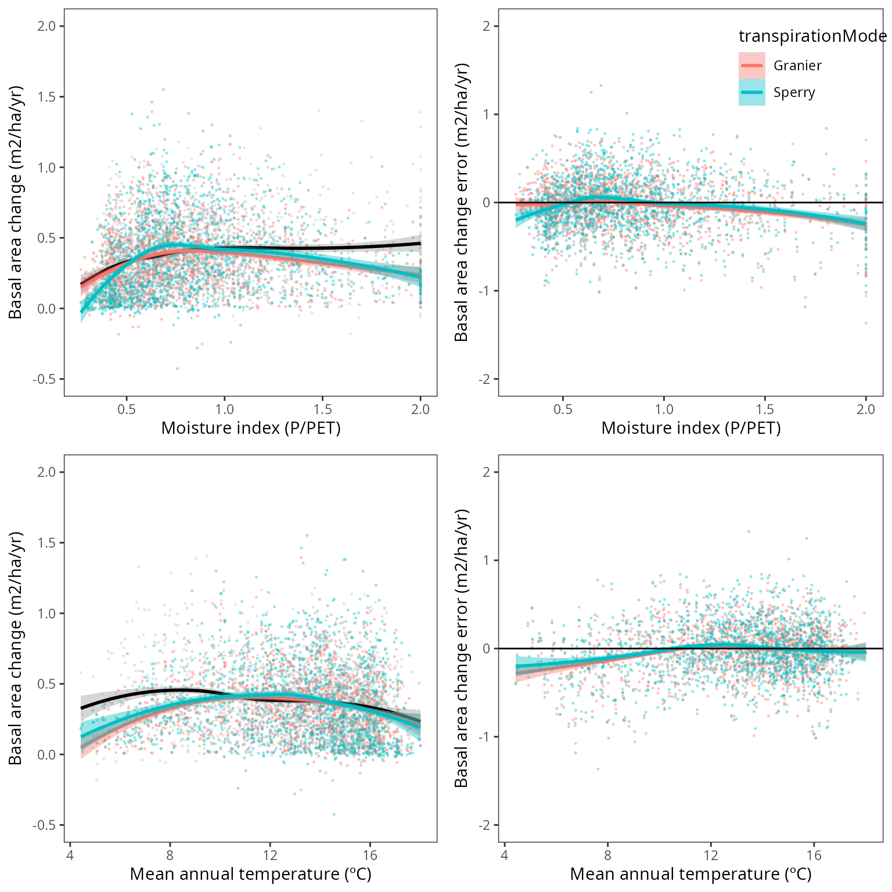

Spatial distribution of errors (IFN2 - IFN4):

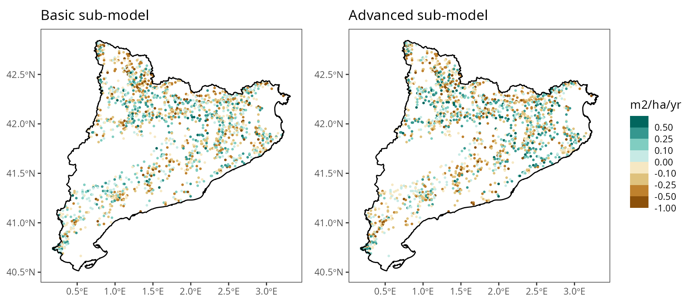

### Density changes

This includes annual changes in density (ind/ha/yr) due to growth of
surviving trees, mortality reductions and ingrowth derived from sapling
growth. In the observed data, changes include also the incorporation of
trees into large diameter classes that results from the variable-radius
sampling design.

Overall predictive capacity:

| version | period | transpirationMode | n | Obs | Pred | Bias | Biasrel | RMSE | RMSErel | R2 |
|:---|:---|:---|---:|---:|---:|---:|---:|---:|---:|---:|
| 2.9.3 | IFN23 | Granier | 1775 | 13.357940 | 9.419832 | -3.9381083 | -29.481403 | 29.29232 | 219.2877 | 0.0040231 |
| 2.9.3 | IFN23 | Sperry | 1775 | 13.357940 | 10.553016 | -2.8049243 | -20.998179 | 29.54857 | 221.2060 | 0.0022281 |
| 2.9.3 | IFN34 | Granier | 1774 | 8.605954 | 8.764622 | 0.1586673 | 1.843692 | 26.71431 | 310.4166 | 0.0065902 |
| 2.9.3 | IFN34 | Sperry | 1774 | 8.605954 | 11.664005 | 3.0580501 | 35.534118 | 26.78752 | 311.2672 | 0.0031044 |
| 2.9.3 | IFN24 | Granier | 1614 | 10.933822 | 7.841235 | -3.0925866 | -28.284591 | 21.10788 | 193.0512 | 0.0148830 |
| 2.9.3 | IFN24 | Sperry | 1614 | 10.933822 | 10.241405 | -0.6924164 | -6.332794 | 20.96644 | 191.7577 | 0.0078613 |

### Changes in leaf area index of trees \> 7.5 cm

Overall predictive capacity using allometric equations:

| version | period | transpirationMode | n | Obs | Pred | Bias | Biasrel | RMSE | RMSErel | R2 |
|:---|:---|:---|---:|---:|---:|---:|---:|---:|---:|---:|
| 2.9.3 | IFN23 | Granier | 1775 | 0.4094972 | 0.3476796 | -0.0618176 | -15.095974 | 0.5041143 | 123.1057 | 0.0485990 |
| 2.9.3 | IFN23 | Sperry | 1775 | 0.2929417 | 0.2965507 | 0.0036090 | 1.232001 | 0.4698143 | 160.3781 | 0.0309913 |
| 2.9.3 | IFN34 | Granier | 1774 | 0.3704697 | 0.3904914 | 0.0200217 | 5.404421 | 0.5263839 | 142.0856 | 0.0448822 |
| 2.9.3 | IFN34 | Sperry | 1774 | 0.2826026 | 0.3350054 | 0.0524027 | 18.542904 | 0.4377824 | 154.9109 | 0.0816851 |
| 2.9.3 | IFN24 | Granier | 1614 | 0.5878670 | 0.5195740 | -0.0682929 | -11.617070 | 0.6869863 | 116.8608 | 0.0876206 |
| 2.9.3 | IFN24 | Sperry | 1614 | 0.5878670 | 0.5808761 | -0.0069909 | -1.189190 | 0.7208363 | 122.6189 | 0.0741648 |

Overall predictive capacity using state variables:

| version | period | transpirationMode | n | Obs | Pred | Bias | Biasrel | RMSE | RMSErel | R2 |
|:---|:---|:---|---:|---:|---:|---:|---:|---:|---:|---:|
| 2.9.3 | IFN23 | Granier | 1775 | 0.4094972 | 0.6016320 | 0.1921348 | 46.91969 | 0.7593180 | 185.4269 | 0.0504373 |
| 2.9.3 | IFN23 | Sperry | 1775 | 0.2929417 | 0.8167653 | 0.5238236 | 178.81499 | 0.9894157 | 337.7518 | 0.0127528 |
| 2.9.3 | IFN34 | Granier | 1774 | 0.3704697 | 0.7432415 | 0.3727719 | 100.62142 | 0.8835952 | 238.5067 | 0.0511186 |
| 2.9.3 | IFN34 | Sperry | 1774 | 0.2826026 | 1.1535709 | 0.8709683 | 308.19538 | 1.4045492 | 497.0050 | 0.0237107 |
| 2.9.3 | IFN24 | Granier | 1614 | 0.5878670 | 1.4556562 | 0.8677893 | 147.61661 | 1.5026004 | 255.6021 | 0.0242077 |
| 2.9.3 | IFN24 | Sperry | 1614 | 0.5878670 | 1.5936815 | 1.0058146 | 171.09561 | 1.8801653 | 319.8284 | 0.0202884 |

## Shrub cover and mean height

### Shrub percent cover changes

Overall predictive capacity:

| version | period | transpirationMode | n | Obs | Pred | Bias | Biasrel | RMSE | RMSErel | R2 |
|:---|:---|:---|---:|---:|---:|---:|---:|---:|---:|---:|
| 2.9.3 | IFN23 | Granier | 1775 | 22.37465 | 19.75818 | -2.616467 | -11.693892 | 44.13387 | 197.2494 | 0.0281254 |
| 2.9.3 | IFN23 | Sperry | 1775 | 22.37465 | 19.25347 | -3.121176 | -13.949612 | 43.82758 | 195.8805 | 0.0059419 |
| 2.9.3 | IFN34 | Granier | 1774 | 22.18602 | 11.87560 | -10.310421 | -46.472603 | 54.41405 | 245.2628 | 0.0509630 |
| 2.9.3 | IFN34 | Sperry | 1774 | 22.18602 | 20.55513 | -1.630895 | -7.351001 | 53.76405 | 242.3330 | 0.0236755 |
| 2.9.3 | IFN24 | Granier | 1614 | 44.61958 | 25.26783 | -19.351747 | -43.370529 | 63.35317 | 141.9851 | 0.0065983 |
| 2.9.3 | IFN24 | Sperry | 1614 | 44.61958 | 27.61571 | -17.003868 | -38.108536 | 64.55488 | 144.6784 | 0.0008235 |

### Shrub mean height changes

Overall predictive capacity:

| version | period | transpirationMode | n | Obs | Pred | Bias | Biasrel | RMSE | RMSErel | R2 |
|:---|:---|:---|---:|---:|---:|---:|---:|---:|---:|---:|
| 2.9.3 | IFN23 | Granier | 1572 | 6.285700 | 43.62822 | 37.518120 | 596.88053 | 84.74814 | 1348.2689 | 0.0127112 |
| 2.9.3 | IFN23 | Sperry | 1560 | 5.810655 | 41.73444 | 36.015967 | 619.82630 | 89.44012 | 1539.2434 | 0.0061212 |
| 2.9.3 | IFN34 | Granier | 1714 | 32.096347 | 42.78995 | 10.815421 | 33.69674 | 81.03306 | 252.4682 | 0.0216451 |
| 2.9.3 | IFN34 | Sperry | 1714 | 32.050402 | 39.14764 | 7.140503 | 22.27898 | 87.99448 | 274.5503 | 0.0015234 |
| 2.9.3 | IFN24 | Granier | 1401 | 34.074337 | 74.52546 | 40.524916 | 118.93090 | 114.60069 | 336.3255 | 0.0286464 |
| 2.9.3 | IFN24 | Sperry | 1341 | 33.288672 | 75.66733 | 42.656877 | 128.14232 | 139.71147 | 419.6967 | 0.0007556 |

## Detailed evaluation by tree species

In the following we provide detailed evaluation results for the most
important species.

### Abies alba

#### Annual diameter increment

Prediction ability for **diameter increase** (cm/yr) of surviving trees:

| version | period | transpirationMode | n | Obs | Pred | Bias | Biasrel | RMSE | RMSErel | R2 |
|:---|:---|:---|---:|---:|---:|---:|---:|---:|---:|---:|
| 2.9.3 | IFN23 | Granier | 581 | 0.3248858 | 0.1757081 | -0.1491777 | -45.91695 | 0.2990908 | 92.06027 | 0.1832686 |
| 2.9.3 | IFN23 | Sperry | 581 | 0.3248858 | 0.1731136 | -0.1517722 | -46.71555 | 0.3032952 | 93.35439 | 0.1565168 |
| 2.9.3 | IFN34 | Granier | 733 | 0.3071834 | 0.1711968 | -0.1359865 | -44.26885 | 0.2688735 | 87.52867 | 0.1560679 |
| 2.9.3 | IFN34 | Sperry | 733 | 0.3071834 | 0.1589369 | -0.1482465 | -48.25994 | 0.2798596 | 91.10507 | 0.0988316 |
| 2.9.3 | IFN24 | Granier | 554 | 0.3204793 | 0.1660305 | -0.1544488 | -48.19306 | 0.2611898 | 81.49975 | 0.2643651 |
| 2.9.3 | IFN24 | Sperry | 554 | 0.3204793 | 0.1640309 | -0.1564483 | -48.81699 | 0.2659607 | 82.98843 | 0.2023990 |

#### Annual height increment

Prediction ability for **height increase** (cm/yr) of surviving trees:

| version | period | transpirationMode | n | Obs | Pred | Bias | Biasrel | RMSE | RMSErel | R2 |
|:---|:---|:---|---:|---:|---:|---:|---:|---:|---:|---:|
| 2.9.3 | IFN23 | Granier | 581 | 16.29681 | 6.442982 | -9.853824 | -60.46476 | 23.65973 | 145.1802 | 0.1394643 |
| 2.9.3 | IFN23 | Sperry | 581 | 16.29681 | 6.404699 | -9.892107 | -60.69967 | 23.81142 | 146.1110 | 0.1112480 |
| 2.9.3 | IFN34 | Granier | 733 | 13.82449 | 6.212174 | -7.612316 | -55.06399 | 20.92261 | 151.3445 | 0.1197799 |
| 2.9.3 | IFN34 | Sperry | 733 | 13.82449 | 5.921157 | -7.903334 | -57.16908 | 21.25651 | 153.7598 | 0.0800358 |
| 2.9.3 | IFN24 | Granier | 554 | 14.71605 | 6.065490 | -8.650559 | -58.78316 | 17.72375 | 120.4382 | 0.2402032 |
| 2.9.3 | IFN24 | Sperry | 554 | 14.71605 | 6.102032 | -8.614016 | -58.53484 | 17.87170 | 121.4436 | 0.1759728 |

#### Growth basal area increment

Prediction ability for **basal area increase due to growth** (m2/ha/yr)
of surviving trees:

| version | period | transpirationMode | n | Obs | Pred | Bias | Biasrel | RMSE | RMSErel | R2 |
|:---|:---|:---|---:|---:|---:|---:|---:|---:|---:|---:|
| 2.9.3 | IFN23 | Granier | 41 | 0.3337317 | 0.1687285 | -0.1650032 | -49.44187 | 0.2406100 | 72.09682 | 0.5174678 |
| 2.9.3 | IFN23 | Sperry | 41 | 0.3337317 | 0.1669853 | -0.1667464 | -49.96420 | 0.2402116 | 71.97746 | 0.5463756 |
| 2.9.3 | IFN34 | Granier | 47 | 0.3566043 | 0.1863233 | -0.1702810 | -47.75070 | 0.2474370 | 69.38698 | 0.5611664 |
| 2.9.3 | IFN34 | Sperry | 47 | 0.3566043 | 0.1761593 | -0.1804450 | -50.60090 | 0.2620951 | 73.49746 | 0.4827352 |
| 2.9.3 | IFN24 | Granier | 41 | 0.3439408 | 0.1575496 | -0.1863911 | -54.19280 | 0.2519176 | 73.24446 | 0.5630300 |
| 2.9.3 | IFN24 | Sperry | 41 | 0.3439408 | 0.1581637 | -0.1857770 | -54.01426 | 0.2517635 | 73.19967 | 0.5207087 |

#### Mortality

Prediction ability for **basal area decrease due to mortality**
(m2/ha/yr):

| version | period | transpirationMode | n | Obs | Pred | Bias | Biasrel | RMSE | RMSErel | R2 |
|:---|:---|:---|---:|---:|---:|---:|---:|---:|---:|---:|
| 2.9.3 | IFN23 | Granier | 41 | 0.0625212 | 0.0137979 | -0.0487233 | -77.93083 | 0.1223226 | 195.6497 | 0.5949484 |
| 2.9.3 | IFN23 | Sperry | 41 | 0.0625212 | 0.0086079 | -0.0539133 | -86.23202 | 0.1392203 | 222.6769 | 0.1918869 |
| 2.9.3 | IFN34 | Granier | 47 | 0.0795714 | 0.0498879 | -0.0296834 | -37.30416 | 0.3016182 | 379.0536 | 0.0000323 |
| 2.9.3 | IFN34 | Sperry | 47 | 0.0795714 | 0.0094474 | -0.0701239 | -88.12710 | 0.1538457 | 193.3430 | 0.1555239 |
| 2.9.3 | IFN24 | Granier | 41 | 0.0678598 | 0.0373322 | -0.0305276 | -44.98623 | 0.1789016 | 263.6341 | 0.0747160 |
| 2.9.3 | IFN24 | Sperry | 41 | 0.0678598 | 0.0105811 | -0.0572787 | -84.40743 | 0.1229091 | 181.1221 | 0.0263679 |

Prediction ability for **density decrease due to mortality**
(ind/ha/yr):

| version | period | transpirationMode | n | Obs | Pred | Bias | Biasrel | RMSE | RMSErel | R2 |
|:---|:---|:---|---:|---:|---:|---:|---:|---:|---:|---:|
| 2.9.3 | IFN23 | Granier | 41 | 1.2737704 | 0.4306707 | -0.8430997 | -66.18930 | 3.153570 | 247.5776 | 0.9176891 |
| 2.9.3 | IFN23 | Sperry | 41 | 1.2737704 | 0.1311441 | -1.1426263 | -89.70426 | 4.624829 | 363.0819 | 0.1253308 |
| 2.9.3 | IFN34 | Granier | 47 | 1.2960226 | 0.7972839 | -0.4987386 | -38.48225 | 5.391271 | 415.9859 | 0.0000140 |
| 2.9.3 | IFN34 | Sperry | 47 | 1.2960226 | 0.1678800 | -1.1281425 | -87.04652 | 4.373717 | 337.4723 | 0.1556176 |
| 2.9.3 | IFN24 | Granier | 41 | 0.2579368 | 0.6663175 | 0.4083807 | 158.32590 | 2.266855 | 878.8414 | 0.0250615 |
| 2.9.3 | IFN24 | Sperry | 41 | 0.2579368 | 0.3369402 | 0.0790035 | 30.62900 | 1.484051 | 575.3546 | 0.0033053 |

#### Ingrowth

Prediction ability for **basal area increase due to ingrowth**
(m2/ha/yr):

| version | period | transpirationMode | n | Obs | Pred | Bias | Biasrel | RMSE | RMSErel | R2 |
|:---|:---|:---|---:|---:|---:|---:|---:|---:|---:|---:|
| 2.9.3 | IFN23 | Granier | 41 | 0.0535332 | 0.0136456 | -0.0398876 | -74.509998 | 0.1185935 | 221.5326 | 0.0201069 |
| 2.9.3 | IFN23 | Sperry | 41 | 0.0535332 | 0.0401618 | -0.0133714 | -24.977736 | 0.1335188 | 249.4131 | 0.0314971 |
| 2.9.3 | IFN34 | Granier | 47 | 0.0280916 | 0.0238658 | -0.0042258 | -15.042922 | 0.0912374 | 324.7857 | 0.0229693 |
| 2.9.3 | IFN34 | Sperry | 47 | 0.0280916 | 0.0296891 | 0.0015975 | 5.686811 | 0.0775698 | 276.1319 | 0.0315755 |
| 2.9.3 | IFN24 | Granier | 41 | 0.0350303 | 0.0438875 | 0.0088572 | 25.284551 | 0.0778693 | 222.2914 | 0.1460852 |
| 2.9.3 | IFN24 | Sperry | 41 | 0.0350303 | 0.0342116 | -0.0008186 | -2.336952 | 0.0833706 | 237.9957 | 0.0357364 |

Prediction ability for **density increase due to ingrowth** (ind/ha/yr):

| version | period | transpirationMode | n | Obs | Pred | Bias | Biasrel | RMSE | RMSErel | R2 |
|:---|:---|:---|---:|---:|---:|---:|---:|---:|---:|---:|
| 2.9.3 | IFN23 | Granier | 41 | 8.141885 | 2.505699 | -5.6361866 | -69.2245894 | 19.25209 | 236.4573 | 0.0205559 |
| 2.9.3 | IFN23 | Sperry | 41 | 8.141885 | 6.600731 | -1.5411538 | -18.9287101 | 21.57432 | 264.9794 | 0.0263007 |
| 2.9.3 | IFN34 | Granier | 47 | 4.181244 | 4.201945 | 0.0207011 | 0.4950939 | 14.56676 | 348.3835 | 0.0235852 |
| 2.9.3 | IFN34 | Sperry | 47 | 4.181244 | 5.063148 | 0.8819047 | 21.0919215 | 11.91431 | 284.9467 | 0.0441502 |
| 2.9.3 | IFN24 | Granier | 41 | 4.512880 | 6.729557 | 2.2166766 | 49.1188891 | 10.96519 | 242.9755 | 0.1357344 |
| 2.9.3 | IFN24 | Sperry | 41 | 4.512880 | 5.008066 | 0.4951856 | 10.9727190 | 11.81659 | 261.8413 | 0.0185379 |

#### Overall basal area changes

Prediction ability for **overall basal area changes** (including growth,
mortality and ingrowth):

| version | period | transpirationMode | n | Obs | Pred | Bias | Biasrel | RMSE | RMSErel | R2 |
|:---|:---|:---|---:|---:|---:|---:|---:|---:|---:|---:|
| 2.9.3 | IFN23 | Granier | 41 | 0.2839633 | 0.1745975 | -0.1093658 | -38.51407 | 0.2942799 | 103.63307 | 0.2323714 |
| 2.9.3 | IFN23 | Sperry | 41 | 0.2839633 | 0.2043301 | -0.0796332 | -28.04347 | 0.2830959 | 99.69452 | 0.2400354 |
| 2.9.3 | IFN34 | Granier | 47 | 0.3158355 | 0.1671022 | -0.1487334 | -47.09203 | 0.4687509 | 148.41614 | 0.0124649 |
| 2.9.3 | IFN34 | Sperry | 47 | 0.3158355 | 0.2046929 | -0.1111426 | -35.19003 | 0.3424142 | 108.41537 | 0.1132763 |
| 2.9.3 | IFN24 | Granier | 41 | 0.3449944 | 0.1778356 | -0.1671587 | -48.45260 | 0.3404229 | 98.67490 | 0.0861575 |
| 2.9.3 | IFN24 | Sperry | 41 | 0.3449944 | 0.2023436 | -0.1426507 | -41.34872 | 0.2930576 | 84.94563 | 0.1085571 |

Predictive capacity plots (IFN2-IFN4):

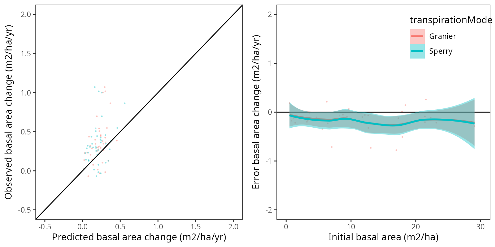

Relationship between **basal area changes** and climatic variables (MAT
and P/PET; IFN2-IFN4):
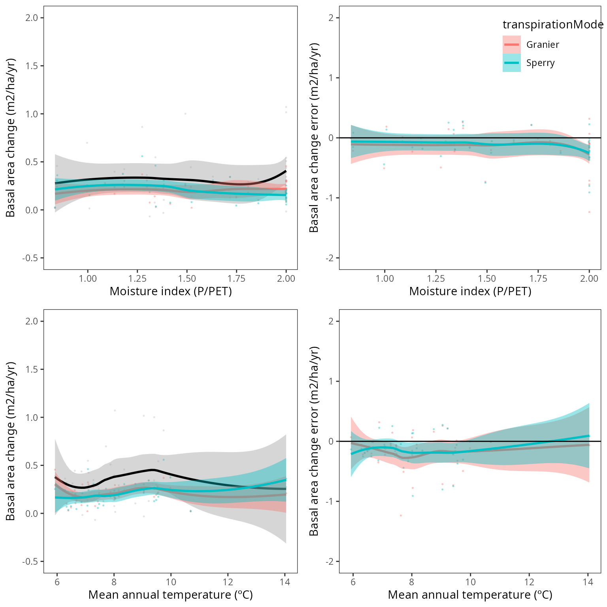

Spatial distribution of errors (IFN2-IFN4):
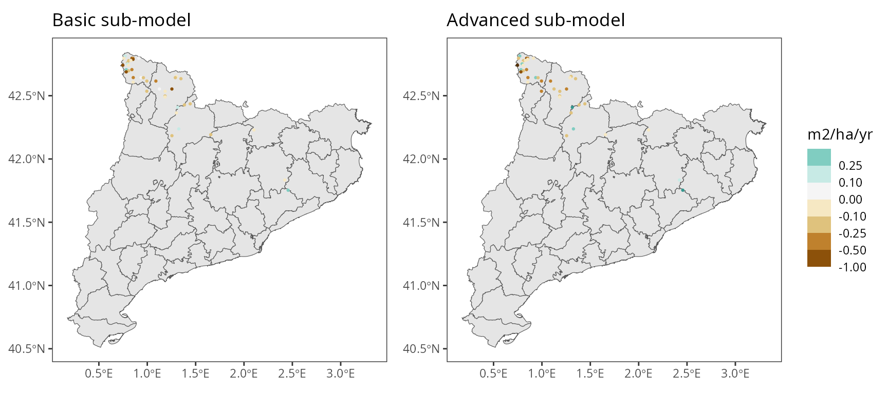

Prediction ability for **overall density changes** (including growth,
mortality and ingrowth):

| version | period | transpirationMode | n | Obs | Pred | Bias | Biasrel | RMSE | RMSErel | R2 |
|:---|:---|:---|---:|---:|---:|---:|---:|---:|---:|---:|
| 2.9.3 | IFN23 | Granier | 41 | 7.907260 | 2.075028 | -5.8322324 | -73.757942 | 20.37133 | 257.6281 | 0.0046192 |
| 2.9.3 | IFN23 | Sperry | 41 | 7.907260 | 6.469587 | -1.4376730 | -18.181684 | 22.05840 | 278.9638 | 0.0051263 |
| 2.9.3 | IFN34 | Granier | 47 | 3.873059 | 3.404661 | -0.4683978 | -12.093743 | 13.50186 | 348.6098 | 0.0011254 |
| 2.9.3 | IFN34 | Sperry | 47 | 3.873059 | 4.895269 | 1.0222097 | 26.392828 | 12.11612 | 312.8308 | 0.0155789 |
| 2.9.3 | IFN24 | Granier | 41 | 6.167707 | 6.321242 | 0.1535353 | 2.489341 | 11.23445 | 182.1496 | 0.1374349 |
| 2.9.3 | IFN24 | Sperry | 41 | 6.167707 | 5.325178 | -0.8425292 | -13.660332 | 12.47478 | 202.2595 | 0.0142452 |

### Fagus sylvatica

#### Annual diameter increment

Prediction ability for **diameter increase** (cm/yr) of surviving trees:

| version | period | transpirationMode | n | Obs | Pred | Bias | Biasrel | RMSE | RMSErel | R2 |
|:---|:---|:---|---:|---:|---:|---:|---:|---:|---:|---:|
| 2.9.3 | IFN23 | Granier | 878 | 0.2623334 | 0.2073334 | -0.0550000 | -20.96571 | 0.2090688 | 79.69585 | 0.1336271 |
| 2.9.3 | IFN23 | Sperry | 878 | 0.2623334 | 0.2112657 | -0.0510677 | -19.46672 | 0.2145563 | 81.78762 | 0.0755360 |
| 2.9.3 | IFN34 | Granier | 1148 | 0.2237397 | 0.1995035 | -0.0242361 | -10.83230 | 0.1693463 | 75.68899 | 0.0996930 |
| 2.9.3 | IFN34 | Sperry | 1148 | 0.2237397 | 0.1976363 | -0.0261033 | -11.66684 | 0.1781869 | 79.64027 | 0.0380644 |
| 2.9.3 | IFN24 | Granier | 842 | 0.2499840 | 0.2032646 | -0.0467194 | -18.68896 | 0.1741470 | 69.66325 | 0.1524445 |
| 2.9.3 | IFN24 | Sperry | 842 | 0.2499840 | 0.1993547 | -0.0506293 | -20.25303 | 0.1883202 | 75.33287 | 0.0495041 |

#### Annual height increment

Prediction ability for **height increase** (cm/yr) of surviving trees:

| version | period | transpirationMode | n | Obs | Pred | Bias | Biasrel | RMSE | RMSErel | R2 |
|:---|:---|:---|---:|---:|---:|---:|---:|---:|---:|---:|
| 2.9.3 | IFN23 | Granier | 878 | 16.94559 | 9.136901 | -7.808689 | -46.08095 | 18.07897 | 106.68834 | 0.0440046 |
| 2.9.3 | IFN23 | Sperry | 878 | 16.94559 | 9.558608 | -7.386983 | -43.59236 | 18.00341 | 106.24247 | 0.0381348 |
| 2.9.3 | IFN34 | Granier | 1148 | 13.05423 | 8.405259 | -4.648968 | -35.61274 | 17.81713 | 136.48551 | 0.0046308 |
| 2.9.3 | IFN34 | Sperry | 1148 | 13.05423 | 8.641139 | -4.413087 | -33.80581 | 18.11142 | 138.73990 | 0.0000127 |
| 2.9.3 | IFN24 | Granier | 842 | 14.97444 | 8.671560 | -6.302881 | -42.09093 | 14.47779 | 96.68335 | 0.0317603 |
| 2.9.3 | IFN24 | Sperry | 842 | 14.97444 | 8.798918 | -6.175523 | -41.24043 | 14.75573 | 98.53945 | 0.0156628 |

#### Growth basal area increment

Prediction ability for **basal area increase due to growth** (m2/ha/yr)
of surviving trees:

| version | period | transpirationMode | n | Obs | Pred | Bias | Biasrel | RMSE | RMSErel | R2 |
|:---|:---|:---|---:|---:|---:|---:|---:|---:|---:|---:|
| 2.9.3 | IFN23 | Granier | 93 | 0.2141684 | 0.1735453 | -0.0406231 | -18.967814 | 0.1421099 | 66.35426 | 0.6168019 |
| 2.9.3 | IFN23 | Sperry | 93 | 0.2141684 | 0.1864878 | -0.0276806 | -12.924694 | 0.1496995 | 69.89804 | 0.5946819 |
| 2.9.3 | IFN34 | Granier | 99 | 0.2098880 | 0.1883435 | -0.0215444 | -10.264738 | 0.1246596 | 59.39340 | 0.6403028 |
| 2.9.3 | IFN34 | Sperry | 99 | 0.2098880 | 0.1972817 | -0.0126063 | -6.006195 | 0.1408179 | 67.09196 | 0.6141650 |
| 2.9.3 | IFN24 | Granier | 93 | 0.2117429 | 0.1732333 | -0.0385095 | -18.186938 | 0.1365205 | 64.47466 | 0.6194588 |
| 2.9.3 | IFN24 | Sperry | 93 | 0.2117429 | 0.1813430 | -0.0303998 | -14.356963 | 0.1537594 | 72.61609 | 0.5754245 |

#### Mortality

Prediction ability for **basal area decrease due to mortality**
(m2/ha/yr):

| version | period | transpirationMode | n | Obs | Pred | Bias | Biasrel | RMSE | RMSErel | R2 |
|:---|:---|:---|---:|---:|---:|---:|---:|---:|---:|---:|
| 2.9.3 | IFN23 | Granier | 93 | 0.0128669 | 0.0162426 | 0.0033756 | 26.235108 | 0.0488393 | 379.5729 | 0.0001213 |
| 2.9.3 | IFN23 | Sperry | 93 | 0.0128669 | 0.0137818 | 0.0009149 | 7.110223 | 0.0436716 | 339.4102 | 0.0059575 |
| 2.9.3 | IFN34 | Granier | 99 | 0.0251491 | 0.0234591 | -0.0016900 | -6.719896 | 0.0557730 | 221.7699 | 0.2789124 |
| 2.9.3 | IFN34 | Sperry | 99 | 0.0251491 | 0.0176272 | -0.0075218 | -29.909052 | 0.0509225 | 202.4826 | 0.1836860 |
| 2.9.3 | IFN24 | Granier | 93 | 0.0181819 | 0.0199993 | 0.0018174 | 9.995436 | 0.0369747 | 203.3600 | 0.1968418 |
| 2.9.3 | IFN24 | Sperry | 93 | 0.0181819 | 0.0145835 | -0.0035984 | -19.791089 | 0.0375810 | 206.6945 | 0.0681115 |

Prediction ability for **density decrease due to mortality**
(ind/ha/yr):

| version | period | transpirationMode | n | Obs | Pred | Bias | Biasrel | RMSE | RMSErel | R2 |
|:---|:---|:---|---:|---:|---:|---:|---:|---:|---:|---:|
| 2.9.3 | IFN23 | Granier | 93 | 0.5030180 | 0.7851911 | 0.2821732 | 56.096041 | 2.929598 | 582.4042 | 0.0059283 |
| 2.9.3 | IFN23 | Sperry | 93 | 0.5030180 | 0.5532235 | 0.0502055 | 9.980858 | 1.781220 | 354.1066 | 0.1059830 |
| 2.9.3 | IFN34 | Granier | 99 | 1.4949666 | 1.3456507 | -0.1493158 | -9.987904 | 5.561581 | 372.0204 | 0.3860488 |
| 2.9.3 | IFN34 | Sperry | 99 | 1.4949666 | 0.6300918 | -0.8648748 | -57.852448 | 3.818657 | 255.4343 | 0.3561007 |
| 2.9.3 | IFN24 | Granier | 93 | 0.6638779 | 1.3932259 | 0.7293479 | 109.861758 | 2.856867 | 430.3301 | 0.4521545 |
| 2.9.3 | IFN24 | Sperry | 93 | 0.6638779 | 0.5848368 | -0.0790411 | -11.905969 | 1.697174 | 255.6455 | 0.2831643 |

#### Ingrowth

Prediction ability for **basal area increase due to ingrowth**
(m2/ha/yr):

| version | period | transpirationMode | n | Obs | Pred | Bias | Biasrel | RMSE | RMSErel | R2 |
|:---|:---|:---|---:|---:|---:|---:|---:|---:|---:|---:|
| 2.9.3 | IFN23 | Granier | 93 | 0.0334581 | 0.0384183 | 0.0049602 | 14.82521 | 0.1143012 | 341.6254 | 0.0005832 |
| 2.9.3 | IFN23 | Sperry | 93 | 0.0334581 | 0.0154226 | -0.0180355 | -53.90480 | 0.1041600 | 311.3152 | 0.0104887 |
| 2.9.3 | IFN34 | Granier | 99 | 0.0235301 | 0.0323900 | 0.0088599 | 37.65341 | 0.0794750 | 337.7587 | 0.0034803 |
| 2.9.3 | IFN34 | Sperry | 99 | 0.0235301 | 0.0368692 | 0.0133391 | 56.68955 | 0.0879608 | 373.8223 | 0.0009118 |
| 2.9.3 | IFN24 | Granier | 93 | 0.0292275 | 0.0369485 | 0.0077210 | 26.41682 | 0.0799973 | 273.7053 | 0.0166448 |
| 2.9.3 | IFN24 | Sperry | 93 | 0.0292275 | 0.0370566 | 0.0078291 | 26.78656 | 0.0734826 | 251.4154 | 0.0164801 |

Prediction ability for **density increase due to ingrowth** (ind/ha/yr):

| version | period | transpirationMode | n | Obs | Pred | Bias | Biasrel | RMSE | RMSErel | R2 |
|:---|:---|:---|---:|---:|---:|---:|---:|---:|---:|---:|
| 2.9.3 | IFN23 | Granier | 93 | 5.418058 | 7.206323 | 1.788266 | 33.00566 | 18.92406 | 349.2776 | 0.0012745 |
| 2.9.3 | IFN23 | Sperry | 93 | 5.418058 | 2.877612 | -2.540446 | -46.88850 | 16.47746 | 304.1211 | 0.0116106 |
| 2.9.3 | IFN34 | Granier | 99 | 4.052478 | 6.421286 | 2.368809 | 58.45334 | 14.73418 | 363.5844 | 0.0035200 |
| 2.9.3 | IFN34 | Sperry | 99 | 4.052478 | 6.552309 | 2.499831 | 61.68650 | 15.49839 | 382.4423 | 0.0033742 |
| 2.9.3 | IFN24 | Granier | 93 | 4.451677 | 6.070922 | 1.619245 | 36.37382 | 12.47007 | 280.1207 | 0.0120335 |
| 2.9.3 | IFN24 | Sperry | 93 | 4.451677 | 5.714846 | 1.263169 | 28.37512 | 11.06609 | 248.5826 | 0.0056297 |

#### Overall basal area changes

Prediction ability for **overall basal area changes** (including growth,
mortality and ingrowth):

| version | period | transpirationMode | n | Obs | Pred | Bias | Biasrel | RMSE | RMSErel | R2 |
|:---|:---|:---|---:|---:|---:|---:|---:|---:|---:|---:|
| 2.9.3 | IFN23 | Granier | 93 | 0.2382169 | 0.1937376 | -0.0444794 | -18.671783 | 0.2207718 | 92.67677 | 0.3352583 |
| 2.9.3 | IFN23 | Sperry | 93 | 0.2382169 | 0.1860143 | -0.0522026 | -21.913910 | 0.2128521 | 89.35221 | 0.3956369 |
| 2.9.3 | IFN34 | Granier | 99 | 0.1917045 | 0.1984485 | 0.0067440 | 3.517939 | 0.1882287 | 98.18693 | 0.3453787 |
| 2.9.3 | IFN34 | Sperry | 99 | 0.1917045 | 0.2188030 | 0.0270985 | 14.135554 | 0.2129479 | 111.08136 | 0.2751532 |
| 2.9.3 | IFN24 | Granier | 93 | 0.2270473 | 0.1906403 | -0.0364070 | -16.034968 | 0.1975026 | 86.98745 | 0.3074487 |
| 2.9.3 | IFN24 | Sperry | 93 | 0.2270473 | 0.2071451 | -0.0199021 | -8.765640 | 0.2082754 | 91.73217 | 0.3333056 |

Predictive capacity plots (IFN2-IFN4):

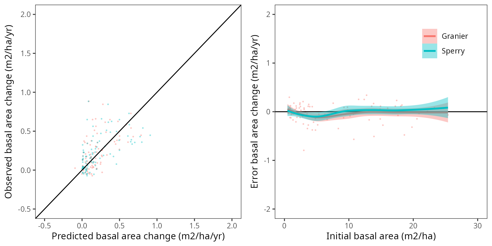

Relationship between **basal area changes** and climatic variables (MAT
and P/PET; IFN2-IFN4):
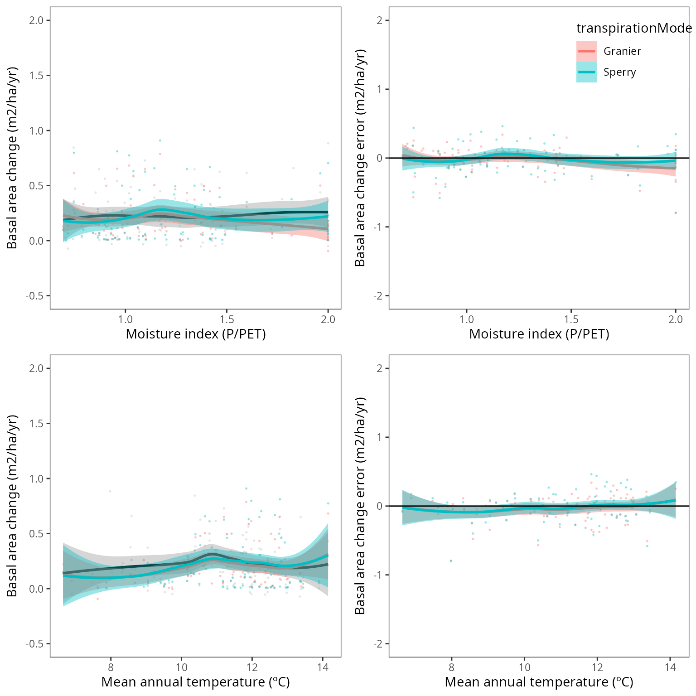

Spatial distribution of errors (IFN2-IFN4):
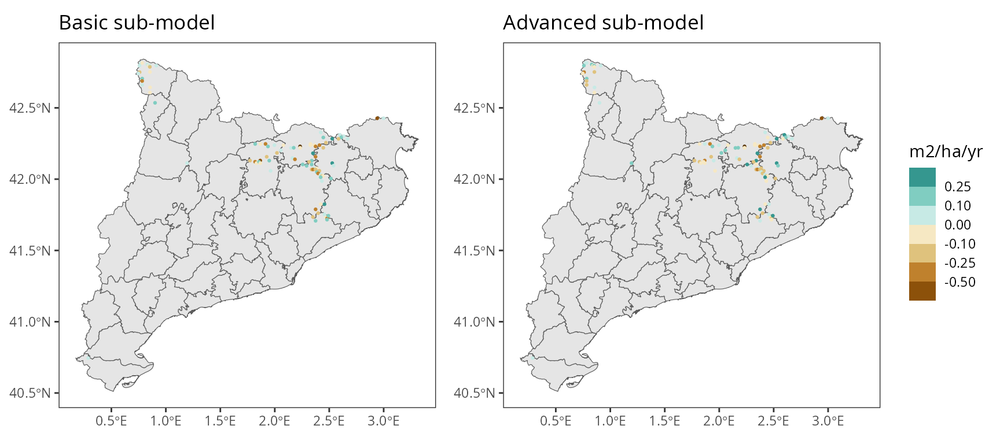

Prediction ability for **overall density changes** (including growth,
mortality and ingrowth):

| version | period | transpirationMode | n | Obs | Pred | Bias | Biasrel | RMSE | RMSErel | R2 |
|:---|:---|:---|---:|---:|---:|---:|---:|---:|---:|---:|
| 2.9.3 | IFN23 | Granier | 93 | 5.246704 | 6.421132 | 1.174428 | 22.38411 | 20.14204 | 383.8990 | 0.0065094 |
| 2.9.3 | IFN23 | Sperry | 93 | 5.246704 | 2.324388 | -2.922316 | -55.69813 | 17.45794 | 332.7410 | 0.0162710 |
| 2.9.3 | IFN34 | Granier | 99 | 2.032230 | 5.075635 | 3.043405 | 149.75688 | 15.62872 | 769.0428 | 0.0175586 |
| 2.9.3 | IFN34 | Sperry | 99 | 2.032230 | 5.922217 | 3.889987 | 191.41464 | 16.15671 | 795.0235 | 0.0015636 |
| 2.9.3 | IFN24 | Granier | 93 | 3.810054 | 4.798758 | 0.988704 | 25.94987 | 13.62157 | 357.5163 | 0.0146571 |
| 2.9.3 | IFN24 | Sperry | 93 | 3.810054 | 5.376227 | 1.566172 | 41.10631 | 11.74192 | 308.1825 | 0.0004029 |

### Pinus halepensis

#### Annual diameter increment

Prediction ability for **diameter increase** (cm/yr) of surviving trees:

| version | period | transpirationMode | n | Obs | Pred | Bias | Biasrel | RMSE | RMSErel | R2 |
|:---|:---|:---|---:|---:|---:|---:|---:|---:|---:|---:|
| 2.9.3 | IFN23 | Granier | 3290 | 0.3451130 | 0.3876252 | 0.0425122 | 12.31833 | 0.2157046 | 62.50261 | 0.0795771 |
| 2.9.3 | IFN23 | Sperry | 3290 | 0.3451130 | 0.3026675 | -0.0424455 | -12.29902 | 0.2224183 | 64.44795 | 0.1042456 |
| 2.9.3 | IFN34 | Granier | 4562 | 0.2441193 | 0.3117245 | 0.0676052 | 27.69353 | 0.1762431 | 72.19550 | 0.0455876 |
| 2.9.3 | IFN34 | Sperry | 4562 | 0.2441193 | 0.1981882 | -0.0459310 | -18.81500 | 0.1813604 | 74.29173 | 0.0593012 |
| 2.9.3 | IFN24 | Granier | 2576 | 0.2837014 | 0.3159174 | 0.0322160 | 11.35559 | 0.1744211 | 61.48053 | 0.0488389 |
| 2.9.3 | IFN24 | Sperry | 2576 | 0.2837014 | 0.2070511 | -0.0766503 | -27.01794 | 0.1900243 | 66.98039 | 0.1033127 |

#### Annual height increment

Prediction ability for **height increase** (cm/yr) of surviving trees:

| version | period | transpirationMode | n | Obs | Pred | Bias | Biasrel | RMSE | RMSErel | R2 |
|:---|:---|:---|---:|---:|---:|---:|---:|---:|---:|---:|
| 2.9.3 | IFN23 | Granier | 3290 | 13.83568 | 17.947883 | 4.1121997 | 29.7216944 | 14.76508 | 106.71740 | 0.0127020 |
| 2.9.3 | IFN23 | Sperry | 3290 | 13.83568 | 13.878267 | 0.0425827 | 0.3077745 | 14.32631 | 103.54612 | 0.0197361 |
| 2.9.3 | IFN34 | Granier | 4562 | 10.16668 | 13.033520 | 2.8668380 | 28.1983632 | 12.03005 | 118.32817 | 0.0027032 |
| 2.9.3 | IFN34 | Sperry | 4562 | 10.16668 | 8.016958 | -2.1497242 | -21.1447952 | 11.03477 | 108.53856 | 0.0159772 |
| 2.9.3 | IFN24 | Granier | 2576 | 11.40008 | 13.506063 | 2.1059807 | 18.4733810 | 10.62837 | 93.23062 | 0.0006878 |
| 2.9.3 | IFN24 | Sperry | 2576 | 11.40008 | 8.783201 | -2.6168816 | -22.9549355 | 10.09282 | 88.53284 | 0.0377835 |

#### Growth basal area increment

Prediction ability for **basal area increase due to growth** (m2/ha/yr)
of surviving trees:

| version | period | transpirationMode | n | Obs | Pred | Bias | Biasrel | RMSE | RMSErel | R2 |
|:---|:---|:---|---:|---:|---:|---:|---:|---:|---:|---:|
| 2.9.3 | IFN23 | Granier | 477 | 0.2369726 | 0.2699030 | 0.0329303 | 13.89626 | 0.1534315 | 64.74652 | 0.6785207 |
| 2.9.3 | IFN23 | Sperry | 477 | 0.2369726 | 0.2075703 | -0.0294023 | -12.40746 | 0.1604483 | 67.70751 | 0.5965321 |
| 2.9.3 | IFN34 | Granier | 494 | 0.2057077 | 0.2708458 | 0.0651381 | 31.66539 | 0.1593632 | 77.47072 | 0.6163864 |
| 2.9.3 | IFN34 | Sperry | 494 | 0.2057077 | 0.1662921 | -0.0394155 | -19.16095 | 0.1513368 | 73.56885 | 0.4875346 |
| 2.9.3 | IFN24 | Granier | 398 | 0.2031947 | 0.2283065 | 0.0251118 | 12.35847 | 0.1454044 | 71.55911 | 0.6068515 |
| 2.9.3 | IFN24 | Sperry | 398 | 0.2031947 | 0.1411542 | -0.0620406 | -30.53257 | 0.1557230 | 76.63729 | 0.5274892 |

#### Mortality

Prediction ability for **basal area decrease due to mortality**
(m2/ha/yr):

| version | period | transpirationMode | n | Obs | Pred | Bias | Biasrel | RMSE | RMSErel | R2 |
|:---|:---|:---|---:|---:|---:|---:|---:|---:|---:|---:|
| 2.9.3 | IFN23 | Granier | 477 | 0.0171807 | 0.0304376 | 0.0132569 | 77.1612346 | 0.0606438 | 352.9755 | 0.1104570 |
| 2.9.3 | IFN23 | Sperry | 477 | 0.0171807 | 0.0281920 | 0.0110112 | 64.0904328 | 0.0562628 | 327.4759 | 0.1729275 |
| 2.9.3 | IFN34 | Granier | 494 | 0.0466047 | 0.0450994 | -0.0015053 | -3.2298422 | 0.0749353 | 160.7893 | 0.1500704 |
| 2.9.3 | IFN34 | Sperry | 494 | 0.0466047 | 0.0410615 | -0.0055432 | -11.8940848 | 0.0703523 | 150.9554 | 0.2199615 |
| 2.9.3 | IFN24 | Granier | 398 | 0.0276508 | 0.0322612 | 0.0046104 | 16.6736882 | 0.0496302 | 179.4890 | 0.2048946 |
| 2.9.3 | IFN24 | Sperry | 398 | 0.0276508 | 0.0278328 | 0.0001820 | 0.6582254 | 0.0443709 | 160.4687 | 0.3105615 |

Prediction ability for **density decrease due to mortality**
(ind/ha/yr):

| version | period | transpirationMode | n | Obs | Pred | Bias | Biasrel | RMSE | RMSErel | R2 |
|:---|:---|:---|---:|---:|---:|---:|---:|---:|---:|---:|
| 2.9.3 | IFN23 | Granier | 477 | 0.9141541 | 1.598389 | 0.6842352 | 74.84900 | 4.945893 | 541.0350 | 0.0387912 |
| 2.9.3 | IFN23 | Sperry | 477 | 0.9141541 | 1.340620 | 0.4264655 | 46.65138 | 3.958686 | 433.0436 | 0.1567807 |
| 2.9.3 | IFN34 | Granier | 494 | 2.6017289 | 2.026513 | -0.5752160 | -22.10899 | 5.358694 | 205.9666 | 0.1621544 |
| 2.9.3 | IFN34 | Sperry | 494 | 2.6017289 | 1.633206 | -0.9685226 | -37.22612 | 4.953363 | 190.3874 | 0.3130151 |
| 2.9.3 | IFN24 | Granier | 398 | 0.9628414 | 1.785348 | 0.8225068 | 85.42494 | 3.138659 | 325.9788 | 0.1960244 |
| 2.9.3 | IFN24 | Sperry | 398 | 0.9628414 | 1.331821 | 0.3689801 | 38.32200 | 1.781292 | 185.0037 | 0.4196342 |

#### Ingrowth

Prediction ability for **basal area increase due to ingrowth**
(m2/ha/yr):

| version | period | transpirationMode | n | Obs | Pred | Bias | Biasrel | RMSE | RMSErel | R2 |
|:---|:---|:---|---:|---:|---:|---:|---:|---:|---:|---:|
| 2.9.3 | IFN23 | Granier | 477 | 0.0438144 | 0.0327355 | -0.0110789 | -25.285911 | 0.1241979 | 283.4637 | 0.0118466 |
| 2.9.3 | IFN23 | Sperry | 477 | 0.0438144 | 0.0413632 | -0.0024512 | -5.594566 | 0.1356866 | 309.6851 | 0.0000002 |
| 2.9.3 | IFN34 | Granier | 494 | 0.0230843 | 0.0351662 | 0.0120819 | 52.338245 | 0.0870189 | 376.9615 | 0.0008095 |
| 2.9.3 | IFN34 | Sperry | 494 | 0.0230843 | 0.0388531 | 0.0157689 | 68.309921 | 0.0847325 | 367.0572 | 0.0006137 |
| 2.9.3 | IFN24 | Granier | 398 | 0.0286826 | 0.0289126 | 0.0002299 | 0.801704 | 0.0721259 | 251.4620 | 0.0022324 |
| 2.9.3 | IFN24 | Sperry | 398 | 0.0286826 | 0.0323054 | 0.0036228 | 12.630480 | 0.0729096 | 254.1942 | 0.0029571 |

Prediction ability for **density increase due to ingrowth** (ind/ha/yr):

| version | period | transpirationMode | n | Obs | Pred | Bias | Biasrel | RMSE | RMSErel | R2 |
|:---|:---|:---|---:|---:|---:|---:|---:|---:|---:|---:|
| 2.9.3 | IFN23 | Granier | 477 | 6.500345 | 4.790142 | -1.7102030 | -26.309418 | 17.87446 | 274.9771 | 0.0111423 |
| 2.9.3 | IFN23 | Sperry | 477 | 6.500345 | 6.428670 | -0.0716752 | -1.102637 | 19.66642 | 302.5442 | 0.0000114 |
| 2.9.3 | IFN34 | Granier | 494 | 3.354195 | 4.931760 | 1.5775647 | 47.032586 | 11.73716 | 349.9249 | 0.0000588 |
| 2.9.3 | IFN34 | Sperry | 494 | 3.354195 | 6.334950 | 2.9807548 | 88.866471 | 12.74533 | 379.9818 | 0.0000714 |
| 2.9.3 | IFN24 | Granier | 398 | 3.871624 | 4.142104 | 0.2704799 | 6.986212 | 9.55088 | 246.6892 | 0.0023564 |
| 2.9.3 | IFN24 | Sperry | 398 | 3.871624 | 5.216579 | 1.3449552 | 34.738786 | 10.23052 | 264.2435 | 0.0008334 |

#### Overall basal area changes

Prediction ability for **overall basal area changes** (including growth,
mortality and ingrowth):

| version | period | transpirationMode | n | Obs | Pred | Bias | Biasrel | RMSE | RMSErel | R2 |
|:---|:---|:---|---:|---:|---:|---:|---:|---:|---:|---:|
| 2.9.3 | IFN23 | Granier | 477 | 0.2439406 | 0.2639985 | 0.0200580 | 8.222486 | 0.2740271 | 112.3336 | 0.2147018 |
| 2.9.3 | IFN23 | Sperry | 477 | 0.2439406 | 0.2169603 | -0.0269802 | -11.060166 | 0.2798736 | 114.7302 | 0.1642981 |
| 2.9.3 | IFN34 | Granier | 494 | 0.1807259 | 0.2660785 | 0.0853526 | 47.227646 | 0.2833437 | 156.7809 | 0.0650272 |
| 2.9.3 | IFN34 | Sperry | 494 | 0.1807259 | 0.1707646 | -0.0099613 | -5.511831 | 0.2766589 | 153.0820 | 0.0252954 |
| 2.9.3 | IFN24 | Granier | 398 | 0.2117019 | 0.2431536 | 0.0314517 | 14.856608 | 0.2199638 | 103.9026 | 0.1765911 |
| 2.9.3 | IFN24 | Sperry | 398 | 0.2117019 | 0.1624416 | -0.0492603 | -23.268695 | 0.2325089 | 109.8284 | 0.0740022 |

Predictive capacity plots (IFN2-IFN4):

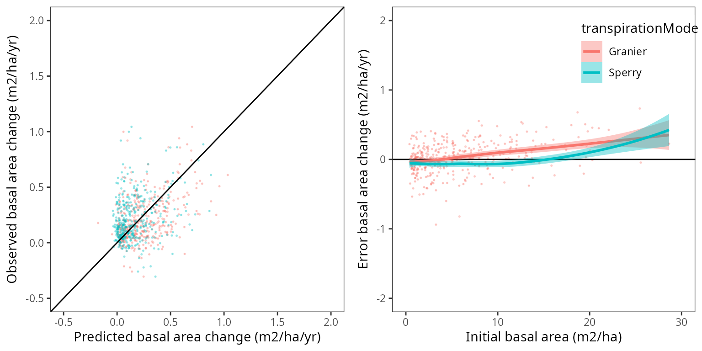

Relationship between **basal area changes** and climatic variables (MAT
and P/PET; IFN2-IFN4):
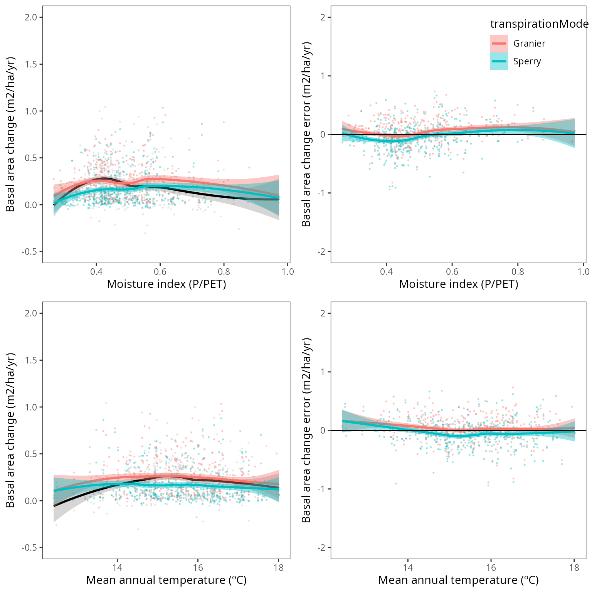

Spatial distribution of errors (IFN2-IFN4):
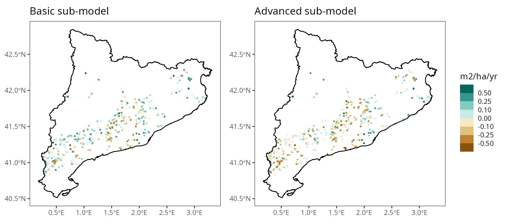

Prediction ability for **overall density changes** (including growth,
mortality and ingrowth):

| version | period | transpirationMode | n | Obs | Pred | Bias | Biasrel | RMSE | RMSErel | R2 |
|:---|:---|:---|---:|---:|---:|---:|---:|---:|---:|---:|
| 2.9.3 | IFN23 | Granier | 477 | 5.7511493 | 3.191753 | -2.5593962 | -44.502343 | 20.49982 | 356.4474 | 0.0143372 |
| 2.9.3 | IFN23 | Sperry | 477 | 5.7511493 | 5.214555 | -0.5365943 | -9.330209 | 21.80384 | 379.1214 | 0.0009526 |
| 2.9.3 | IFN34 | Granier | 494 | 0.7589133 | 3.133988 | 2.3750746 | 312.957306 | 16.04044 | 2113.6067 | 0.0046566 |
| 2.9.3 | IFN34 | Sperry | 494 | 0.7589133 | 4.729197 | 3.9702840 | 523.153827 | 16.28182 | 2145.4123 | 0.0088772 |
| 2.9.3 | IFN24 | Granier | 398 | 3.0614036 | 3.644043 | 0.5826392 | 19.031767 | 12.63915 | 412.8548 | 0.0186809 |
| 2.9.3 | IFN24 | Sperry | 398 | 3.0614036 | 4.669142 | 1.6077382 | 52.516376 | 12.86855 | 420.3480 | 0.0034856 |

### Pinus nigra

#### Annual diameter increment

Prediction ability for **diameter increase** (cm/yr) of surviving trees:

| version | period | transpirationMode | n | Obs | Pred | Bias | Biasrel | RMSE | RMSErel | R2 |
|:---|:---|:---|---:|---:|---:|---:|---:|---:|---:|---:|
| 2.9.3 | IFN23 | Granier | 2460 | 0.2558898 | 0.3084823 | 0.0525925 | 20.552784 | 0.1624684 | 63.49154 | 0.0258013 |
| 2.9.3 | IFN23 | Sperry | 2460 | 0.2558898 | 0.2793620 | 0.0234722 | 9.172785 | 0.1649767 | 64.47177 | 0.0421616 |
| 2.9.3 | IFN34 | Granier | 3321 | 0.1715706 | 0.2716321 | 0.1000615 | 58.320909 | 0.1665795 | 97.09097 | 0.0002235 |
| 2.9.3 | IFN34 | Sperry | 3321 | 0.1715706 | 0.2119063 | 0.0403358 | 23.509723 | 0.1497371 | 87.27436 | 0.0192770 |
| 2.9.3 | IFN24 | Granier | 2014 | 0.2117903 | 0.2669436 | 0.0551533 | 26.041464 | 0.1520186 | 71.77790 | 0.0002560 |
| 2.9.3 | IFN24 | Sperry | 2014 | 0.2117903 | 0.2162414 | 0.0044511 | 2.101643 | 0.1449316 | 68.43166 | 0.0392910 |

#### Annual height increment

Prediction ability for **height increase** (cm/yr) of surviving trees:

| version | period | transpirationMode | n | Obs | Pred | Bias | Biasrel | RMSE | RMSErel | R2 |
|:---|:---|:---|---:|---:|---:|---:|---:|---:|---:|---:|
| 2.9.3 | IFN23 | Granier | 2460 | 13.008362 | 18.36914 | 5.360779 | 41.21025 | 13.759154 | 105.77161 | 0.0202986 |
| 2.9.3 | IFN23 | Sperry | 2460 | 13.008362 | 16.65015 | 3.641788 | 27.99574 | 13.278948 | 102.08009 | 0.0435860 |
| 2.9.3 | IFN34 | Granier | 3321 | 9.923332 | 15.13471 | 5.211382 | 52.51645 | 12.597435 | 126.94764 | 0.0000337 |
| 2.9.3 | IFN34 | Sperry | 3321 | 9.923332 | 11.79298 | 1.869648 | 18.84093 | 11.120683 | 112.06602 | 0.0289577 |
| 2.9.3 | IFN24 | Granier | 2014 | 11.082126 | 15.07059 | 3.988464 | 35.99006 | 10.272929 | 92.69817 | 0.0054392 |
| 2.9.3 | IFN24 | Sperry | 2014 | 11.082126 | 12.23322 | 1.151090 | 10.38691 | 8.978396 | 81.01691 | 0.0880869 |

#### Growth basal area increment

Prediction ability for **basal area increase due to growth** (m2/ha/yr)
of surviving trees:

| version | period | transpirationMode | n | Obs | Pred | Bias | Biasrel | RMSE | RMSErel | R2 |
|:---|:---|:---|---:|---:|---:|---:|---:|---:|---:|---:|
| 2.9.3 | IFN23 | Granier | 299 | 0.1973055 | 0.2442557 | 0.0469502 | 23.795702 | 0.1505157 | 76.28562 | 0.6800344 |
| 2.9.3 | IFN23 | Sperry | 299 | 0.1973055 | 0.2218152 | 0.0245097 | 12.422221 | 0.1498109 | 75.92841 | 0.6785288 |
| 2.9.3 | IFN34 | Granier | 332 | 0.1485922 | 0.2477795 | 0.0991873 | 66.751334 | 0.1898917 | 127.79385 | 0.6286336 |
| 2.9.3 | IFN34 | Sperry | 332 | 0.1485922 | 0.1914779 | 0.0428857 | 28.861342 | 0.1667533 | 112.22210 | 0.5897071 |
| 2.9.3 | IFN24 | Granier | 253 | 0.1706274 | 0.2200110 | 0.0493836 | 28.942377 | 0.1568859 | 91.94649 | 0.6184239 |
| 2.9.3 | IFN24 | Sperry | 253 | 0.1706274 | 0.1791179 | 0.0084905 | 4.976033 | 0.1503393 | 88.10969 | 0.6486463 |

#### Mortality

Prediction ability for **basal area decrease due to mortality**
(m2/ha/yr):

| version | period | transpirationMode | n | Obs | Pred | Bias | Biasrel | RMSE | RMSErel | R2 |
|:---|:---|:---|---:|---:|---:|---:|---:|---:|---:|---:|
| 2.9.3 | IFN23 | Granier | 299 | 0.0124471 | 0.0118526 | -0.0005946 | -4.776786 | 0.0445620 | 358.0104 | 0.0992300 |
| 2.9.3 | IFN23 | Sperry | 299 | 0.0124471 | 0.0116539 | -0.0007932 | -6.372444 | 0.0444200 | 356.8689 | 0.1079484 |
| 2.9.3 | IFN34 | Granier | 332 | 0.0174871 | 0.0157463 | -0.0017408 | -9.954494 | 0.0457070 | 261.3759 | 0.1108188 |
| 2.9.3 | IFN34 | Sperry | 332 | 0.0174871 | 0.0148268 | -0.0026603 | -15.213127 | 0.0451960 | 258.4535 | 0.1369015 |
| 2.9.3 | IFN24 | Granier | 253 | 0.0132369 | 0.0138174 | 0.0005806 | 4.385924 | 0.0352192 | 266.0688 | 0.0894560 |
| 2.9.3 | IFN24 | Sperry | 253 | 0.0132369 | 0.0114430 | -0.0017939 | -13.552181 | 0.0319832 | 241.6220 | 0.2513125 |

Prediction ability for **density decrease due to mortality**
(ind/ha/yr):

| version | period | transpirationMode | n | Obs | Pred | Bias | Biasrel | RMSE | RMSErel | R2 |
|:---|:---|:---|---:|---:|---:|---:|---:|---:|---:|---:|
| 2.9.3 | IFN23 | Granier | 299 | 0.7776704 | 0.5297469 | -0.2479235 | -31.88028 | 3.248881 | 417.7710 | 0.0268965 |
| 2.9.3 | IFN23 | Sperry | 299 | 0.7776704 | 0.5205545 | -0.2571159 | -33.06232 | 3.245173 | 417.2941 | 0.0292123 |
| 2.9.3 | IFN34 | Granier | 332 | 1.1926192 | 0.6427536 | -0.5498656 | -46.10572 | 3.758500 | 315.1467 | 0.0764763 |
| 2.9.3 | IFN34 | Sperry | 332 | 1.1926192 | 0.5615563 | -0.6310629 | -52.91403 | 3.715426 | 311.5350 | 0.1548815 |
| 2.9.3 | IFN24 | Granier | 253 | 0.5679904 | 0.6477849 | 0.0797946 | 14.04858 | 2.388511 | 420.5197 | 0.0405233 |
| 2.9.3 | IFN24 | Sperry | 253 | 0.5679904 | 0.5073832 | -0.0606072 | -10.67045 | 2.099800 | 369.6893 | 0.2159129 |

#### Ingrowth

Prediction ability for **basal area increase due to ingrowth**
(m2/ha/yr):

| version | period | transpirationMode | n | Obs | Pred | Bias | Biasrel | RMSE | RMSErel | R2 |
|:---|:---|:---|---:|---:|---:|---:|---:|---:|---:|---:|
| 2.9.3 | IFN23 | Granier | 299 | 0.0322431 | 0.0408395 | 0.0085963 | 26.66102 | 0.1202017 | 372.7980 | 0.0181666 |
| 2.9.3 | IFN23 | Sperry | 299 | 0.0322431 | 0.0413613 | 0.0091182 | 28.27950 | 0.1073440 | 332.9206 | 0.0076816 |
| 2.9.3 | IFN34 | Granier | 332 | 0.0176960 | 0.0418604 | 0.0241645 | 136.55369 | 0.0858957 | 485.3972 | 0.0012826 |
| 2.9.3 | IFN34 | Sperry | 332 | 0.0176960 | 0.0386218 | 0.0209259 | 118.25231 | 0.0808740 | 457.0195 | 0.0019380 |
| 2.9.3 | IFN24 | Granier | 253 | 0.0210942 | 0.0342740 | 0.0131798 | 62.48102 | 0.0702191 | 332.8842 | 0.0233006 |
| 2.9.3 | IFN24 | Sperry | 253 | 0.0210942 | 0.0329578 | 0.0118637 | 56.24142 | 0.0719719 | 341.1934 | 0.0003215 |

Prediction ability for **density increase due to ingrowth** (ind/ha/yr):

| version | period | transpirationMode | n | Obs | Pred | Bias | Biasrel | RMSE | RMSErel | R2 |
|:---|:---|:---|---:|---:|---:|---:|---:|---:|---:|---:|
| 2.9.3 | IFN23 | Granier | 299 | 4.863574 | 6.599629 | 1.736055 | 35.69505 | 18.416823 | 378.6685 | 0.0188409 |
| 2.9.3 | IFN23 | Sperry | 299 | 4.863574 | 6.463916 | 1.600342 | 32.90465 | 16.463161 | 338.4992 | 0.0022273 |
| 2.9.3 | IFN34 | Granier | 332 | 2.787991 | 6.505783 | 3.717792 | 133.35022 | 13.125190 | 470.7759 | 0.0005866 |
| 2.9.3 | IFN34 | Sperry | 332 | 2.787991 | 6.250377 | 3.462386 | 124.18928 | 12.526857 | 449.3148 | 0.0011921 |
| 2.9.3 | IFN24 | Granier | 253 | 2.916620 | 4.997221 | 2.080602 | 71.33607 | 9.795172 | 335.8399 | 0.0203836 |
| 2.9.3 | IFN24 | Sperry | 253 | 2.916620 | 5.101795 | 2.185176 | 74.92153 | 10.588404 | 363.0368 | 0.0007211 |

#### Overall basal area changes

Prediction ability for **overall basal area changes** (including growth,
mortality and ingrowth):

| version | period | transpirationMode | n | Obs | Pred | Bias | Biasrel | RMSE | RMSErel | R2 |
|:---|:---|:---|---:|---:|---:|---:|---:|---:|---:|---:|
| 2.9.3 | IFN23 | Granier | 299 | 0.2096273 | 0.2734867 | 0.0638593 | 30.46326 | 0.2517444 | 120.0914 | 0.2822120 |
| 2.9.3 | IFN23 | Sperry | 299 | 0.2096273 | 0.2517364 | 0.0421090 | 20.08757 | 0.2432199 | 116.0249 | 0.3200936 |
| 2.9.3 | IFN34 | Granier | 332 | 0.1577085 | 0.2754339 | 0.1177253 | 74.64742 | 0.2421147 | 153.5204 | 0.3083784 |
| 2.9.3 | IFN34 | Sperry | 332 | 0.1577085 | 0.2188713 | 0.0611628 | 38.78215 | 0.2169896 | 137.5890 | 0.3103837 |
| 2.9.3 | IFN24 | Granier | 253 | 0.1822697 | 0.2529334 | 0.0706637 | 38.76879 | 0.2262218 | 124.1138 | 0.3051596 |
| 2.9.3 | IFN24 | Sperry | 253 | 0.1822697 | 0.2122525 | 0.0299828 | 16.44967 | 0.2097442 | 115.0736 | 0.3578467 |

Predictive capacity plots (IFN2-IFN4):

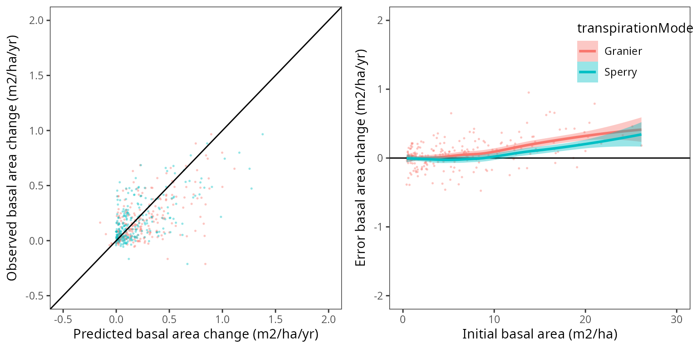

Relationship between **basal area changes** and climatic variables (MAT
and P/PET; IFN2-IFN4):
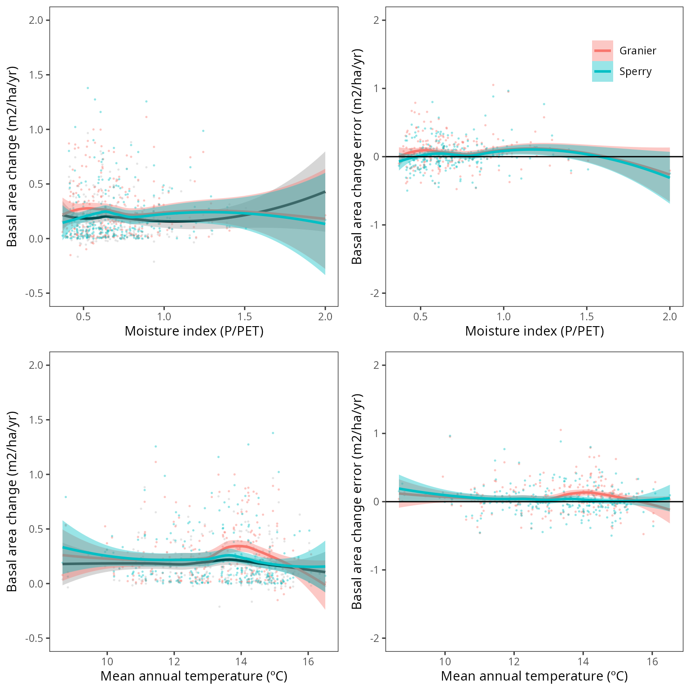

Spatial distribution of errors (IFN2-IFN4):
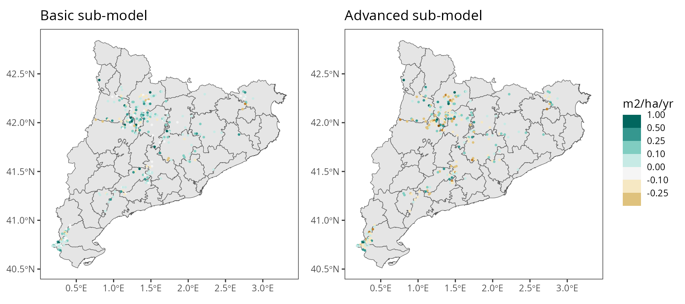

Prediction ability for **overall density changes** (including growth,
mortality and ingrowth):

| version | period | transpirationMode | n | Obs | Pred | Bias | Biasrel | RMSE | RMSErel | R2 |
|:---|:---|:---|---:|---:|---:|---:|---:|---:|---:|---:|
| 2.9.3 | IFN23 | Granier | 299 | 4.120112 | 6.069883 | 1.949771 | 47.32326 | 19.47738 | 472.7393 | 0.0053530 |
| 2.9.3 | IFN23 | Sperry | 299 | 4.120112 | 5.943362 | 1.823251 | 44.25246 | 17.82874 | 432.7247 | 0.0040316 |
| 2.9.3 | IFN34 | Granier | 332 | 2.133934 | 5.863030 | 3.729096 | 174.75219 | 14.53151 | 680.9728 | 0.0017855 |
| 2.9.3 | IFN34 | Sperry | 332 | 2.133934 | 5.802592 | 3.668659 | 171.91998 | 14.63469 | 685.8079 | 0.0010471 |
| 2.9.3 | IFN24 | Granier | 253 | 2.531671 | 5.040474 | 2.508803 | 99.09674 | 11.82512 | 467.0877 | 0.0094190 |
| 2.9.3 | IFN24 | Sperry | 253 | 2.531671 | 5.176030 | 2.644360 | 104.45117 | 12.05899 | 476.3253 | 0.0011559 |

### Pinus sylvestris

#### Annual diameter increment

Prediction ability for **diameter increase** (cm/yr) of surviving trees:

| version | period | transpirationMode | n | Obs | Pred | Bias | Biasrel | RMSE | RMSErel | R2 |
|:---|:---|:---|---:|---:|---:|---:|---:|---:|---:|---:|
| 2.9.3 | IFN23 | Granier | 5735 | 0.2624103 | 0.2782603 | 0.0158500 | 6.040146 | 0.1763768 | 67.21412 | 0.0044670 |
| 2.9.3 | IFN23 | Sperry | 5735 | 0.2624103 | 0.2880083 | 0.0255979 | 9.754925 | 0.1788676 | 68.16334 | 0.0044030 |
| 2.9.3 | IFN34 | Granier | 7174 | 0.2004406 | 0.2586554 | 0.0582147 | 29.043383 | 0.1587823 | 79.21662 | 0.0003373 |
| 2.9.3 | IFN34 | Sperry | 7174 | 0.2004406 | 0.2599221 | 0.0594815 | 29.675351 | 0.1674667 | 83.54928 | 0.0006846 |
| 2.9.3 | IFN24 | Granier | 5067 | 0.2301231 | 0.2515565 | 0.0214334 | 9.313867 | 0.1447991 | 62.92245 | 0.0016348 |
| 2.9.3 | IFN24 | Sperry | 5067 | 0.2301231 | 0.2557069 | 0.0255838 | 11.117421 | 0.1515710 | 65.86517 | 0.0016593 |

#### Annual height increment

Prediction ability for **height increase** (cm/yr) of surviving trees:

| version | period | transpirationMode | n | Obs | Pred | Bias | Biasrel | RMSE | RMSErel | R2 |
|:---|:---|:---|---:|---:|---:|---:|---:|---:|---:|---:|
| 2.9.3 | IFN23 | Granier | 5735 | 13.532836 | 15.13643 | 1.603596 | 11.84967 | 12.588856 | 93.02452 | 0.0266769 |
| 2.9.3 | IFN23 | Sperry | 5735 | 13.532836 | 15.68074 | 2.147901 | 15.87178 | 12.824279 | 94.76416 | 0.0233785 |
| 2.9.3 | IFN34 | Granier | 7174 | 9.943236 | 13.11621 | 3.172975 | 31.91089 | 12.207179 | 122.76868 | 0.0175592 |
| 2.9.3 | IFN34 | Sperry | 7174 | 9.943236 | 13.20190 | 3.258668 | 32.77271 | 12.439680 | 125.10696 | 0.0215288 |
| 2.9.3 | IFN24 | Granier | 5067 | 11.449844 | 13.03288 | 1.583034 | 13.82581 | 9.066559 | 79.18500 | 0.0458568 |
| 2.9.3 | IFN24 | Sperry | 5067 | 11.449844 | 13.28096 | 1.831117 | 15.99251 | 9.433095 | 82.38623 | 0.0378802 |

#### Growth basal area increment

Prediction ability for **basal area increase due to growth** (m2/ha/yr)
of surviving trees:

| version | period | transpirationMode | n | Obs | Pred | Bias | Biasrel | RMSE | RMSErel | R2 |
|:---|:---|:---|---:|---:|---:|---:|---:|---:|---:|---:|
| 2.9.3 | IFN23 | Granier | 496 | 0.2807627 | 0.2930273 | 0.0122647 | 4.368336 | 0.1924925 | 68.56057 | 0.5639624 |
| 2.9.3 | IFN23 | Sperry | 496 | 0.2807627 | 0.3055486 | 0.0247859 | 8.828067 | 0.2010509 | 71.60886 | 0.5667575 |
| 2.9.3 | IFN34 | Granier | 522 | 0.2350824 | 0.3055257 | 0.0704433 | 29.965386 | 0.1935338 | 82.32594 | 0.6092187 |
| 2.9.3 | IFN34 | Sperry | 522 | 0.2350824 | 0.3099564 | 0.0748740 | 31.850123 | 0.2141304 | 91.08739 | 0.6123292 |
| 2.9.3 | IFN24 | Granier | 458 | 0.2545322 | 0.2716278 | 0.0170955 | 6.716447 | 0.1735631 | 68.18903 | 0.5797712 |
| 2.9.3 | IFN24 | Sperry | 458 | 0.2545322 | 0.2790564 | 0.0245242 | 9.635011 | 0.1892343 | 74.34589 | 0.5674542 |

#### Mortality

Prediction ability for **basal area decrease due to mortality**
(m2/ha/yr):

| version | period | transpirationMode | n | Obs | Pred | Bias | Biasrel | RMSE | RMSErel | R2 |
|:---|:---|:---|---:|---:|---:|---:|---:|---:|---:|---:|
| 2.9.3 | IFN23 | Granier | 496 | 0.0319119 | 0.0406648 | 0.0087530 | 27.4286401 | 0.0619124 | 194.0106 | 0.3043714 |
| 2.9.3 | IFN23 | Sperry | 496 | 0.0319119 | 0.0406586 | 0.0087467 | 27.4090824 | 0.0619111 | 194.0065 | 0.3043801 |
| 2.9.3 | IFN34 | Granier | 522 | 0.0567274 | 0.0518344 | -0.0048930 | -8.6255267 | 0.0900577 | 158.7552 | 0.2164592 |
| 2.9.3 | IFN34 | Sperry | 522 | 0.0567274 | 0.0514657 | -0.0052617 | -9.2754632 | 0.0896250 | 157.9924 | 0.2245876 |
| 2.9.3 | IFN24 | Granier | 458 | 0.0416362 | 0.0413656 | -0.0002705 | -0.6497635 | 0.0565140 | 135.7330 | 0.3974533 |
| 2.9.3 | IFN24 | Sperry | 458 | 0.0416362 | 0.0408292 | -0.0008070 | -1.9381752 | 0.0568289 | 136.4893 | 0.3914893 |

Prediction ability for **density decrease due to mortality**
(ind/ha/yr):

| version | period | transpirationMode | n | Obs | Pred | Bias | Biasrel | RMSE | RMSErel | R2 |
|:---|:---|:---|---:|---:|---:|---:|---:|---:|---:|---:|
| 2.9.3 | IFN23 | Granier | 496 | 1.666455 | 1.504857 | -0.1615988 | -9.697156 | 4.161693 | 249.7332 | 0.3422814 |
| 2.9.3 | IFN23 | Sperry | 496 | 1.666455 | 1.504652 | -0.1618032 | -9.709423 | 4.161675 | 249.7322 | 0.3422736 |
| 2.9.3 | IFN34 | Granier | 522 | 2.527976 | 1.642409 | -0.8855672 | -35.030675 | 4.946214 | 195.6590 | 0.1595086 |
| 2.9.3 | IFN34 | Sperry | 522 | 2.527976 | 1.601697 | -0.9262797 | -36.641153 | 4.845950 | 191.6928 | 0.2146625 |
| 2.9.3 | IFN24 | Granier | 458 | 1.078167 | 1.566766 | 0.4885995 | 45.317628 | 2.102586 | 195.0149 | 0.2947451 |
| 2.9.3 | IFN24 | Sperry | 458 | 1.078167 | 1.506604 | 0.4284377 | 39.737616 | 2.059250 | 190.9955 | 0.2862689 |

#### Ingrowth

Prediction ability for **basal area increase due to ingrowth**
(m2/ha/yr):

| version | period | transpirationMode | n | Obs | Pred | Bias | Biasrel | RMSE | RMSErel | R2 |
|:---|:---|:---|---:|---:|---:|---:|---:|---:|---:|---:|
| 2.9.3 | IFN23 | Granier | 496 | 0.0380071 | 0.0365579 | -0.0014492 | -3.812977 | 0.1150870 | 302.8041 | 0.0081088 |
| 2.9.3 | IFN23 | Sperry | 496 | 0.0380071 | 0.0393270 | 0.0013199 | 3.472892 | 0.1205697 | 317.2294 | 0.0000005 |
| 2.9.3 | IFN34 | Granier | 522 | 0.0209448 | 0.0383259 | 0.0173811 | 82.985488 | 0.0931770 | 444.8701 | 0.0007440 |
| 2.9.3 | IFN34 | Sperry | 522 | 0.0209448 | 0.0427661 | 0.0218214 | 104.185188 | 0.0975040 | 465.5290 | 0.0041890 |
| 2.9.3 | IFN24 | Granier | 458 | 0.0229485 | 0.0421446 | 0.0191960 | 83.648118 | 0.0833227 | 363.0851 | 0.0003126 |
| 2.9.3 | IFN24 | Sperry | 458 | 0.0229485 | 0.0375312 | 0.0145827 | 63.545181 | 0.0772080 | 336.4397 | 0.0002515 |

Prediction ability for **density increase due to ingrowth** (ind/ha/yr):

| version | period | transpirationMode | n | Obs | Pred | Bias | Biasrel | RMSE | RMSErel | R2 |
|:---|:---|:---|---:|---:|---:|---:|---:|---:|---:|---:|
| 2.9.3 | IFN23 | Granier | 496 | 5.437764 | 5.799984 | 0.3622203 | 6.66120 | 16.77417 | 308.4755 | 0.0119841 |
| 2.9.3 | IFN23 | Sperry | 496 | 5.437764 | 6.257897 | 0.8201326 | 15.08217 | 17.74264 | 326.2856 | 0.0000002 |
| 2.9.3 | IFN34 | Granier | 522 | 3.058468 | 5.807781 | 2.7493135 | 89.89185 | 13.68525 | 447.4545 | 0.0013888 |
| 2.9.3 | IFN34 | Sperry | 522 | 3.058468 | 6.761718 | 3.7032501 | 121.08187 | 14.68344 | 480.0913 | 0.0044491 |
| 2.9.3 | IFN24 | Granier | 458 | 3.154621 | 5.925117 | 2.7704956 | 87.82340 | 11.33599 | 359.3455 | 0.0018194 |
| 2.9.3 | IFN24 | Sperry | 458 | 3.154621 | 5.247110 | 2.0924889 | 66.33091 | 10.54285 | 334.2033 | 0.0000716 |

#### Overall basal area changes

Prediction ability for **overall basal area changes** (including growth,
mortality and ingrowth):

| version | period | transpirationMode | n | Obs | Pred | Bias | Biasrel | RMSE | RMSErel | R2 |
|:---|:---|:---|---:|---:|---:|---:|---:|---:|---:|---:|
| 2.9.3 | IFN23 | Granier | 496 | 0.2708541 | 0.2873193 | 0.0164652 | 6.078993 | 0.2926359 | 108.0419 | 0.1853760 |
| 2.9.3 | IFN23 | Sperry | 496 | 0.2708541 | 0.3020137 | 0.0311596 | 11.504194 | 0.3016487 | 111.3694 | 0.1860409 |
| 2.9.3 | IFN34 | Granier | 522 | 0.1997108 | 0.2967895 | 0.0970786 | 48.609605 | 0.2905982 | 145.5095 | 0.2042864 |
| 2.9.3 | IFN34 | Sperry | 522 | 0.1997108 | 0.3084545 | 0.1087437 | 54.450589 | 0.3127175 | 156.5852 | 0.2035943 |
| 2.9.3 | IFN24 | Granier | 458 | 0.2462700 | 0.2894987 | 0.0432286 | 17.553350 | 0.2598092 | 105.4977 | 0.2161621 |
| 2.9.3 | IFN24 | Sperry | 458 | 0.2462700 | 0.2967514 | 0.0504813 | 20.498358 | 0.2815493 | 114.3254 | 0.2159113 |

Predictive capacity plots (IFN2-IFN4):

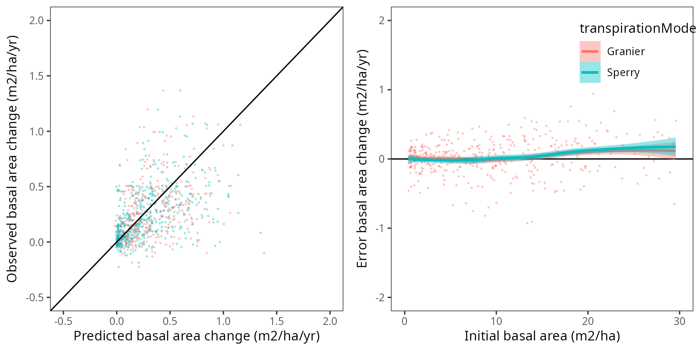

Relationship between **basal area changes** and climatic variables (MAT
and P/PET; IFN2-IFN4):
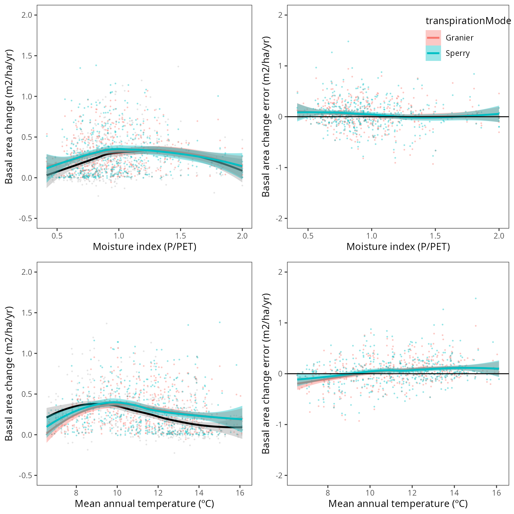

Spatial distribution of errors (IFN2-IFN4):
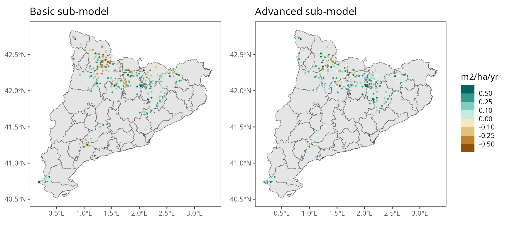

Prediction ability for **overall density changes** (including growth,
mortality and ingrowth):

| version | period | transpirationMode | n | Obs | Pred | Bias | Biasrel | RMSE | RMSErel | R2 |
|:---|:---|:---|---:|---:|---:|---:|---:|---:|---:|---:|
| 2.9.3 | IFN23 | Granier | 496 | 3.5114523 | 4.340299 | 0.8288472 | 23.60411 | 18.08350 | 514.9864 | 0.0140321 |
| 2.9.3 | IFN23 | Sperry | 496 | 3.5114523 | 4.753245 | 1.2417922 | 35.36406 | 19.10260 | 544.0086 | 0.0002893 |
| 2.9.3 | IFN34 | Granier | 522 | 0.5269553 | 4.165372 | 3.6384168 | 690.46019 | 16.13783 | 3062.4658 | 0.0000120 |
| 2.9.3 | IFN34 | Sperry | 522 | 0.5269553 | 5.253547 | 4.7265918 | 896.96249 | 17.15675 | 3255.8255 | 0.0021526 |
| 2.9.3 | IFN24 | Granier | 458 | 1.7337891 | 5.253321 | 3.5195323 | 202.99657 | 13.40961 | 773.4279 | 0.0039107 |
| 2.9.3 | IFN24 | Sperry | 458 | 1.7337891 | 4.818449 | 3.0846596 | 177.91435 | 13.08821 | 754.8903 | 0.0013060 |

### Pinus uncinata

#### Annual diameter increment

Prediction ability for **diameter increase** (cm/yr) of surviving trees:

| version | period | transpirationMode | n | Obs | Pred | Bias | Biasrel | RMSE | RMSErel | R2 |
|:---|:---|:---|---:|---:|---:|---:|---:|---:|---:|---:|
| 2.9.3 | IFN23 | Granier | 2298 | 0.2008612 | 0.1165946 | -0.0842666 | -41.95267 | 0.1753474 | 87.29777 | 0.0355711 |
| 2.9.3 | IFN23 | Sperry | 2298 | 0.2008612 | 0.1348837 | -0.0659775 | -32.84731 | 0.1662416 | 82.76441 | 0.0508878 |
| 2.9.3 | IFN34 | Granier | 2848 | 0.1664953 | 0.1176723 | -0.0488229 | -29.32392 | 0.1388770 | 83.41200 | 0.0000613 |
| 2.9.3 | IFN34 | Sperry | 2848 | 0.1664953 | 0.1380961 | -0.0283991 | -17.05703 | 0.1339936 | 80.47892 | 0.0010126 |
| 2.9.3 | IFN24 | Granier | 2139 | 0.1814906 | 0.1149656 | -0.0665250 | -36.65481 | 0.1332196 | 73.40303 | 0.0179076 |
| 2.9.3 | IFN24 | Sperry | 2139 | 0.1814906 | 0.1331151 | -0.0483755 | -26.65454 | 0.1238572 | 68.24440 | 0.0399330 |

#### Annual height increment

Prediction ability for **height increase** (cm/yr) of surviving trees:

| version | period | transpirationMode | n | Obs | Pred | Bias | Biasrel | RMSE | RMSErel | R2 |
|:---|:---|:---|---:|---:|---:|---:|---:|---:|---:|---:|
| 2.9.3 | IFN23 | Granier | 2298 | 9.489485 | 5.975979 | -3.513506 | -37.02526 | 10.731454 | 113.08784 | 0.0620335 |
| 2.9.3 | IFN23 | Sperry | 2298 | 9.489485 | 6.922512 | -2.566972 | -27.05070 | 10.536314 | 111.03146 | 0.0532495 |
| 2.9.3 | IFN34 | Granier | 2848 | 10.630800 | 5.811764 | -4.819036 | -45.33089 | 11.135944 | 104.75171 | 0.0601085 |
| 2.9.3 | IFN34 | Sperry | 2848 | 10.630800 | 6.858666 | -3.772134 | -35.48307 | 10.963954 | 103.13386 | 0.0327517 |
| 2.9.3 | IFN24 | Granier | 2139 | 9.933420 | 5.700436 | -4.232983 | -42.61355 | 8.430390 | 84.86896 | 0.0893507 |
| 2.9.3 | IFN24 | Sperry | 2139 | 9.933420 | 6.604616 | -3.328804 | -33.51116 | 8.154796 | 82.09454 | 0.0672899 |

#### Growth basal area increment

Prediction ability for **basal area increase due to growth** (m2/ha/yr)
of surviving trees:

| version | period | transpirationMode | n | Obs | Pred | Bias | Biasrel | RMSE | RMSErel | R2 |
|:---|:---|:---|---:|---:|---:|---:|---:|---:|---:|---:|
| 2.9.3 | IFN23 | Granier | 149 | 0.2780166 | 0.1478584 | -0.1301583 | -46.81672 | 0.2028723 | 72.97128 | 0.6633819 |
| 2.9.3 | IFN23 | Sperry | 149 | 0.2780166 | 0.1718108 | -0.1062058 | -38.20125 | 0.1816499 | 65.33778 | 0.6734270 |
| 2.9.3 | IFN34 | Granier | 153 | 0.2624445 | 0.1755295 | -0.0869150 | -33.11748 | 0.1702353 | 64.86524 | 0.5805546 |
| 2.9.3 | IFN34 | Sperry | 153 | 0.2624445 | 0.2069129 | -0.0555317 | -21.15940 | 0.1568397 | 59.76109 | 0.5600639 |
| 2.9.3 | IFN24 | Granier | 149 | 0.2486968 | 0.1410802 | -0.1076167 | -43.27223 | 0.1635645 | 65.76864 | 0.7122247 |
| 2.9.3 | IFN24 | Sperry | 149 | 0.2486968 | 0.1655975 | -0.0830993 | -33.41390 | 0.1399465 | 56.27193 | 0.7378589 |

#### Mortality

Prediction ability for **basal area decrease due to mortality**
(m2/ha/yr):

| version | period | transpirationMode | n | Obs | Pred | Bias | Biasrel | RMSE | RMSErel | R2 |
|:---|:---|:---|---:|---:|---:|---:|---:|---:|---:|---:|
| 2.9.3 | IFN23 | Granier | 149 | 0.0685725 | 0.0445654 | -0.0240071 | -35.00984 | 0.0958757 | 139.8165 | 0.3726499 |
| 2.9.3 | IFN23 | Sperry | 149 | 0.0685725 | 0.0445654 | -0.0240071 | -35.00984 | 0.0958757 | 139.8165 | 0.3726499 |
| 2.9.3 | IFN34 | Granier | 153 | 0.0827843 | 0.0542638 | -0.0285206 | -34.45164 | 0.1124489 | 135.8335 | 0.3414284 |
| 2.9.3 | IFN34 | Sperry | 153 | 0.0827843 | 0.0542637 | -0.0285206 | -34.45174 | 0.1124489 | 135.8335 | 0.3414283 |
| 2.9.3 | IFN24 | Granier | 149 | 0.0703331 | 0.0436521 | -0.0266811 | -37.93527 | 0.0849146 | 120.7321 | 0.4958553 |
| 2.9.3 | IFN24 | Sperry | 149 | 0.0703331 | 0.0436509 | -0.0266823 | -37.93700 | 0.0849152 | 120.7328 | 0.4958532 |

Prediction ability for **density decrease due to mortality**
(ind/ha/yr):

| version | period | transpirationMode | n | Obs | Pred | Bias | Biasrel | RMSE | RMSErel | R2 |
|:---|:---|:---|---:|---:|---:|---:|---:|---:|---:|---:|
| 2.9.3 | IFN23 | Granier | 149 | 2.258640 | 1.326188 | -0.9324525 | -41.28380 | 3.896957 | 172.5355 | 0.2854984 |
| 2.9.3 | IFN23 | Sperry | 149 | 2.258640 | 1.326188 | -0.9324525 | -41.28380 | 3.896957 | 172.5355 | 0.2854984 |
| 2.9.3 | IFN34 | Granier | 153 | 2.666283 | 1.529639 | -1.1366437 | -42.63027 | 4.388343 | 164.5865 | 0.2244071 |
| 2.9.3 | IFN34 | Sperry | 153 | 2.666283 | 1.529637 | -1.1366460 | -42.63036 | 4.388343 | 164.5865 | 0.2244072 |
| 2.9.3 | IFN24 | Granier | 149 | 1.014270 | 1.299109 | 0.2848390 | 28.08314 | 1.674879 | 165.1314 | 0.2571726 |
| 2.9.3 | IFN24 | Sperry | 149 | 1.014270 | 1.299084 | 0.2848132 | 28.08060 | 1.674887 | 165.1322 | 0.2571642 |

#### Ingrowth

Prediction ability for **basal area increase due to ingrowth**
(m2/ha/yr):

| version | period | transpirationMode | n | Obs | Pred | Bias | Biasrel | RMSE | RMSErel | R2 |
|:---|:---|:---|---:|---:|---:|---:|---:|---:|---:|---:|
| 2.9.3 | IFN23 | Granier | 149 | 0.0451890 | 0.0436020 | -0.0015870 | -3.512019 | 0.1276956 | 282.5809 | 0.0019019 |
| 2.9.3 | IFN23 | Sperry | 149 | 0.0451890 | 0.0529501 | 0.0077611 | 17.174688 | 0.1448776 | 320.6035 | 0.0249639 |
| 2.9.3 | IFN34 | Granier | 153 | 0.0360767 | 0.0591179 | 0.0230412 | 63.867221 | 0.1022087 | 283.3092 | 0.0031524 |
| 2.9.3 | IFN34 | Sperry | 153 | 0.0360767 | 0.0489456 | 0.0128689 | 35.670788 | 0.1078549 | 298.9598 | 0.0160268 |
| 2.9.3 | IFN24 | Granier | 149 | 0.0342135 | 0.0616488 | 0.0274353 | 80.188432 | 0.0930687 | 272.0231 | 0.0000237 |
| 2.9.3 | IFN24 | Sperry | 149 | 0.0342135 | 0.0679221 | 0.0337086 | 98.524189 | 0.1008855 | 294.8704 | 0.0000521 |

Prediction ability for **density increase due to ingrowth** (ind/ha/yr):

| version | period | transpirationMode | n | Obs | Pred | Bias | Biasrel | RMSE | RMSErel | R2 |
|:---|:---|:---|---:|---:|---:|---:|---:|---:|---:|---:|
| 2.9.3 | IFN23 | Granier | 149 | 6.502543 | 8.077732 | 1.575189 | 24.22419 | 19.45573 | 299.2019 | 0.0004271 |
| 2.9.3 | IFN23 | Sperry | 149 | 6.502543 | 9.367002 | 2.864459 | 44.05136 | 22.29634 | 342.8864 | 0.0217672 |
| 2.9.3 | IFN34 | Granier | 153 | 5.197995 | 10.370444 | 5.172449 | 99.50855 | 17.00899 | 327.2222 | 0.0011182 |
| 2.9.3 | IFN34 | Sperry | 153 | 5.197995 | 8.792194 | 3.594199 | 69.14588 | 17.77441 | 341.9474 | 0.0165833 |
| 2.9.3 | IFN24 | Granier | 149 | 4.559891 | 9.596791 | 5.036899 | 110.46095 | 13.89822 | 304.7929 | 0.0000350 |
| 2.9.3 | IFN24 | Sperry | 149 | 4.559891 | 9.943037 | 5.383145 | 118.05424 | 14.63174 | 320.8792 | 0.0027967 |

#### Overall basal area changes

Prediction ability for **overall basal area changes** (including growth,
mortality and ingrowth):

| version | period | transpirationMode | n | Obs | Pred | Bias | Biasrel | RMSE | RMSErel | R2 |
|:---|:---|:---|---:|---:|---:|---:|---:|---:|---:|---:|
| 2.9.3 | IFN23 | Granier | 149 | 0.2853119 | 0.1504279 | -0.1348840 | -47.27598 | 0.3434424 | 120.37437 | 0.0895452 |
| 2.9.3 | IFN23 | Sperry | 149 | 0.2853119 | 0.1844778 | -0.1008340 | -35.34168 | 0.3324430 | 116.51916 | 0.0988443 |
| 2.9.3 | IFN34 | Granier | 153 | 0.2425902 | 0.1851561 | -0.0574341 | -23.67536 | 0.2754404 | 113.54141 | 0.0584804 |
| 2.9.3 | IFN34 | Sperry | 153 | 0.2425902 | 0.2075603 | -0.0350300 | -14.43997 | 0.2787098 | 114.88915 | 0.0571897 |
| 2.9.3 | IFN24 | Granier | 149 | 0.2721022 | 0.1664745 | -0.1056277 | -38.81912 | 0.2757251 | 101.33146 | 0.1187840 |
| 2.9.3 | IFN24 | Sperry | 149 | 0.2721022 | 0.1998686 | -0.0722336 | -26.54651 | 0.2687846 | 98.78074 | 0.1114735 |

Predictive capacity plots (IFN2-IFN4):

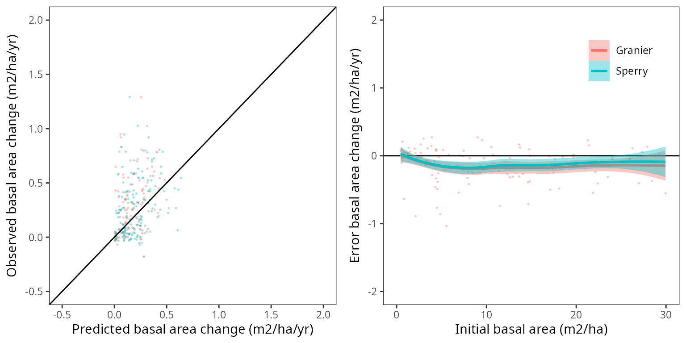

Relationship between **basal area changes** and climatic variables (MAT
and P/PET; IFN2-IFN4):
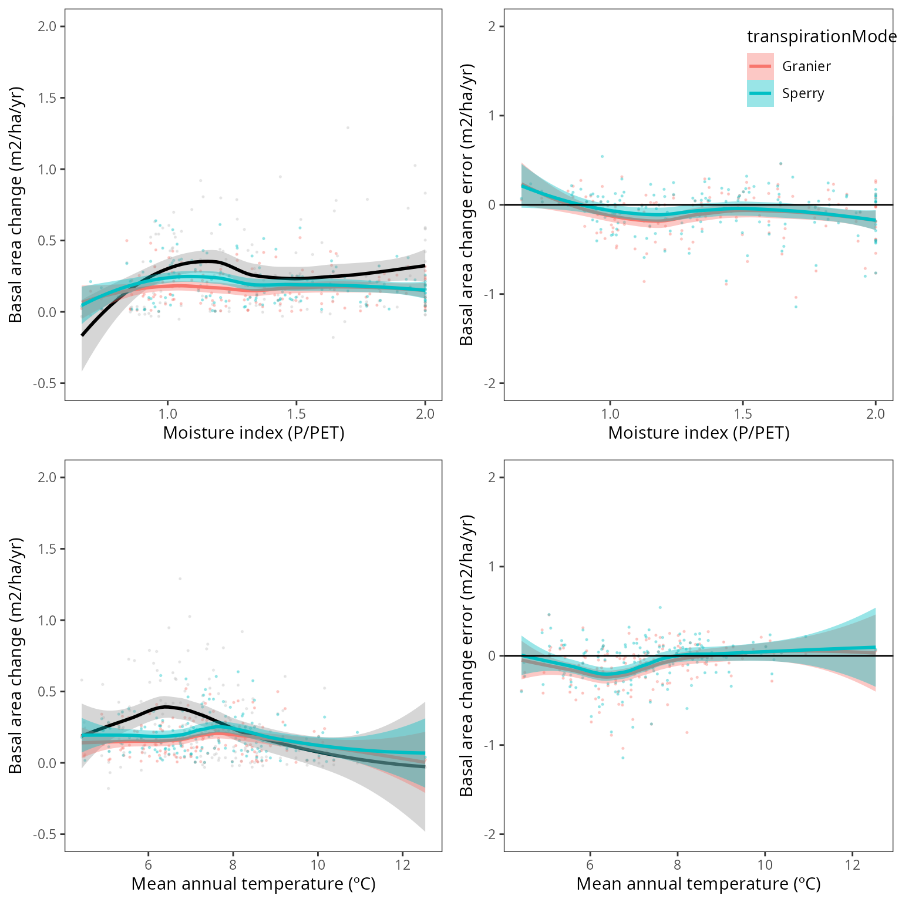

Spatial distribution of errors (IFN2-IFN4):
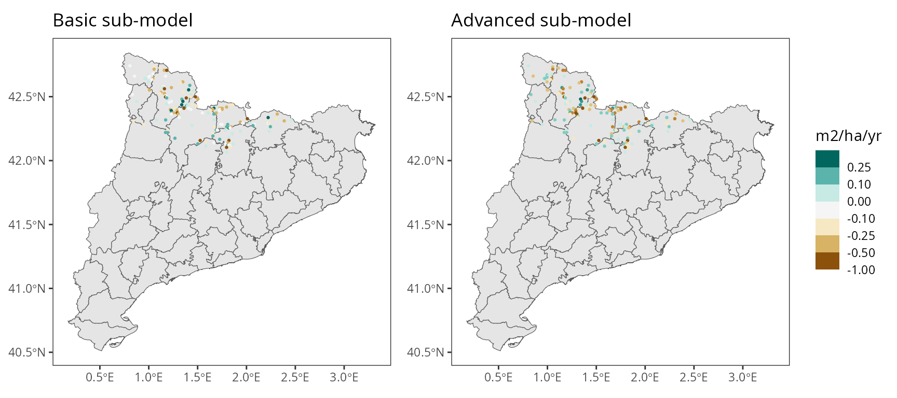

Prediction ability for **overall density changes** (including growth,
mortality and ingrowth):

| version | period | transpirationMode | n | Obs | Pred | Bias | Biasrel | RMSE | RMSErel | R2 |
|:---|:---|:---|---:|---:|---:|---:|---:|---:|---:|---:|
| 2.9.3 | IFN23 | Granier | 149 | 5.849145 | 6.751544 | 0.902399 | 15.42788 | 22.61941 | 386.7131 | 0.0004506 |
| 2.9.3 | IFN23 | Sperry | 149 | 5.849145 | 8.040814 | 2.191669 | 37.46990 | 25.06728 | 428.5631 | 0.0077463 |
| 2.9.3 | IFN34 | Granier | 153 | 4.220601 | 8.840805 | 4.620203 | 109.46789 | 19.24872 | 456.0658 | 0.0103830 |
| 2.9.3 | IFN34 | Sperry | 153 | 4.220601 | 7.262557 | 3.041956 | 72.07399 | 20.68930 | 490.1979 | 0.0088353 |
| 2.9.3 | IFN24 | Granier | 149 | 5.007985 | 8.297681 | 3.289696 | 65.68902 | 15.62815 | 312.0647 | 0.0000220 |
| 2.9.3 | IFN24 | Sperry | 149 | 5.007985 | 8.726725 | 3.718740 | 74.25621 | 16.32875 | 326.0542 | 0.0020819 |

### Quercus faginea

#### Annual diameter increment

Prediction ability for **diameter increase** (cm/yr) of surviving trees:

| version | period | transpirationMode | n | Obs | Pred | Bias | Biasrel | RMSE | RMSErel | R2 |
|:---|:---|:---|---:|---:|---:|---:|---:|---:|---:|---:|
| 2.9.3 | IFN23 | Granier | 1135 | 0.2083410 | 0.1928031 | -0.0155379 | -7.457921 | 0.1413544 | 67.84765 | 0.0557608 |
| 2.9.3 | IFN23 | Sperry | 1135 | 0.2083410 | 0.2174100 | 0.0090691 | 4.353002 | 0.1395385 | 66.97602 | 0.0378643 |
| 2.9.3 | IFN34 | Granier | 579 | 0.1310169 | 0.1373183 | 0.0063015 | 4.809652 | 0.1112301 | 84.89752 | 0.0529122 |
| 2.9.3 | IFN34 | Sperry | 579 | 0.1310169 | 0.1902449 | 0.0592280 | 45.206411 | 0.1191519 | 90.94393 | 0.0520712 |
| 2.9.3 | IFN24 | Granier | 1037 | 0.1734577 | 0.1571122 | -0.0163455 | -9.423332 | 0.1125941 | 64.91160 | 0.0628440 |
| 2.9.3 | IFN24 | Sperry | 1037 | 0.1734577 | 0.1967670 | 0.0233093 | 13.438054 | 0.1135029 | 65.43553 | 0.0267260 |

#### Annual height increment

Prediction ability for **height increase** (cm/yr) of surviving trees:

| version | period | transpirationMode | n | Obs | Pred | Bias | Biasrel | RMSE | RMSErel | R2 |
|:---|:---|:---|---:|---:|---:|---:|---:|---:|---:|---:|
| 2.9.3 | IFN23 | Granier | 1135 | 8.282914 | 6.103908 | -2.1790055 | -26.30723 | 11.354373 | 137.0819 | 0.0048432 |
| 2.9.3 | IFN23 | Sperry | 1135 | 8.282914 | 7.221045 | -1.0618686 | -12.81999 | 11.297277 | 136.3925 | 0.0039801 |
| 2.9.3 | IFN34 | Granier | 579 | 3.700627 | 4.410598 | 0.7099711 | 19.18516 | 9.304260 | 251.4239 | 0.0003450 |
| 2.9.3 | IFN34 | Sperry | 579 | 3.700627 | 6.641037 | 2.9404102 | 79.45709 | 9.570765 | 258.6255 | 0.0133455 |
| 2.9.3 | IFN24 | Granier | 1037 | 5.696068 | 4.800268 | -0.8958010 | -15.72665 | 8.253095 | 144.8911 | 0.0057538 |
| 2.9.3 | IFN24 | Sperry | 1037 | 5.696068 | 6.481332 | 0.7852636 | 13.78606 | 8.516075 | 149.5079 | 0.0014925 |

#### Growth basal area increment

Prediction ability for **basal area increase due to growth** (m2/ha/yr)
of surviving trees:

| version | period | transpirationMode | n | Obs | Pred | Bias | Biasrel | RMSE | RMSErel | R2 |
|:---|:---|:---|---:|---:|---:|---:|---:|---:|---:|---:|
| 2.9.3 | IFN23 | Granier | 236 | 0.1094487 | 0.0986754 | -0.0107733 | -9.843221 | 0.0792618 | 72.41914 | 0.5779736 |
| 2.9.3 | IFN23 | Sperry | 236 | 0.1094487 | 0.1196542 | 0.0102055 | 9.324453 | 0.0862592 | 78.81244 | 0.6155523 |
| 2.9.3 | IFN34 | Granier | 127 | 0.0643630 | 0.0659891 | 0.0016260 | 2.526356 | 0.0598727 | 93.02339 | 0.5888888 |
| 2.9.3 | IFN34 | Sperry | 127 | 0.0643630 | 0.0989198 | 0.0345568 | 53.690372 | 0.0816951 | 126.92855 | 0.7058045 |
| 2.9.3 | IFN24 | Granier | 210 | 0.1004444 | 0.0840434 | -0.0164010 | -16.328458 | 0.0733928 | 73.06811 | 0.5813009 |
| 2.9.3 | IFN24 | Sperry | 210 | 0.1004444 | 0.1207059 | 0.0202615 | 20.171828 | 0.0963527 | 95.92638 | 0.5586032 |

#### Mortality

Prediction ability for **basal area decrease due to mortality**
(m2/ha/yr):

| version | period | transpirationMode | n | Obs | Pred | Bias | Biasrel | RMSE | RMSErel | R2 |
|:---|:---|:---|---:|---:|---:|---:|---:|---:|---:|---:|
| 2.9.3 | IFN23 | Granier | 236 | 0.0053933 | 0.0162797 | 0.0108864 | 201.85080 | 0.0566134 | 1049.6980 | 0.0024362 |
| 2.9.3 | IFN23 | Sperry | 236 | 0.0053933 | 0.0038633 | -0.0015300 | -28.36931 | 0.0196835 | 364.9611 | 0.0478079 |
| 2.9.3 | IFN34 | Granier | 127 | 0.0083747 | 0.0456468 | 0.0372721 | 445.05462 | 0.0915392 | 1093.0418 | 0.0696161 |
| 2.9.3 | IFN34 | Sperry | 127 | 0.0083747 | 0.0036622 | -0.0047125 | -56.27095 | 0.0330105 | 394.1678 | 0.3055136 |
| 2.9.3 | IFN24 | Granier | 210 | 0.0094895 | 0.0386425 | 0.0291531 | 307.21542 | 0.0711683 | 749.9722 | 0.2500400 |
| 2.9.3 | IFN24 | Sperry | 210 | 0.0094895 | 0.0040936 | -0.0053959 | -56.86205 | 0.0228806 | 241.1165 | 0.2398281 |

Prediction ability for **density decrease due to mortality**
(ind/ha/yr):

| version | period | transpirationMode | n | Obs | Pred | Bias | Biasrel | RMSE | RMSErel | R2 |
|:---|:---|:---|---:|---:|---:|---:|---:|---:|---:|---:|
| 2.9.3 | IFN23 | Granier | 236 | 0.6166907 | 1.7984542 | 1.1817635 | 191.62985 | 7.460526 | 1209.7678 | 0.0045494 |
| 2.9.3 | IFN23 | Sperry | 236 | 0.6166907 | 0.2658720 | -0.3508188 | -56.88731 | 2.664029 | 431.9879 | 0.0434564 |
| 2.9.3 | IFN34 | Granier | 127 | 0.5766980 | 4.5915801 | 4.0148821 | 696.18453 | 8.995680 | 1559.8598 | 0.2849624 |
| 2.9.3 | IFN34 | Sperry | 127 | 0.5766980 | 0.2395559 | -0.3371421 | -58.46077 | 2.228779 | 386.4724 | 0.2476570 |
| 2.9.3 | IFN24 | Granier | 210 | 0.4865583 | 3.8358466 | 3.3492883 | 688.36320 | 7.747200 | 1592.2450 | 0.5504167 |
| 2.9.3 | IFN24 | Sperry | 210 | 0.4865583 | 0.2804434 | -0.2061149 | -42.36181 | 1.474803 | 303.1093 | 0.3610187 |

#### Ingrowth

Prediction ability for **basal area increase due to ingrowth**
(m2/ha/yr):

| version | period | transpirationMode | n | Obs | Pred | Bias | Biasrel | RMSE | RMSErel | R2 |
|:---|:---|:---|---:|---:|---:|---:|---:|---:|---:|---:|
| 2.9.3 | IFN23 | Granier | 236 | 0.0130634 | 0.0211669 | 0.0081036 | 62.03285 | 0.0749454 | 573.7062 | 0.0043294 |
| 2.9.3 | IFN23 | Sperry | 236 | 0.0130634 | 0.0389798 | 0.0259164 | 198.38992 | 0.0988565 | 756.7461 | 0.0069505 |
| 2.9.3 | IFN34 | Granier | 127 | 0.0037973 | 0.0142598 | 0.0104625 | 275.52332 | 0.0446746 | 1176.4763 | 0.0045210 |
| 2.9.3 | IFN34 | Sperry | 127 | 0.0037973 | 0.0298458 | 0.0260485 | 685.96971 | 0.0661975 | 1743.2693 | 0.0003844 |
| 2.9.3 | IFN24 | Granier | 210 | 0.0063430 | 0.0176933 | 0.0113503 | 178.94096 | 0.0449992 | 709.4281 | 0.0184554 |
| 2.9.3 | IFN24 | Sperry | 210 | 0.0063430 | 0.0427215 | 0.0363784 | 573.51892 | 0.0799063 | 1259.7516 | 0.0075581 |

Prediction ability for **density increase due to ingrowth** (ind/ha/yr):

| version | period | transpirationMode | n | Obs | Pred | Bias | Biasrel | RMSE | RMSErel | R2 |
|:---|:---|:---|---:|---:|---:|---:|---:|---:|---:|---:|
| 2.9.3 | IFN23 | Granier | 236 | 2.0885510 | 4.139675 | 2.051124 | 98.20801 | 13.538888 | 648.2431 | 0.0052365 |
| 2.9.3 | IFN23 | Sperry | 236 | 2.0885510 | 6.859938 | 4.771387 | 228.45441 | 16.902136 | 809.2757 | 0.0077781 |
| 2.9.3 | IFN34 | Granier | 127 | 0.7143175 | 2.944675 | 2.230358 | 312.23624 | 9.121483 | 1276.9508 | 0.0045633 |
| 2.9.3 | IFN34 | Sperry | 127 | 0.7143175 | 5.184057 | 4.469740 | 625.73575 | 11.036892 | 1545.0962 | 0.0010823 |
| 2.9.3 | IFN24 | Granier | 210 | 0.9174718 | 3.024347 | 2.106875 | 229.63919 | 7.077724 | 771.4378 | 0.0175663 |
| 2.9.3 | IFN24 | Sperry | 210 | 0.9174718 | 6.302964 | 5.385492 | 586.99265 | 11.415748 | 1244.2615 | 0.0055690 |

#### Overall basal area changes

Prediction ability for **overall basal area changes** (including growth,
mortality and ingrowth):

| version | period | transpirationMode | n | Obs | Pred | Bias | Biasrel | RMSE | RMSErel | R2 |
|:---|:---|:---|---:|---:|---:|---:|---:|---:|---:|---:|
| 2.9.3 | IFN23 | Granier | 236 | -0.1692768 | 0.1026599 | 0.2719366 | 160.6462 | 0.5161274 | 304.9015 | 0.0662988 |
| 2.9.3 | IFN23 | Sperry | 236 | -0.1692768 | 0.1562227 | 0.3254994 | 192.2883 | 0.5924392 | 349.9825 | 0.3189295 |
| 2.9.3 | IFN34 | Granier | 127 | -0.1670882 | 0.0295985 | 0.1966867 | 117.7143 | 0.4001682 | 239.4952 | 0.0530578 |
| 2.9.3 | IFN34 | Sperry | 127 | -0.1670882 | 0.1268826 | 0.2939708 | 175.9375 | 0.5055027 | 302.5365 | 0.5773309 |
| 2.9.3 | IFN24 | Granier | 210 | -0.0772680 | 0.0539988 | 0.1312669 | 169.8851 | 0.2550247 | 330.0521 | 0.0086278 |
| 2.9.3 | IFN24 | Sperry | 210 | -0.0772680 | 0.1725817 | 0.2498497 | 323.3546 | 0.4044669 | 523.4598 | 0.3110973 |

Predictive capacity plots (IFN2-IFN4):

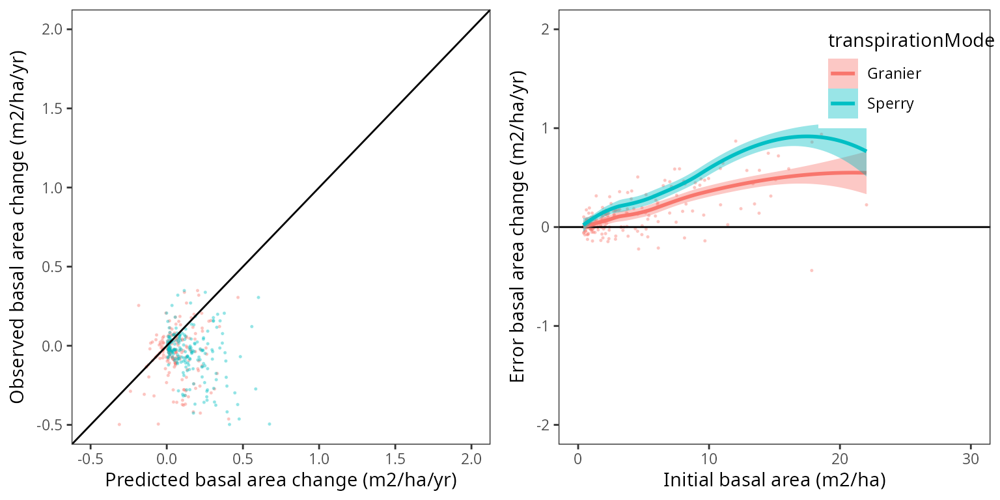

Relationship between **basal area changes** and climatic variables (MAT
and P/PET; IFN2-IFN4):
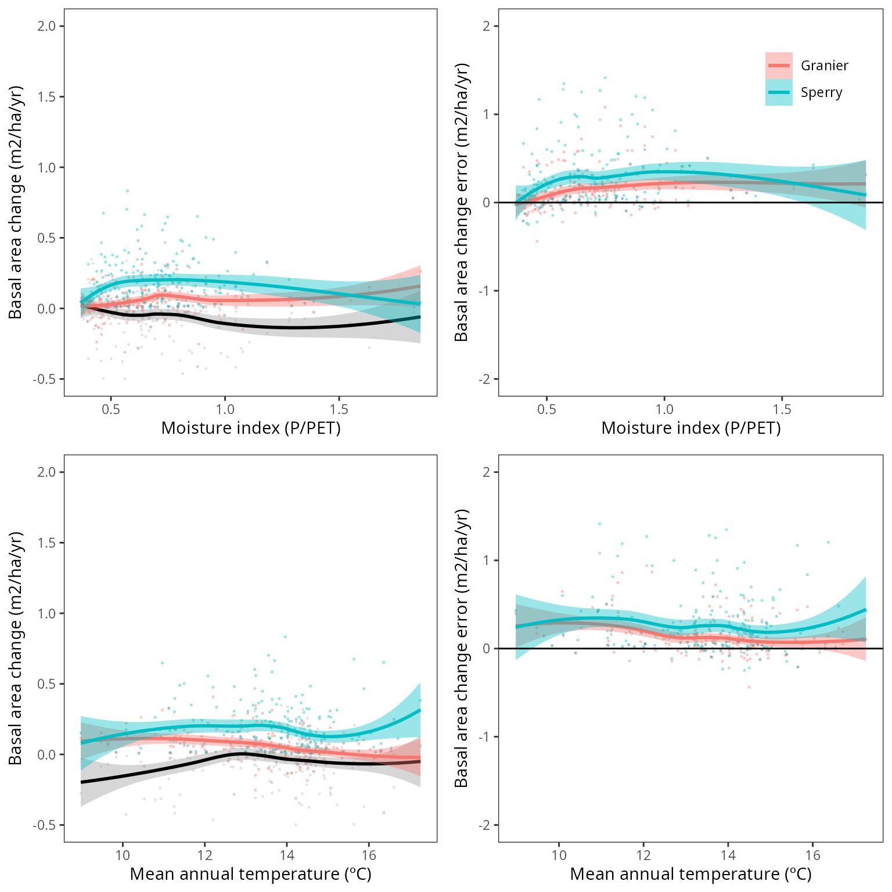

Spatial distribution of errors (IFN2-IFN4):
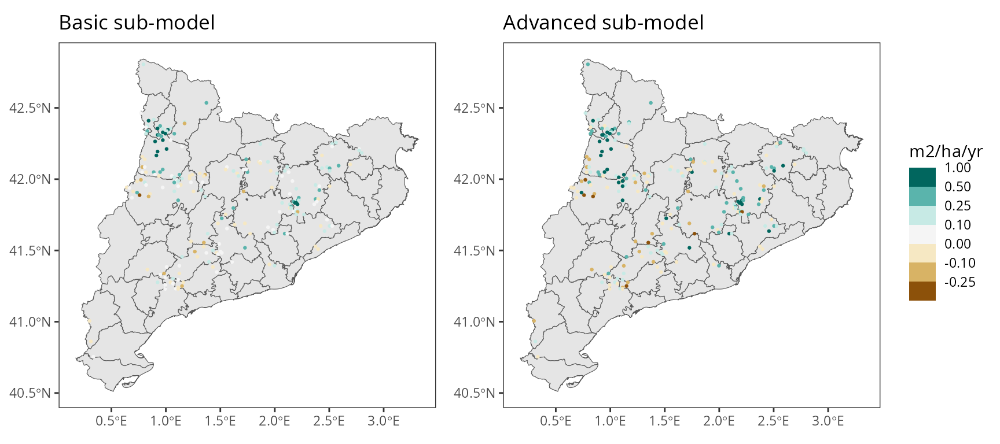

Prediction ability for **overall density changes** (including growth,
mortality and ingrowth):

| version | period | transpirationMode | n | Obs | Pred | Bias | Biasrel | RMSE | RMSErel | R2 |
|:---|:---|:---|---:|---:|---:|---:|---:|---:|---:|---:|
| 2.9.3 | IFN23 | Granier | 236 | -12.702170 | 2.3412212 | 15.043391 | 118.43166 | 32.40450 | 255.1100 | 0.0609177 |
| 2.9.3 | IFN23 | Sperry | 236 | -12.702170 | 6.5940659 | 19.296235 | 151.91291 | 38.03304 | 299.4216 | 0.0053558 |
| 2.9.3 | IFN34 | Granier | 127 | -11.564537 | -1.6469046 | 9.917632 | 85.75901 | 22.28675 | 192.7163 | 0.1710288 |
| 2.9.3 | IFN34 | Sperry | 127 | -11.564537 | 4.9445013 | 16.509038 | 142.75572 | 29.30423 | 253.3973 | 0.0096475 |
| 2.9.3 | IFN24 | Granier | 210 | -6.818172 | -0.8115001 | 6.006672 | 88.09798 | 12.86559 | 188.6955 | 0.3409367 |
| 2.9.3 | IFN24 | Sperry | 210 | -6.818172 | 6.5796198 | 13.397791 | 196.50124 | 21.76772 | 319.2604 | 0.0102316 |

### Quercus ilex

#### Annual diameter increment

Prediction ability for **diameter increase** (cm/yr) of surviving trees:

| version | period | transpirationMode | n | Obs | Pred | Bias | Biasrel | RMSE | RMSErel | R2 |
|:---|:---|:---|---:|---:|---:|---:|---:|---:|---:|---:|
| 2.9.3 | IFN23 | Granier | 3918 | 0.1489045 | 0.1772410 | 0.0283365 | 19.03001 | 0.1104943 | 74.20480 | 0.0672058 |
| 2.9.3 | IFN23 | Sperry | 3918 | 0.1489045 | 0.2026040 | 0.0536995 | 36.06308 | 0.1204250 | 80.87402 | 0.0369690 |
| 2.9.3 | IFN34 | Granier | 5772 | 0.1105881 | 0.1519348 | 0.0413467 | 37.38798 | 0.0989712 | 89.49537 | 0.0712142 |
| 2.9.3 | IFN34 | Sperry | 5772 | 0.1105881 | 0.1825545 | 0.0719664 | 65.07606 | 0.1150158 | 104.00373 | 0.0332283 |
| 2.9.3 | IFN24 | Granier | 3693 | 0.1291420 | 0.1565345 | 0.0273925 | 21.21115 | 0.0888028 | 68.76371 | 0.0915264 |
| 2.9.3 | IFN24 | Sperry | 3693 | 0.1291420 | 0.1886585 | 0.0595165 | 46.08612 | 0.1050948 | 81.37924 | 0.0378757 |

#### Annual height increment

Prediction ability for **height increase** (cm/yr) of surviving trees:

| version | period | transpirationMode | n | Obs | Pred | Bias | Biasrel | RMSE | RMSErel | R2 |
|:---|:---|:---|---:|---:|---:|---:|---:|---:|---:|---:|
| 2.9.3 | IFN23 | Granier | 3918 | 5.950905 | 5.642813 | -0.3080921 | -5.177231 | 7.874177 | 132.3190 | 0.0088152 |
| 2.9.3 | IFN23 | Sperry | 3918 | 5.950905 | 6.636050 | 0.6851446 | 11.513284 | 8.011895 | 134.6332 | 0.0064293 |
| 2.9.3 | IFN34 | Granier | 5772 | 3.782069 | 4.621783 | 0.8397141 | 22.202507 | 8.239339 | 217.8527 | 0.0047156 |
| 2.9.3 | IFN34 | Sperry | 5772 | 3.782069 | 5.841157 | 2.0590879 | 54.443425 | 8.600617 | 227.4051 | 0.0023248 |
| 2.9.3 | IFN24 | Granier | 3693 | 4.747147 | 4.844661 | 0.0975141 | 2.054162 | 5.859919 | 123.4408 | 0.0043054 |
| 2.9.3 | IFN24 | Sperry | 3693 | 4.747147 | 6.054492 | 1.3073446 | 27.539582 | 6.211643 | 130.8500 | 0.0014173 |

#### Growth basal area increment

Prediction ability for **basal area increase due to growth** (m2/ha/yr)
of surviving trees:

| version | period | transpirationMode | n | Obs | Pred | Bias | Biasrel | RMSE | RMSErel | R2 |
|:---|:---|:---|---:|---:|---:|---:|---:|---:|---:|---:|
| 2.9.3 | IFN23 | Granier | 524 | 0.1431107 | 0.1715542 | 0.0284435 | 19.87518 | 0.0901055 | 62.96212 | 0.7222836 |
| 2.9.3 | IFN23 | Sperry | 524 | 0.1431107 | 0.2040681 | 0.0609574 | 42.59458 | 0.1261918 | 88.17775 | 0.7398702 |
| 2.9.3 | IFN34 | Granier | 610 | 0.1234432 | 0.1705182 | 0.0470749 | 38.13488 | 0.1078005 | 87.32802 | 0.6474181 |
| 2.9.3 | IFN34 | Sperry | 610 | 0.1234432 | 0.2199635 | 0.0965203 | 78.19004 | 0.1724030 | 139.66175 | 0.6802270 |
| 2.9.3 | IFN24 | Granier | 489 | 0.1323631 | 0.1618460 | 0.0294829 | 22.27426 | 0.0822241 | 62.12009 | 0.7369705 |
| 2.9.3 | IFN24 | Sperry | 489 | 0.1323631 | 0.2108111 | 0.0784480 | 59.26724 | 0.1458464 | 110.18660 | 0.7400181 |

#### Mortality

Prediction ability for **basal area decrease due to mortality**
(m2/ha/yr):

| version | period | transpirationMode | n | Obs | Pred | Bias | Biasrel | RMSE | RMSErel | R2 |
|:---|:---|:---|---:|---:|---:|---:|---:|---:|---:|---:|
| 2.9.3 | IFN23 | Granier | 524 | 0.0059090 | 0.0110158 | 0.0051068 | 86.423533 | 0.0356261 | 602.9080 | 0.0242889 |
| 2.9.3 | IFN23 | Sperry | 524 | 0.0059090 | 0.0057865 | -0.0001226 | -2.074552 | 0.0220340 | 372.8867 | 0.0282856 |
| 2.9.3 | IFN34 | Granier | 610 | 0.0154508 | 0.0232249 | 0.0077741 | 50.315324 | 0.0799641 | 517.5393 | 0.0766743 |
| 2.9.3 | IFN34 | Sperry | 610 | 0.0154508 | 0.0074214 | -0.0080294 | -51.967317 | 0.0406859 | 263.3250 | 0.1086174 |
| 2.9.3 | IFN24 | Granier | 489 | 0.0096707 | 0.0173101 | 0.0076394 | 78.995294 | 0.0428467 | 443.0568 | 0.0795685 |
| 2.9.3 | IFN24 | Sperry | 489 | 0.0096707 | 0.0063043 | -0.0033664 | -34.810068 | 0.0214081 | 221.3704 | 0.0989045 |

Prediction ability for **density decrease due to mortality**
(ind/ha/yr):

| version | period | transpirationMode | n | Obs | Pred | Bias | Biasrel | RMSE | RMSErel | R2 |
|:---|:---|:---|---:|---:|---:|---:|---:|---:|---:|---:|
| 2.9.3 | IFN23 | Granier | 524 | 0.7206350 | 1.1965779 | 0.4759430 | 66.04494 | 4.545020 | 630.6966 | 0.0189368 |
| 2.9.3 | IFN23 | Sperry | 524 | 0.7206350 | 0.5343830 | -0.1862520 | -25.84554 | 2.922075 | 405.4862 | 0.0287007 |
| 2.9.3 | IFN34 | Granier | 610 | 1.7657018 | 2.4653587 | 0.6996569 | 39.62486 | 8.753283 | 495.7396 | 0.0782386 |
| 2.9.3 | IFN34 | Sperry | 610 | 1.7657018 | 0.6222751 | -1.1434267 | -64.75763 | 5.258866 | 297.8343 | 0.0839876 |
| 2.9.3 | IFN24 | Granier | 489 | 0.6802705 | 1.9473077 | 1.2670373 | 186.25492 | 5.102462 | 750.0637 | 0.0916957 |
| 2.9.3 | IFN24 | Sperry | 489 | 0.6802705 | 0.5938822 | -0.0863883 | -12.69911 | 2.177322 | 320.0671 | 0.0313045 |

#### Ingrowth

Prediction ability for **basal area increase due to ingrowth**
(m2/ha/yr):

| version | period | transpirationMode | n | Obs | Pred | Bias | Biasrel | RMSE | RMSErel | R2 |
|:---|:---|:---|---:|---:|---:|---:|---:|---:|---:|---:|
| 2.9.3 | IFN23 | Granier | 524 | 0.0872894 | 0.0548725 | -0.0324169 | -37.13724 | 0.1518624 | 173.9757 | 0.0000814 |
| 2.9.3 | IFN23 | Sperry | 524 | 0.0872894 | 0.0638605 | -0.0234289 | -26.84044 | 0.1573253 | 180.2341 | 0.0000000 |
| 2.9.3 | IFN34 | Granier | 610 | 0.0744236 | 0.0477143 | -0.0267093 | -35.88823 | 0.1375123 | 184.7697 | 0.0000190 |
| 2.9.3 | IFN34 | Sperry | 610 | 0.0744236 | 0.0635388 | -0.0108848 | -14.62552 | 0.1393336 | 187.2169 | 0.0007798 |
| 2.9.3 | IFN24 | Granier | 489 | 0.0917714 | 0.0472976 | -0.0444738 | -48.46153 | 0.1348858 | 146.9802 | 0.0035816 |
| 2.9.3 | IFN24 | Sperry | 489 | 0.0917714 | 0.0694314 | -0.0223400 | -24.34308 | 0.1353008 | 147.4324 | 0.0057408 |

Prediction ability for **density increase due to ingrowth** (ind/ha/yr):

| version | period | transpirationMode | n | Obs | Pred | Bias | Biasrel | RMSE | RMSErel | R2 |
|:---|:---|:---|---:|---:|---:|---:|---:|---:|---:|---:|
| 2.9.3 | IFN23 | Granier | 524 | 14.68018 | 10.267661 | -4.412520 | -30.05767 | 26.45366 | 180.1998 | 0.0000534 |
| 2.9.3 | IFN23 | Sperry | 524 | 14.68018 | 11.142326 | -3.537855 | -24.09953 | 26.97664 | 183.7623 | 0.0002184 |
| 2.9.3 | IFN34 | Granier | 610 | 12.36190 | 8.961435 | -3.400469 | -27.50764 | 23.54030 | 190.4261 | 0.0004095 |
| 2.9.3 | IFN34 | Sperry | 610 | 12.36190 | 11.052437 | -1.309467 | -10.59276 | 23.34720 | 188.8641 | 0.0002484 |
| 2.9.3 | IFN24 | Granier | 489 | 13.71557 | 7.347157 | -6.368415 | -46.43200 | 20.47223 | 149.2627 | 0.0011983 |
| 2.9.3 | IFN24 | Sperry | 489 | 13.71557 | 9.880980 | -3.834592 | -27.95795 | 19.76626 | 144.1155 | 0.0093615 |

#### Overall basal area changes

Prediction ability for **overall basal area changes** (including growth,
mortality and ingrowth):

| version | period | transpirationMode | n | Obs | Pred | Bias | Biasrel | RMSE | RMSErel | R2 |
|:---|:---|:---|---:|---:|---:|---:|---:|---:|---:|---:|
| 2.9.3 | IFN23 | Granier | 524 | 0.2098339 | 0.2148253 | 0.0049913 | 2.378693 | 0.2024605 | 96.48605 | 0.2083278 |
| 2.9.3 | IFN23 | Sperry | 524 | 0.2098339 | 0.2624308 | 0.0525969 | 25.065944 | 0.2216350 | 105.62400 | 0.2537251 |
| 2.9.3 | IFN34 | Granier | 610 | 0.1902548 | 0.1946943 | 0.0044395 | 2.333441 | 0.2023414 | 106.35283 | 0.1825470 |
| 2.9.3 | IFN34 | Sperry | 610 | 0.1902548 | 0.2796430 | 0.0893882 | 46.983423 | 0.2426749 | 127.55257 | 0.2318815 |
| 2.9.3 | IFN24 | Granier | 489 | 0.2215166 | 0.1903221 | -0.0311946 | -14.082264 | 0.1807040 | 81.57580 | 0.2241293 |
| 2.9.3 | IFN24 | Sperry | 489 | 0.2215166 | 0.2862463 | 0.0647297 | 29.221159 | 0.2227084 | 100.53802 | 0.2436730 |

Predictive capacity plots (IFN2-IFN4):

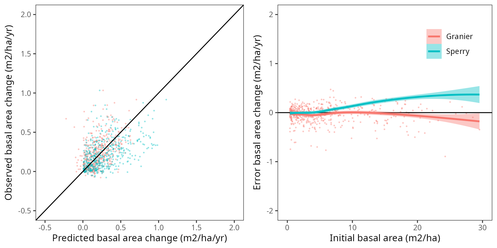

Relationship between **basal area changes** and climatic variables (MAT
and P/PET; IFN2-IFN4):
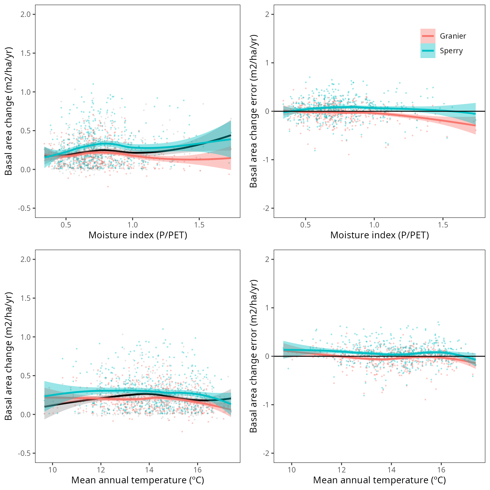

Spatial distribution of errors (IFN2-IFN4):
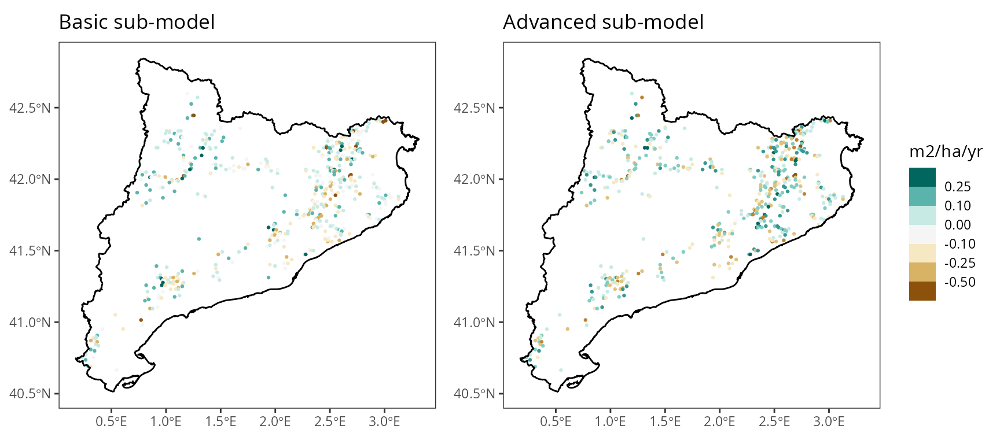

Prediction ability for **overall density changes** (including growth,
mortality and ingrowth):

| version | period | transpirationMode | n | Obs | Pred | Bias | Biasrel | RMSE | RMSErel | R2 |
|:---|:---|:---|---:|---:|---:|---:|---:|---:|---:|---:|
| 2.9.3 | IFN23 | Granier | 524 | 13.10901 | 9.071083 | -4.0379219 | -30.802657 | 27.63769 | 210.8298 | 0.0004681 |
| 2.9.3 | IFN23 | Sperry | 524 | 13.10901 | 10.607943 | -2.5010625 | -19.078965 | 27.40938 | 209.0882 | 0.0002017 |
| 2.9.3 | IFN34 | Granier | 610 | 10.94218 | 6.496076 | -4.4461051 | -40.632712 | 26.06156 | 238.1751 | 0.0016049 |
| 2.9.3 | IFN34 | Sperry | 610 | 10.94218 | 10.430162 | -0.5120195 | -4.679318 | 24.81450 | 226.7783 | 0.0004097 |
| 2.9.3 | IFN24 | Granier | 489 | 12.82621 | 5.477479 | -7.3487353 | -57.294656 | 21.88869 | 170.6559 | 0.0088750 |
| 2.9.3 | IFN24 | Sperry | 489 | 12.82621 | 9.900998 | -2.9252166 | -22.806547 | 20.53866 | 160.1303 | 0.0061626 |

### Quercus pubescens

#### Annual diameter increment

Prediction ability for **diameter increase** (cm/yr) of surviving trees:

| version | period | transpirationMode | n | Obs | Pred | Bias | Biasrel | RMSE | RMSErel | R2 |
|:---|:---|:---|---:|---:|---:|---:|---:|---:|---:|---:|
| 2.9.3 | IFN23 | Granier | 256 | 0.2601437 | 0.2219477 | -0.0381960 | -14.68266 | 0.1643263 | 63.16751 | 0.1560524 |
| 2.9.3 | IFN23 | Sperry | 256 | 0.2601437 | 0.1817317 | -0.0784120 | -30.14179 | 0.1791726 | 68.87446 | 0.1454331 |
| 2.9.3 | IFN34 | Granier | 1936 | 0.1457380 | 0.1643728 | 0.0186348 | 12.78651 | 0.1209050 | 82.96049 | 0.0562826 |
| 2.9.3 | IFN34 | Sperry | 1936 | 0.1457380 | 0.1976329 | 0.0518949 | 35.60834 | 0.1298686 | 89.11099 | 0.0183239 |
| 2.9.3 | IFN24 | Granier | 236 | 0.2305138 | 0.1781990 | -0.0523148 | -22.69486 | 0.1607156 | 69.72060 | 0.1334099 |
| 2.9.3 | IFN24 | Sperry | 236 | 0.2305138 | 0.1356624 | -0.0948515 | -41.14785 | 0.1762379 | 76.45438 | 0.1678664 |

#### Annual height increment

Prediction ability for **height increase** (cm/yr) of surviving trees:

| version | period | transpirationMode | n | Obs | Pred | Bias | Biasrel | RMSE | RMSErel | R2 |
|:---|:---|:---|---:|---:|---:|---:|---:|---:|---:|---:|
| 2.9.3 | IFN23 | Granier | 256 | 11.922826 | 7.102031 | -4.820796 | -40.43333 | 15.139792 | 126.9816 | 0.0060401 |
| 2.9.3 | IFN23 | Sperry | 256 | 11.922826 | 5.558861 | -6.363965 | -53.37631 | 15.687586 | 131.5761 | 0.0030231 |
| 2.9.3 | IFN34 | Granier | 1936 | 3.860419 | 5.965957 | 2.105538 | 54.54170 | 11.383103 | 294.8670 | 0.0097857 |
| 2.9.3 | IFN34 | Sperry | 1936 | 3.860419 | 7.723379 | 3.862960 | 100.06582 | 11.902783 | 308.3288 | 0.0096279 |
| 2.9.3 | IFN24 | Granier | 236 | 9.232653 | 5.507702 | -3.724951 | -40.34540 | 9.322255 | 100.9705 | 0.0343227 |
| 2.9.3 | IFN24 | Sperry | 236 | 9.232653 | 3.895550 | -5.337103 | -57.80682 | 10.317613 | 111.7513 | 0.0039732 |

#### Growth basal area increment

Prediction ability for **basal area increase due to growth** (m2/ha/yr)
of surviving trees:

| version | period | transpirationMode | n | Obs | Pred | Bias | Biasrel | RMSE | RMSErel | R2 |
|:---|:---|:---|---:|---:|---:|---:|---:|---:|---:|---:|
| 2.9.3 | IFN23 | Granier | 79 | 0.0891238 | 0.0730349 | -0.0160889 | -18.052257 | 0.0614658 | 68.96674 | 0.6522246 |
| 2.9.3 | IFN23 | Sperry | 79 | 0.0891238 | 0.0601712 | -0.0289525 | -32.485774 | 0.0706159 | 79.23352 | 0.6261577 |
| 2.9.3 | IFN34 | Granier | 318 | 0.0901147 | 0.0974983 | 0.0073836 | 8.193565 | 0.0635313 | 70.50045 | 0.6635464 |
| 2.9.3 | IFN34 | Sperry | 318 | 0.0901147 | 0.1318315 | 0.0417168 | 46.292963 | 0.0981401 | 108.90569 | 0.6820725 |
| 2.9.3 | IFN24 | Granier | 76 | 0.0776113 | 0.0571347 | -0.0204766 | -26.383541 | 0.0590280 | 76.05599 | 0.5761773 |
| 2.9.3 | IFN24 | Sperry | 76 | 0.0776113 | 0.0438234 | -0.0337879 | -43.534779 | 0.0717880 | 92.49685 | 0.4501398 |

#### Mortality

Prediction ability for **basal area decrease due to mortality**
(m2/ha/yr):

| version | period | transpirationMode | n | Obs | Pred | Bias | Biasrel | RMSE | RMSErel | R2 |
|:---|:---|:---|---:|---:|---:|---:|---:|---:|---:|---:|
| 2.9.3 | IFN23 | Granier | 79 | 0.0058549 | 0.0117108 | 0.0058558 | 100.015681 | 0.0379150 | 647.5750 | 0.0018919 |
| 2.9.3 | IFN23 | Sperry | 79 | 0.0058549 | 0.0062388 | 0.0003839 | 6.556739 | 0.0233459 | 398.7403 | 0.0004846 |
| 2.9.3 | IFN34 | Granier | 318 | 0.0101969 | 0.0377162 | 0.0275193 | 269.878600 | 0.0924166 | 906.3194 | 0.1619447 |
| 2.9.3 | IFN34 | Sperry | 318 | 0.0101969 | 0.0051749 | -0.0050220 | -49.250433 | 0.0267774 | 262.6031 | 0.2180495 |
| 2.9.3 | IFN24 | Granier | 76 | 0.0065697 | 0.0175178 | 0.0109480 | 166.643036 | 0.0460452 | 700.8685 | 0.0013526 |
| 2.9.3 | IFN24 | Sperry | 76 | 0.0065697 | 0.0090813 | 0.0025116 | 38.229329 | 0.0221145 | 336.6117 | 0.0086960 |

Prediction ability for **density decrease due to mortality**
(ind/ha/yr):

| version | period | transpirationMode | n | Obs | Pred | Bias | Biasrel | RMSE | RMSErel | R2 |
|:---|:---|:---|---:|---:|---:|---:|---:|---:|---:|---:|
| 2.9.3 | IFN23 | Granier | 79 | 0.6973683 | 1.1357761 | 0.4384078 | 62.86604 | 4.893603 | 701.7244 | 0.0039247 |
| 2.9.3 | IFN23 | Sperry | 79 | 0.6973683 | 0.5127621 | -0.1846062 | -26.47184 | 2.931821 | 420.4122 | 0.0005366 |
| 2.9.3 | IFN34 | Granier | 318 | 1.0071161 | 4.0602707 | 3.0531546 | 303.15816 | 10.229095 | 1015.6818 | 0.2931612 |
| 2.9.3 | IFN34 | Sperry | 318 | 1.0071161 | 0.3109872 | -0.6961289 | -69.12102 | 3.258376 | 323.5353 | 0.3351003 |
| 2.9.3 | IFN24 | Granier | 76 | 0.1307881 | 1.8128972 | 1.6821090 | 1286.13297 | 5.776029 | 4416.3257 | 0.0003739 |
| 2.9.3 | IFN24 | Sperry | 76 | 0.1307881 | 0.6057423 | 0.4749542 | 363.14784 | 1.358486 | 1038.6924 | 0.0031350 |

#### Ingrowth

Prediction ability for **basal area increase due to ingrowth**
(m2/ha/yr):

| version | period | transpirationMode | n | Obs | Pred | Bias | Biasrel | RMSE | RMSErel | R2 |
|:---|:---|:---|---:|---:|---:|---:|---:|---:|---:|---:|
| 2.9.3 | IFN23 | Granier | 79 | 0.000000 | 0.0640595 | 0.0640595 | Inf | 0.1129618 | Inf | NA |
| 2.9.3 | IFN23 | Sperry | 79 | 0.000000 | 0.0517975 | 0.0517975 | Inf | 0.0987928 | Inf | NA |
| 2.9.3 | IFN34 | Granier | 318 | 0.022931 | 0.0250107 | 0.0020797 | 9.06932 | 0.0666660 | 290.7242 | 0.0108609 |
| 2.9.3 | IFN34 | Sperry | 318 | 0.022931 | 0.0381563 | 0.0152252 | 66.39587 | 0.0822106 | 358.5129 | 0.0048009 |
| 2.9.3 | IFN24 | Granier | 76 | 0.000000 | 0.0381625 | 0.0381625 | Inf | 0.0819286 | Inf | NA |
| 2.9.3 | IFN24 | Sperry | 76 | 0.000000 | 0.0441272 | 0.0441272 | Inf | 0.0741278 | Inf | NA |

Prediction ability for **density increase due to ingrowth** (ind/ha/yr):

| version | period | transpirationMode | n | Obs | Pred | Bias | Biasrel | RMSE | RMSErel | R2 |
|:---|:---|:---|---:|---:|---:|---:|---:|---:|---:|---:|
| 2.9.3 | IFN23 | Granier | 79 | 0.00000 | 12.664840 | 12.6648403 | Inf | 22.12580 | Inf | NA |
| 2.9.3 | IFN23 | Sperry | 79 | 0.00000 | 10.436225 | 10.4362247 | Inf | 19.67734 | Inf | NA |
| 2.9.3 | IFN34 | Granier | 318 | 3.79738 | 4.653572 | 0.8561915 | 22.54690 | 11.43664 | 301.1717 | 0.0126221 |
| 2.9.3 | IFN34 | Sperry | 318 | 3.79738 | 6.348719 | 2.5513389 | 67.18681 | 13.28263 | 349.7841 | 0.0053325 |
| 2.9.3 | IFN24 | Granier | 76 | 0.00000 | 6.895456 | 6.8954564 | Inf | 14.15673 | Inf | NA |
| 2.9.3 | IFN24 | Sperry | 76 | 0.00000 | 8.350982 | 8.3509816 | Inf | 14.12910 | Inf | NA |

#### Overall basal area changes

Prediction ability for **overall basal area changes** (including growth,
mortality and ingrowth):

| version | period | transpirationMode | n | Obs | Pred | Bias | Biasrel | RMSE | RMSErel | R2 |
|:---|:---|:---|---:|---:|---:|---:|---:|---:|---:|---:|
| 2.9.3 | IFN23 | Granier | 79 | -0.2128612 | 0.1259154 | 0.3387766 | 159.15374 | 0.4329395 | 203.3905 | 0.0778531 |
| 2.9.3 | IFN23 | Sperry | 79 | -0.2128612 | 0.1066803 | 0.3195415 | 150.11728 | 0.4128702 | 193.9622 | 0.1773117 |
| 2.9.3 | IFN34 | Granier | 318 | 0.0994825 | 0.0818858 | -0.0175967 | -17.68823 | 0.1524520 | 153.2450 | 0.1899403 |
| 2.9.3 | IFN34 | Sperry | 318 | 0.0994825 | 0.1673866 | 0.0679040 | 68.25725 | 0.1643975 | 165.2526 | 0.2432266 |
| 2.9.3 | IFN24 | Granier | 76 | -0.1022525 | 0.0760209 | 0.1782734 | 174.34630 | 0.2351245 | 229.9450 | 0.0045565 |
| 2.9.3 | IFN24 | Sperry | 76 | -0.1022525 | 0.0843485 | 0.1866010 | 182.49047 | 0.2397396 | 234.4585 | 0.0500256 |

Predictive capacity plots (IFN2-IFN4):

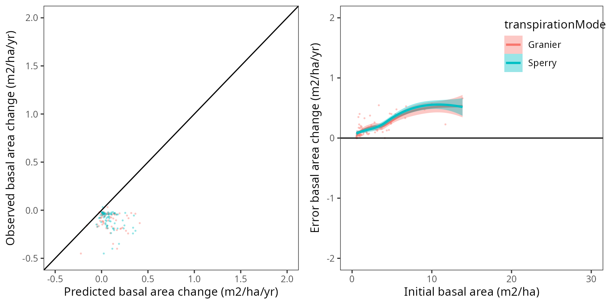

Relationship between **basal area changes** and climatic variables (MAT
and P/PET; IFN2-IFN4):
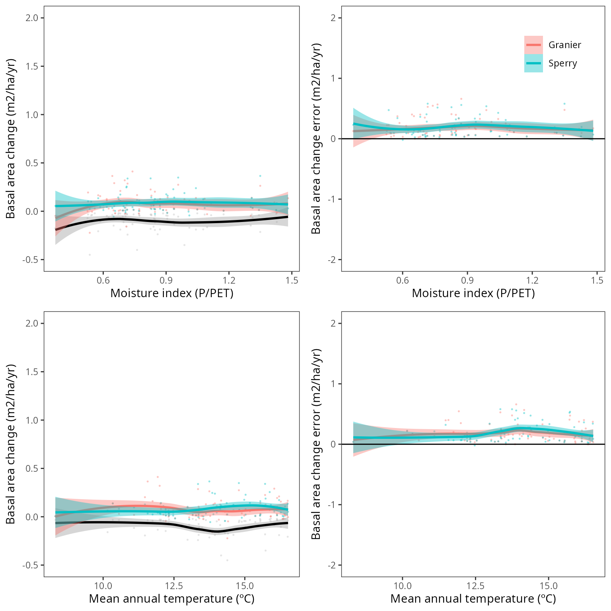

Spatial distribution of errors (IFN2-IFN4):
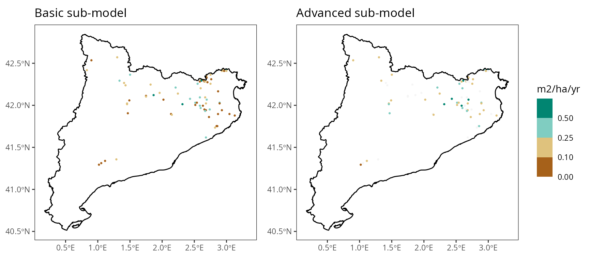

Prediction ability for **overall density changes** (including growth,
mortality and ingrowth):

| version | period | transpirationMode | n | Obs | Pred | Bias | Biasrel | RMSE | RMSErel | R2 |
|:---|:---|:---|---:|---:|---:|---:|---:|---:|---:|---:|
| 2.9.3 | IFN23 | Granier | 79 | -13.481885 | 11.5290641 | 25.010949 | 185.51522 | 34.78344 | 258.0013 | 0.0203396 |
| 2.9.3 | IFN23 | Sperry | 79 | -13.481885 | 9.9234627 | 23.405348 | 173.60590 | 33.95803 | 251.8789 | 0.0030670 |
| 2.9.3 | IFN34 | Granier | 318 | 2.610030 | 0.5933012 | -2.016729 | -77.26841 | 15.49942 | 593.8408 | 0.0571170 |
| 2.9.3 | IFN34 | Sperry | 318 | 2.610030 | 6.0377320 | 3.427702 | 131.32808 | 14.29634 | 547.7464 | 0.0004613 |
| 2.9.3 | IFN24 | Granier | 76 | -6.282228 | 5.0825592 | 11.364787 | 180.90377 | 18.20315 | 289.7563 | 0.0854851 |
| 2.9.3 | IFN24 | Sperry | 76 | -6.282228 | 7.9211333 | 14.203361 | 226.08796 | 19.86664 | 316.2356 | 0.0053125 |

### Quercus suber

#### Annual diameter increment

Prediction ability for **diameter increase** (cm/yr) of surviving trees:

| version | period | transpirationMode | n | Obs | Pred | Bias | Biasrel | RMSE | RMSErel | R2 |
|:---|:---|:---|---:|---:|---:|---:|---:|---:|---:|---:|
| 2.9.3 | IFN23 | Granier | 1243 | 0.1410210 | 0.2068347 | 0.0658137 | 46.66945 | 0.1669355 | 118.37631 | 0.0088297 |
| 2.9.3 | IFN23 | Sperry | 1243 | 0.1410210 | 0.2014637 | 0.0604427 | 42.86077 | 0.1678270 | 119.00850 | 0.0071823 |
| 2.9.3 | IFN34 | Granier | 1427 | 0.1346440 | 0.1886441 | 0.0540001 | 40.10588 | 0.1454577 | 108.03138 | 0.0001814 |
| 2.9.3 | IFN34 | Sperry | 1427 | 0.1346440 | 0.1482393 | 0.0135953 | 10.09724 | 0.1489167 | 110.60031 | 0.0002041 |
| 2.9.3 | IFN24 | Granier | 1142 | 0.1398422 | 0.1876579 | 0.0478158 | 34.19266 | 0.1202655 | 86.00090 | 0.0069571 |
| 2.9.3 | IFN24 | Sperry | 1142 | 0.1398422 | 0.1689032 | 0.0290610 | 20.78129 | 0.1213699 | 86.79063 | 0.0050891 |

#### Annual height increment

Prediction ability for **height increase** (cm/yr) of surviving trees:

| version | period | transpirationMode | n | Obs | Pred | Bias | Biasrel | RMSE | RMSErel | R2 |
|:---|:---|:---|---:|---:|---:|---:|---:|---:|---:|---:|
| 2.9.3 | IFN23 | Granier | 1243 | 4.260807 | 6.553254 | 2.292448 | 53.80313 | 7.174093 | 168.3740 | 0.0095388 |
| 2.9.3 | IFN23 | Sperry | 1243 | 4.260807 | 6.470349 | 2.209542 | 51.85737 | 7.284835 | 170.9731 | 0.0087024 |
| 2.9.3 | IFN34 | Granier | 1427 | 2.408686 | 5.994964 | 3.586277 | 148.88933 | 9.121639 | 378.6977 | 0.0067776 |
| 2.9.3 | IFN34 | Sperry | 1427 | 2.408686 | 4.785585 | 2.376898 | 98.68028 | 8.859291 | 367.8059 | 0.0117383 |
| 2.9.3 | IFN24 | Granier | 1142 | 3.200462 | 5.834757 | 2.634295 | 82.30983 | 5.927453 | 185.2062 | 0.0094382 |
| 2.9.3 | IFN24 | Sperry | 1142 | 3.200462 | 5.456965 | 2.256503 | 70.50553 | 6.076619 | 189.8669 | 0.0049343 |

#### Growth basal area increment

Prediction ability for **basal area increase due to growth** (m2/ha/yr)
of surviving trees:

| version | period | transpirationMode | n | Obs | Pred | Bias | Biasrel | RMSE | RMSErel | R2 |
|:---|:---|:---|---:|---:|---:|---:|---:|---:|---:|---:|
| 2.9.3 | IFN23 | Granier | 147 | 0.1162374 | 0.1617277 | 0.0454903 | 39.135692 | 0.1127966 | 97.03986 | 0.4942661 |
| 2.9.3 | IFN23 | Sperry | 147 | 0.1162374 | 0.1596585 | 0.0434211 | 37.355530 | 0.1188924 | 102.28417 | 0.4631770 |
| 2.9.3 | IFN34 | Granier | 150 | 0.1211765 | 0.1615544 | 0.0403779 | 33.321578 | 0.1066299 | 87.99555 | 0.5060840 |
| 2.9.3 | IFN34 | Sperry | 150 | 0.1211765 | 0.1293733 | 0.0081968 | 6.764307 | 0.1180207 | 97.39567 | 0.3177576 |
| 2.9.3 | IFN24 | Granier | 144 | 0.1133569 | 0.1423114 | 0.0289545 | 25.542776 | 0.0923422 | 81.46148 | 0.5237030 |
| 2.9.3 | IFN24 | Sperry | 144 | 0.1133569 | 0.1328259 | 0.0194690 | 17.174984 | 0.1032834 | 91.11345 | 0.4534160 |

#### Mortality

Prediction ability for **basal area decrease due to mortality**
(m2/ha/yr):

| version | period | transpirationMode | n | Obs | Pred | Bias | Biasrel | RMSE | RMSErel | R2 |
|:---|:---|:---|---:|---:|---:|---:|---:|---:|---:|---:|
| 2.9.3 | IFN23 | Granier | 147 | 0.0103218 | 0.0176510 | 0.0073292 | 71.00680 | 0.0337549 | 327.0247 | 0.0544494 |
| 2.9.3 | IFN23 | Sperry | 147 | 0.0103218 | 0.0176502 | 0.0073284 | 70.99938 | 0.0337546 | 327.0224 | 0.0544544 |
| 2.9.3 | IFN34 | Granier | 150 | 0.0392110 | 0.0308408 | -0.0083703 | -21.34667 | 0.0750039 | 191.2825 | 0.1497010 |
| 2.9.3 | IFN34 | Sperry | 150 | 0.0392110 | 0.0215520 | -0.0176591 | -45.03592 | 0.0760461 | 193.9404 | 0.2275668 |
| 2.9.3 | IFN24 | Granier | 144 | 0.0217277 | 0.0316763 | 0.0099486 | 45.78772 | 0.0518129 | 238.4647 | 0.1317459 |
| 2.9.3 | IFN24 | Sperry | 144 | 0.0217277 | 0.0173618 | -0.0043659 | -20.09357 | 0.0369309 | 169.9715 | 0.2237142 |

Prediction ability for **density decrease due to mortality**
(ind/ha/yr):

| version | period | transpirationMode | n | Obs | Pred | Bias | Biasrel | RMSE | RMSErel | R2 |
|:---|:---|:---|---:|---:|---:|---:|---:|---:|---:|---:|
| 2.9.3 | IFN23 | Granier | 147 | 0.5610858 | 0.7709766 | 0.2098909 | 37.40798 | 2.219966 | 395.6553 | 0.0937794 |
| 2.9.3 | IFN23 | Sperry | 147 | 0.5610858 | 0.7709625 | 0.2098767 | 37.40546 | 2.219965 | 395.6551 | 0.0937797 |
| 2.9.3 | IFN34 | Granier | 150 | 2.2370471 | 1.8490620 | -0.3879851 | -17.34363 | 5.463273 | 244.2181 | 0.1666712 |
| 2.9.3 | IFN34 | Sperry | 150 | 2.2370471 | 0.8918259 | -1.3452212 | -60.13379 | 5.496417 | 245.6997 | 0.2689673 |
| 2.9.3 | IFN24 | Granier | 144 | 0.9504470 | 2.4098230 | 1.4593760 | 153.54628 | 5.139984 | 540.7965 | 0.1498226 |
| 2.9.3 | IFN24 | Sperry | 144 | 0.9504470 | 0.7626415 | -0.1878055 | -19.75970 | 2.503221 | 263.3731 | 0.2179537 |

#### Ingrowth

Prediction ability for **basal area increase due to ingrowth**
(m2/ha/yr):

| version | period | transpirationMode | n | Obs | Pred | Bias | Biasrel | RMSE | RMSErel | R2 |
|:---|:---|:---|---:|---:|---:|---:|---:|---:|---:|---:|
| 2.9.3 | IFN23 | Granier | 147 | 0.0307680 | 0.0125718 | -0.0181963 | -59.14012 | 0.0807822 | 262.5525 | 0.0013783 |
| 2.9.3 | IFN23 | Sperry | 147 | 0.0307680 | 0.0124342 | -0.0183338 | -59.58720 | 0.0760801 | 247.2698 | 0.0413383 |
| 2.9.3 | IFN34 | Granier | 150 | 0.0152949 | 0.0120131 | -0.0032818 | -21.45651 | 0.0542093 | 354.4270 | 0.0046299 |
| 2.9.3 | IFN34 | Sperry | 150 | 0.0152949 | 0.0064306 | -0.0088643 | -57.95570 | 0.0492969 | 322.3092 | 0.0022936 |
| 2.9.3 | IFN24 | Granier | 144 | 0.0198601 | 0.0076898 | -0.0121703 | -61.27995 | 0.0430578 | 216.8054 | 0.0323280 |
| 2.9.3 | IFN24 | Sperry | 144 | 0.0198601 | 0.0092591 | -0.0106010 | -53.37823 | 0.0511043 | 257.3215 | 0.0085565 |

Prediction ability for **density increase due to ingrowth** (ind/ha/yr):

| version | period | transpirationMode | n | Obs | Pred | Bias | Biasrel | RMSE | RMSErel | R2 |
|:---|:---|:---|---:|---:|---:|---:|---:|---:|---:|---:|
| 2.9.3 | IFN23 | Granier | 147 | 4.493781 | 2.243367 | -2.2504136 | -50.07840 | 11.793168 | 262.4331 | 0.0003354 |
| 2.9.3 | IFN23 | Sperry | 147 | 4.493781 | 2.160479 | -2.3333020 | -51.92292 | 10.832612 | 241.0579 | 0.0439688 |
| 2.9.3 | IFN34 | Granier | 150 | 2.243832 | 2.019427 | -0.2244055 | -10.00099 | 7.909450 | 352.4974 | 0.0026081 |
| 2.9.3 | IFN34 | Sperry | 150 | 2.243832 | 1.091775 | -1.1520572 | -51.34329 | 7.053376 | 314.3451 | 0.0021810 |
| 2.9.3 | IFN24 | Granier | 144 | 2.642877 | 1.171964 | -1.4709131 | -55.65576 | 5.800612 | 219.4810 | 0.0185027 |
| 2.9.3 | IFN24 | Sperry | 144 | 2.642877 | 1.246779 | -1.3960978 | -52.82493 | 6.561238 | 248.2612 | 0.0154725 |

#### Overall basal area changes

Prediction ability for **overall basal area changes** (including growth,
mortality and ingrowth):

| version | period | transpirationMode | n | Obs | Pred | Bias | Biasrel | RMSE | RMSErel | R2 |
|:---|:---|:---|---:|---:|---:|---:|---:|---:|---:|---:|
| 2.9.3 | IFN23 | Granier | 147 | 0.1361603 | 0.1542198 | 0.0180595 | 13.263400 | 0.1437150 | 105.5483 | 0.2196664 |
| 2.9.3 | IFN23 | Sperry | 147 | 0.1361603 | 0.1524657 | 0.0163054 | 11.975129 | 0.1572964 | 115.5229 | 0.1748304 |
| 2.9.3 | IFN34 | Granier | 150 | 0.0981880 | 0.1471210 | 0.0489329 | 49.835940 | 0.1671329 | 170.2172 | 0.1280634 |
| 2.9.3 | IFN34 | Sperry | 150 | 0.0981880 | 0.1215039 | 0.0233159 | 23.746146 | 0.1769179 | 180.1828 | 0.0632521 |
| 2.9.3 | IFN24 | Granier | 144 | 0.1219790 | 0.1118721 | -0.0101069 | -8.285783 | 0.1262743 | 103.5213 | 0.1818564 |
| 2.9.3 | IFN24 | Sperry | 144 | 0.1219790 | 0.1297381 | 0.0077591 | 6.360996 | 0.1418344 | 116.2777 | 0.1887382 |

Predictive capacity plots (IFN2-IFN4):

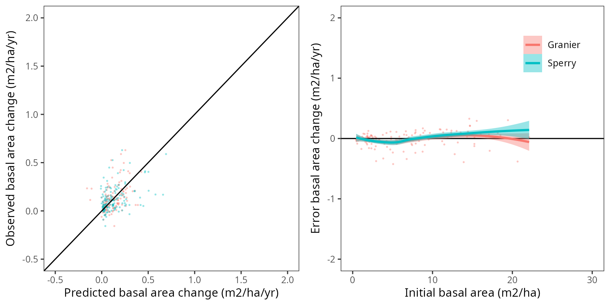

Relationship between **basal area changes** and climatic variables (MAT
and P/PET; IFN2-IFN4):
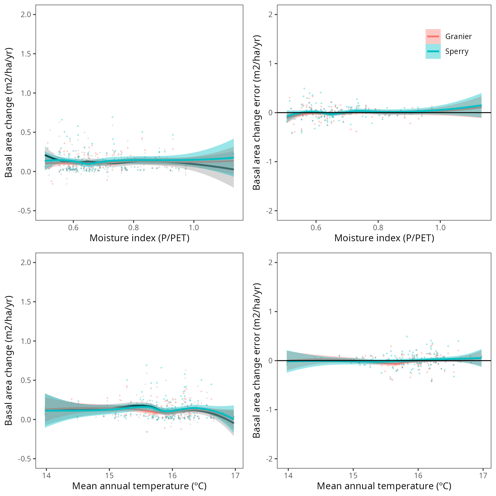

Spatial distribution of errors (IFN2-IFN4):
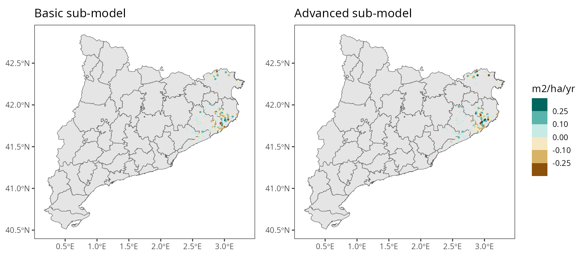

Prediction ability for **overall density changes** (including growth,
mortality and ingrowth):

| version | period | transpirationMode | n | Obs | Pred | Bias | Biasrel | RMSE | RMSErel | R2 |
|:---|:---|:---|---:|---:|---:|---:|---:|---:|---:|---:|
| 2.9.3 | IFN23 | Granier | 147 | 3.8521751 | 1.4723905 | -2.3797846 | -61.77769 | 11.902571 | 308.9831 | 0.0110541 |
| 2.9.3 | IFN23 | Sperry | 147 | 3.8521751 | 1.3895162 | -2.4626589 | -63.92905 | 11.288250 | 293.0357 | 0.0431200 |
| 2.9.3 | IFN34 | Granier | 150 | -0.3761505 | 0.1703646 | 0.5465151 | 145.29160 | 10.689872 | 2841.9132 | 0.0096702 |
| 2.9.3 | IFN34 | Sperry | 150 | -0.3761505 | 0.1999490 | 0.5760995 | 153.15663 | 9.380709 | 2493.8708 | 0.0144818 |
| 2.9.3 | IFN24 | Granier | 144 | 1.6882040 | -1.2374874 | -2.9256914 | -173.30201 | 8.087096 | 479.0355 | 0.0541903 |
| 2.9.3 | IFN24 | Sperry | 144 | 1.6882040 | 0.5320192 | -1.1561847 | -68.48608 | 7.363092 | 436.1494 | 0.0016765 |
