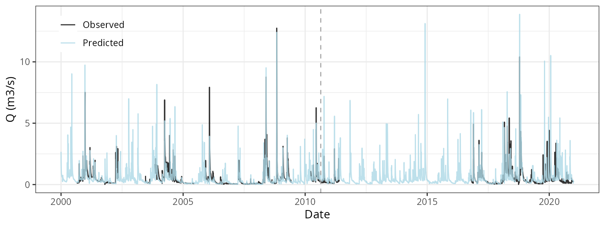
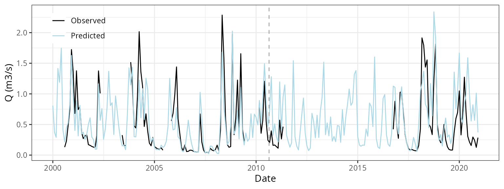
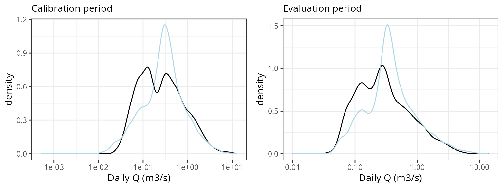
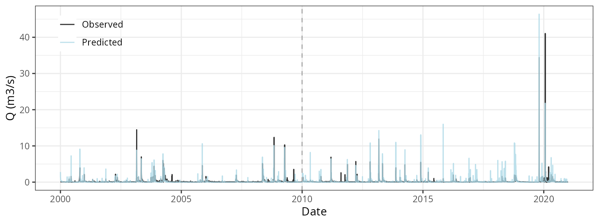
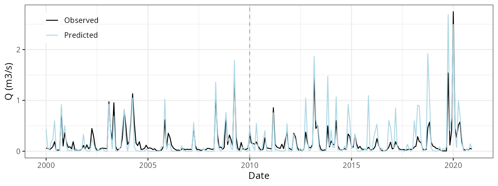
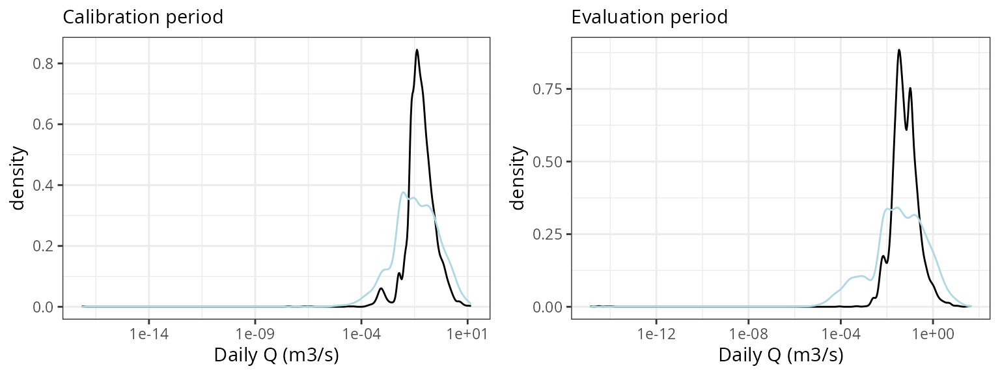

# Evaluation of watershed-level runoff against river gauge data

## Introduction

### Goal

The aim of this article is to provide an assessment of the performance
of
[`spwb_land()`](https://emf-creaf.github.io/medfateland/reference/spwb_land.md)
for the prediction of watershed outflow. To this aim, we simulate
hydrological processes in a set of benchmark watersheds and compare the
model predictions of watershed outflow, after parameter calibration,
against measurements obtained using river gauges at watershed outlets.

### Calibration and simulation

For each watershed, the following procedure has been conducted:

1.  Initial warm-up simulation with default parameters for a specified
    number of years
2.  Calibration of watershed parameters for a specific period (warm-up +
    analysis) using a genetic algorithm and Kling–Gupta efficiency (KGE)
    as optimization function.
3.  Simulation with calibrated watershed parameters.

### Evaluation

For each watershed, simulation results are compared to observed
watershed outflow, differentiating between the period used for
calibration and a posterior period used for independent evaluation. Note
that the performance can decrease for the evaluation period because of
vegetation growth not included in simulations, which may have reduced
observed watershed outflow.

**Goodness-of-fit statistics**

The following goodness of fit statistics are calculated using package
`hydroGOF`:

- Nash-Sutcliffe Efficiency (NSE): This coefficient is sensitive to
  extreme values and might yield sub-optimal results when the dataset
  contains large outliers.
- Kling–Gupta efficiency (KGE): Provides a decomposition of the
  Nash-Sutcliffe efficiency, which facilitates the analysis of the
  importance of different components (bias, correlation and
  variability).
- Index of agreement (d): Initially proposed by Willmott (1981) to
  overcome the drawbacks of the R2, such as the differences in observed
  and predicted means and variances (Legates and McCabe, 1999). d is
  also dimensionless and bounded between 0 and 1 and can be interpreted
  similarly to R2.
- Volumetric efficiency index (VE): Originally proposed by Criss and
  Winston (2008) to circumvent some of the NSE flaws. VE values are also
  bounded \[0, 1\] and represent the fraction of water delivered at the
  proper time.
- Root mean squared error (RMSE): The usual estimation of average model
  error (i.e. the square root of mean squared errors).

**Hydrological analysis**

The density distribution and percentiles of daily discharge are compared
between observations and predictions, for both the calibration and
evaluation periods.

## Watershed (TETIS) parameters

The following table contains the period of calibration and the set of
TETIS parameters employed in simulations on all watersheds after
calibration:

| medfateland | medfate | model | watershed | Calibration_start | Calibration_end | R_localflow | R_interflow | R_baseflow | n_interflow | n_baseflow | n_manning | num_daily_substeps | rock_max_infiltration | deep_aquifer_loss |
|:---|:---|:---|:---|:---|:---|---:|---:|---:|---:|---:|---:|---:|---:|---:|
| 3.0.1 | 5.2.0 | tetis | aiguadora | 2000-08-22 | 2010-08-22 | 0.9424477 | 2.828243 | 2.948424 | 0.1014878 | 1.2576093 | 0.0647127 | 24 | 10 | 3.608671 |
| 3.0.1 | 5.2.0 | tetis | siurana | 2000-01-01 | 2009-12-31 | 0.1938123 | 1.704728 | 1.166648 | 0.0350404 | 0.4877026 | 0.0736420 | 24 | 10 | 3.472153 |

## Evaluation results

### AIGUADORA watershed with TETIS and version 3.0.1

#### Goodness-of-fit

| Scale   | Period      |    NSE |   KGE |     d |    VE |  RMSE |
|:--------|:------------|-------:|------:|------:|------:|------:|
| Daily   | Calibration |  0.574 | 0.766 | 0.727 | 0.502 | 0.537 |
| Daily   | Evaluation  | -0.574 | 0.302 | 0.474 | 0.123 | 0.849 |
| Monthly | Calibration |  0.707 | 0.749 | 0.763 | 0.614 | 0.287 |
| Monthly | Evaluation  |  0.059 | 0.429 | 0.525 | 0.323 | 0.455 |

#### Time series

*Daily*

*Monthly*

#### Hydrological analysis (daily scale)

*Density distribution*

*Percentiles*

|  | Observed.Calibration | Simulated.Calibration | Observed.Evaluation | Simulated.Evaluation |
|:---|---:|---:|---:|---:|
| 1% | 0.0300 | 0.021 | 0.0600 | 0.056 |
| 5% | 0.0500 | 0.041 | 0.0700 | 0.084 |
| 10% | 0.0600 | 0.063 | 0.0900 | 0.111 |
| 15% | 0.0800 | 0.086 | 0.1000 | 0.137 |
| 25% | 0.1000 | 0.150 | 0.1300 | 0.221 |
| 50% | 0.2600 | 0.297 | 0.2700 | 0.349 |
| 75% | 0.5700 | 0.527 | 0.5400 | 0.618 |
| 85% | 0.9300 | 0.826 | 0.8500 | 0.946 |
| 90% | 1.2400 | 1.123 | 1.1700 | 1.280 |
| 95% | 1.8500 | 1.741 | 1.7660 | 2.010 |
| 99% | 3.7998 | 3.705 | 3.3616 | 4.338 |

#### Computation times

| medfateland_ver | medfate_ver | watershed | model | transpirationMode | soilDomains | rhizosphereOverlap | input | days | Elapsed_time_sec |
|:---|:---|:---|:---|:---|:---|:---|:---|---:|---:|
| 3.0.1 | 5.2.0 | aiguadora | spwb | Granier | buckets | total | simplified | 30 | 7.339 |
| 3.0.1 | 5.2.0 | aiguadora | spwb | Granier | single | total | simplified | 30 | 7.902 |
| 3.0.1 | 5.2.0 | aiguadora | spwb | Granier | dual | total | simplified | 30 | 8.229 |
| 3.0.1 | 5.2.0 | aiguadora | spwb | Granier | buckets | total | detailed | 30 | 8.632 |
| 3.0.1 | 5.2.0 | aiguadora | spwb | Granier | single | total | detailed | 30 | 9.176 |
| 3.0.1 | 5.2.0 | aiguadora | spwb | Granier | dual | total | detailed | 30 | 9.609 |
| 3.0.1 | 5.2.0 | aiguadora | growth | Granier | buckets | total | simplified | 30 | 7.610 |
| 3.0.1 | 5.2.0 | aiguadora | growth | Granier | single | total | simplified | 30 | 9.273 |
| 3.0.1 | 5.2.0 | aiguadora | growth | Granier | dual | total | simplified | 30 | 9.099 |
| 3.0.1 | 5.2.0 | aiguadora | growth | Granier | buckets | total | detailed | 30 | 11.124 |
| 3.0.1 | 5.2.0 | aiguadora | growth | Granier | single | total | detailed | 30 | 12.349 |
| 3.0.1 | 5.2.0 | aiguadora | growth | Granier | dual | total | detailed | 30 | 12.561 |

### SIURANA watershed with TETIS and version 3.0.1

#### Goodness-of-fit

| Scale   | Period      |    NSE |   KGE |     d |     VE |  RMSE |
|:--------|:------------|-------:|------:|------:|-------:|------:|
| Daily   | Calibration |  0.164 | 0.612 | 0.613 |  0.105 | 0.511 |
| Daily   | Evaluation  | -0.124 | 0.496 | 0.475 | -0.210 | 1.052 |
| Monthly | Calibration |  0.792 | 0.835 | 0.766 |  0.524 | 0.122 |
| Monthly | Evaluation  |  0.237 | 0.436 | 0.565 |  0.160 | 0.278 |

#### Time series

*Daily*

*Monthly*

#### Hydrological analysis (daily scale)

*Density distribution*

*Percentiles*

|  | Observed.Calibration | Simulated.Calibration | Observed.Evaluation | Simulated.Evaluation |
|:---|---:|---:|---:|---:|
| 1% | 0.0000000 | 0.000 | 0.0000000 | 0.000 |
| 5% | 0.0000000 | 0.000 | 0.0000000 | 0.000 |
| 10% | 0.0013747 | 0.000 | 0.0073056 | 0.000 |
| 15% | 0.0116000 | 0.000 | 0.0150000 | 0.000 |
| 25% | 0.0231000 | 0.000 | 0.0250000 | 0.000 |
| 50% | 0.0512000 | 0.000 | 0.0505000 | 0.004 |
| 75% | 0.1249990 | 0.024 | 0.1200006 | 0.074 |
| 85% | 0.2199000 | 0.106 | 0.1924064 | 0.238 |
| 90% | 0.3299600 | 0.240 | 0.2719856 | 0.482 |
| 95% | 0.6722750 | 0.703 | 0.5070718 | 1.167 |
| 99% | 2.0643371 | 2.958 | 1.9439456 | 4.858 |

#### Computation times

| medfateland_ver | medfate_ver | watershed | model | transpirationMode | soilDomains | rhizosphereOverlap | input | days | Elapsed_time_sec |
|:---|:---|:---|:---|:---|:---|:---|:---|---:|---:|
| 3.0.1 | 5.2.0 | siurana | spwb | Granier | buckets | total | simplified | 30 | 4.001 |
| 3.0.1 | 5.2.0 | siurana | spwb | Granier | single | total | simplified | 30 | 4.235 |
| 3.0.1 | 5.2.0 | siurana | spwb | Granier | dual | total | simplified | 30 | 4.298 |
| 3.0.1 | 5.2.0 | siurana | spwb | Granier | buckets | total | detailed | 30 | 4.402 |
| 3.0.1 | 5.2.0 | siurana | spwb | Granier | single | total | detailed | 30 | 4.989 |
| 3.0.1 | 5.2.0 | siurana | spwb | Granier | dual | total | detailed | 30 | 5.116 |
| 3.0.1 | 5.2.0 | siurana | growth | Granier | buckets | total | simplified | 30 | 4.152 |
| 3.0.1 | 5.2.0 | siurana | growth | Granier | single | total | simplified | 30 | 4.824 |
| 3.0.1 | 5.2.0 | siurana | growth | Granier | dual | total | simplified | 30 | 4.968 |
| 3.0.1 | 5.2.0 | siurana | growth | Granier | buckets | total | detailed | 30 | 5.944 |
| 3.0.1 | 5.2.0 | siurana | growth | Granier | single | total | detailed | 30 | 6.528 |
| 3.0.1 | 5.2.0 | siurana | growth | Granier | dual | total | detailed | 30 | 6.615 |
