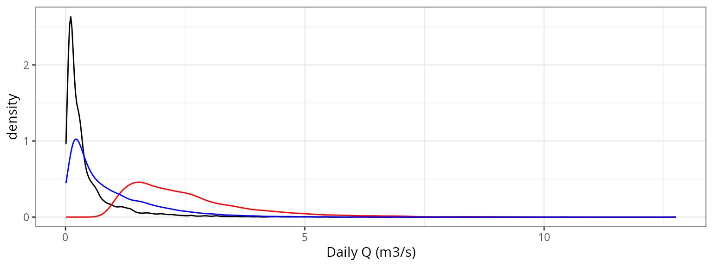
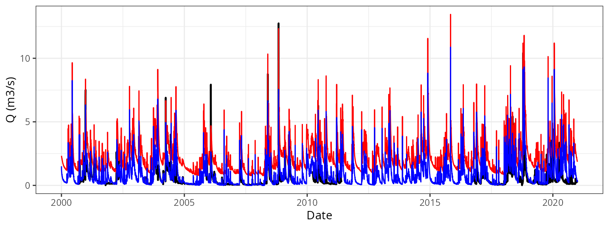
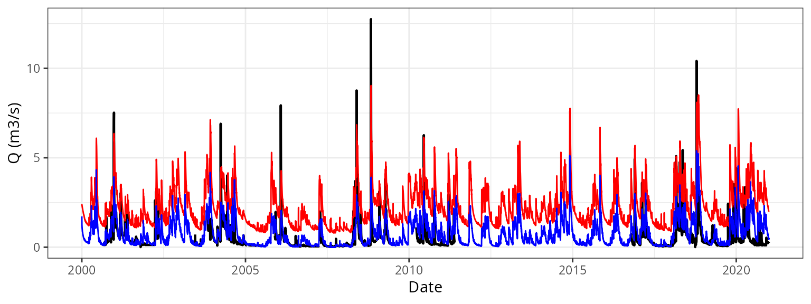
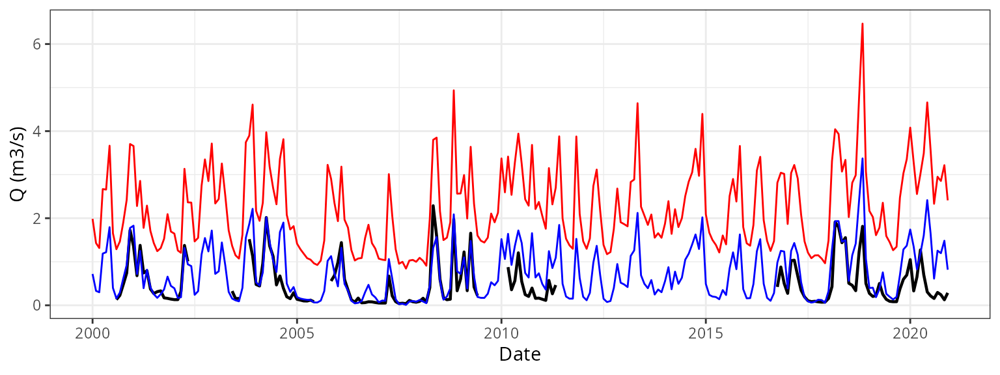
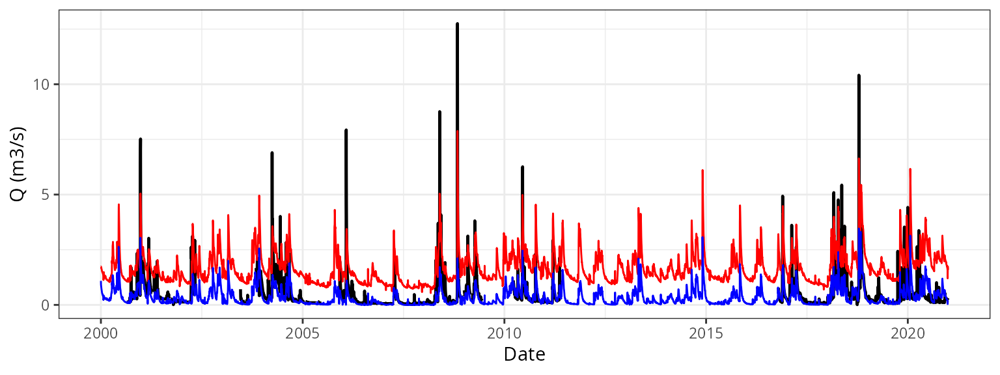
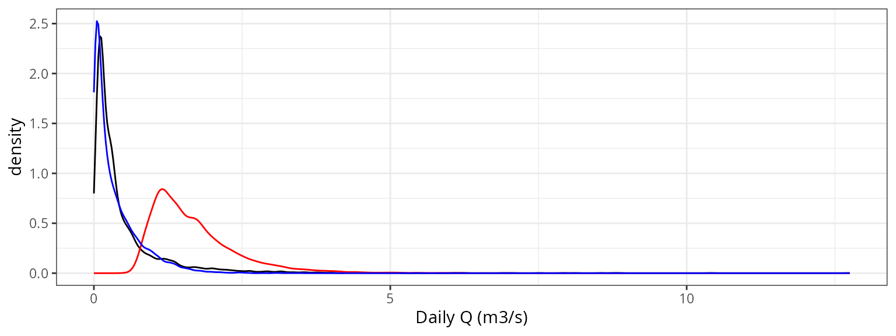

# Evaluation of watershed-level runoff against river gauge data

## Introduction

### Goal

The aim of this article is to provide an assessment of the performance
of
[`spwb_land()`](https://emf-creaf.github.io/medfateland/reference/spwb_land.md)
for the prediction of watershed outflow. To this aim, we simulate
hydrological processes in a set of benchmark watersheds and compare the
model predictions of watershed outflow against measurements obtained
using river gauges at watershed outlets.

### Simulation procedure

For each watershed, the following procedure has been conducted:

1.  Initial warm-up simulation for a specified number of years
2.  Simulation for the period with observed data **before** calibrating
    watershed parameters
3.  Manual calibration of watershed parameters (to be replaced with
    automatized calibration)
4.  Final simulation for the period with observed data **after**
    calibrating watershed parameters.

### Goodness-of-fit statistics

The following goodness of fit statistics are calculated using package
`hydroGOF`:

- Nash-Sutcliffe Efficiency (NSE): This coefficient is sensitive to
  extreme values and might yield sub-optimal results when the dataset
  contains large outliers.
- Kling–Gupta efficiency (KGE): Provides a decomposition of the
  Nash-Sutcliffe efficiency, which facilitates the analysis of the
  importance of different components (bias, correlation and
  variability).
- Index of agreement (d): Initially proposed by Willmott (1981) to
  overcome the drawbacks of the R2, such as the differences in observed
  and predicted means and variances (Legates and McCabe, 1999). d is
  also dimensionless and bounded between 0 and 1 and can be interpreted
  similarly to R2.
- Volumetric efficiency index (VE): Originally proposed by Criss and
  Winston (2008) to circumvent some of the NSE flaws. VE values are also
  bounded \[0, 1\] and represent the fraction of water delivered at the
  proper time.
- Root mean squared error (RMSE): The usual estimation of average model
  error (i.e. the square root of mean squared errors).

### Hydrological analysis

## Watershed (TETIS) parameters

The following table contains the set of TETIS parameters employed in
[`spwb_land()`](https://emf-creaf.github.io/medfateland/reference/spwb_land.md)
simulations on all watersheds, before and after calibration:

| medfateland | medfate | model | watershed | Calibration | R_localflow | R_interflow | R_baseflow | n_interflow | n_baseflow | num_daily_substeps | rock_max_infiltration | deep_aquifer_loss |
|:---|:---|:---|:---|:---|---:|---:|---:|---:|---:|---:|---:|---:|
| 2.5.1 | 4.8.0 | tetis | aiguadora | before | 1 | 50 | 5 | 1.0 | 1.0 | 4 | 10 | 0 |
| 2.5.1 | 4.8.0 | tetis | aiguadora | after | 1 | 8 | 1 | 0.5 | 0.7 | 4 | 10 | 5 |
| 2.5.1 | 4.8.0 | tetis | aiguadora | before | 1 | 50 | 5 | 1.0 | 1.0 | 4 | 10 | 0 |
| 2.5.1 | 4.8.0 | tetis | aiguadora | after | 1 | 8 | 1 | 0.5 | 0.7 | 4 | 10 | 5 |
| 2.6.0 | 4.8.1 | tetis | aiguadora | before | 1 | 50 | 5 | 1.0 | 1.0 | 4 | 10 | 0 |
| 2.6.0 | 4.8.1 | tetis | aiguadora | after | 1 | 8 | 1 | 0.5 | 0.7 | 4 | 10 | 5 |
| 2.7.0 | 4.8.4 | tetis | aiguadora | before | 1 | 50 | 5 | 1.0 | 1.0 | 4 | 10 | 0 |
| 2.7.0 | 4.8.4 | tetis | aiguadora | after | 1 | 8 | 1 | 0.5 | 0.7 | 4 | 10 | 5 |
| 2.8.0 | 4.8.4 | tetis | aiguadora | before | 1 | 50 | 5 | 1.0 | 1.0 | 1 | 10 | 0 |
| 2.8.0 | 4.8.4 | tetis | aiguadora | after | 1 | 8 | 1 | 0.5 | 0.7 | 4 | 10 | 5 |

## Evaluation results

### AIGUADORA watershed with TETIS and version 2.4.6

#### Graphical evaluation

*Daily*

*Monthly*

#### Goodness-of-fit

| Scale   | Calibration |     NSE |    KGE |     d |     VE |  RMSE |
|:--------|:------------|--------:|-------:|------:|-------:|------:|
| Daily   | Before      | -10.432 | -2.136 | 0.614 | -3.571 | 2.487 |
| Daily   | After       |  -0.748 |  0.132 | 0.306 | -0.224 | 0.973 |
| Monthly | Before      | -21.961 | -3.604 | 0.652 | -3.483 | 2.352 |
| Monthly | After       |  -1.519 | -0.209 | 0.325 | -0.054 | 0.779 |

#### Hydrological analysis

*Density distribution*

*Percentiles*

|     | Observed | Uncalibrated | Calibrated |
|:----|---------:|-------------:|-----------:|
| 1%  |    0.040 |        0.980 |      0.051 |
| 5%  |    0.060 |        1.129 |      0.095 |
| 10% |    0.070 |        1.254 |      0.134 |
| 15% |    0.080 |        1.377 |      0.169 |
| 25% |    0.110 |        1.580 |      0.250 |
| 50% |    0.250 |        2.201 |      0.590 |
| 75% |    0.520 |        3.088 |      1.279 |
| 85% |    0.820 |        3.749 |      1.765 |
| 90% |    1.150 |        4.262 |      2.126 |
| 95% |    1.724 |        5.175 |      2.719 |
| 99% |    3.370 |        7.220 |      4.049 |

### AIGUADORA watershed with TETIS and version 2.5.1

#### Graphical evaluation

*Daily*

*Monthly*

#### Goodness-of-fit

| Scale   | Calibration |     NSE |    KGE |     d |     VE |  RMSE |
|:--------|:------------|--------:|-------:|------:|-------:|------:|
| Daily   | Before      |  -7.688 | -1.721 | 0.543 | -2.851 | 2.257 |
| Daily   | After       |  -0.388 |  0.306 | 0.466 |  0.061 | 0.902 |
| Monthly | Before      | -16.128 | -3.002 | 0.592 | -2.804 | 2.096 |
| Monthly | After       |  -0.396 |  0.139 | 0.515 |  0.246 | 0.598 |

#### Hydrological analysis

*Density distribution*

*Percentiles*

|     | Observed | Uncalibrated | Calibrated |
|:----|---------:|-------------:|-----------:|
| 1%  |     0.04 |        0.861 |      0.021 |
| 5%  |     0.06 |        0.995 |      0.057 |
| 10% |     0.07 |        1.111 |      0.089 |
| 15% |     0.08 |        1.227 |      0.116 |
| 25% |     0.12 |        1.404 |      0.178 |
| 50% |     0.26 |        2.006 |      0.474 |
| 75% |     0.56 |        2.910 |      1.146 |
| 85% |     0.89 |        3.576 |      1.618 |
| 90% |     1.22 |        4.132 |      2.018 |
| 95% |     1.82 |        5.035 |      2.582 |
| 99% |     3.53 |        7.443 |      4.298 |

### AIGUADORA watershed with TETIS and version 2.6.0

#### Graphical evaluation

*Daily*

*Monthly*

#### Goodness-of-fit

| Scale   | Calibration |     NSE |    KGE |     d |     VE |  RMSE |
|:--------|:------------|--------:|-------:|------:|-------:|------:|
| Daily   | Before      |  -6.443 | -1.507 | 0.512 | -2.607 | 2.089 |
| Daily   | After       |  -0.122 |  0.429 | 0.521 |  0.157 | 0.811 |
| Monthly | Before      | -13.789 | -2.713 | 0.563 | -2.556 | 1.948 |
| Monthly | After       |  -0.010 |  0.331 | 0.587 |  0.359 | 0.509 |

#### Hydrological analysis

*Density distribution*

*Percentiles*

|     | Observed | Uncalibrated | Calibrated |
|:----|---------:|-------------:|-----------:|
| 1%  |     0.04 |        0.835 |      0.010 |
| 5%  |     0.06 |        0.962 |      0.049 |
| 10% |     0.07 |        1.073 |      0.078 |
| 15% |     0.08 |        1.182 |      0.105 |
| 25% |     0.12 |        1.356 |      0.162 |
| 50% |     0.26 |        1.931 |      0.445 |
| 75% |     0.56 |        2.775 |      1.073 |
| 85% |     0.89 |        3.397 |      1.502 |
| 90% |     1.22 |        3.886 |      1.823 |
| 95% |     1.82 |        4.662 |      2.323 |
| 99% |     3.53 |        6.745 |      3.827 |

### AIGUADORA watershed with TETIS and version 2.7.0

#### Graphical evaluation

*Daily*

*Monthly*

#### Goodness-of-fit

| Scale   | Calibration |     NSE |    KGE |     d |     VE |  RMSE |
|:--------|:------------|--------:|-------:|------:|-------:|------:|
| Daily   | Before      |  -5.958 | -1.435 | 0.510 | -2.591 | 2.020 |
| Daily   | After       |   0.156 |  0.496 | 0.540 |  0.190 | 0.703 |
| Monthly | Before      | -13.289 | -2.649 | 0.558 | -2.519 | 1.914 |
| Monthly | After       |   0.057 |  0.382 | 0.603 |  0.383 | 0.492 |

#### Hydrological analysis

*Density distribution*

*Percentiles*

|     | Observed | Uncalibrated | Calibrated |
|:----|---------:|-------------:|-----------:|
| 1%  |     0.04 |        0.877 |      0.023 |
| 5%  |     0.06 |        0.998 |      0.059 |
| 10% |     0.07 |        1.118 |      0.093 |
| 15% |     0.08 |        1.221 |      0.124 |
| 25% |     0.12 |        1.393 |      0.186 |
| 50% |     0.26 |        1.979 |      0.494 |
| 75% |     0.56 |        2.765 |      1.109 |
| 85% |     0.89 |        3.305 |      1.481 |
| 90% |     1.22 |        3.740 |      1.721 |
| 95% |     1.82 |        4.406 |      2.086 |
| 99% |     3.53 |        5.918 |      2.992 |

### AIGUADORA watershed with TETIS and version 2.8.0

#### Graphical evaluation

*Daily*

*Monthly*

#### Goodness-of-fit

| Scale   | Calibration |    NSE |    KGE |     d |     VE |  RMSE |
|:--------|:------------|-------:|-------:|------:|-------:|------:|
| Daily   | Before      | -2.170 | -0.606 | 0.287 | -1.468 | 1.364 |
| Daily   | After       |  0.362 |  0.387 | 0.679 |  0.436 | 0.612 |
| Monthly | Before      | -5.232 | -1.376 | 0.344 | -1.367 | 1.264 |
| Monthly | After       |  0.506 |  0.510 | 0.707 |  0.545 | 0.356 |

#### Hydrological analysis

*Density distribution*

*Percentiles*

|     | Observed | Uncalibrated | Calibrated |
|:----|---------:|-------------:|-----------:|
| 1%  |     0.04 |        0.784 |      0.000 |
| 5%  |     0.06 |        0.883 |      0.012 |
| 10% |     0.07 |        0.974 |      0.022 |
| 15% |     0.08 |        1.053 |      0.035 |
| 25% |     0.12 |        1.156 |      0.066 |
| 50% |     0.26 |        1.490 |      0.202 |
| 75% |     0.56 |        1.992 |      0.505 |
| 85% |     0.89 |        2.336 |      0.726 |
| 90% |     1.22 |        2.613 |      0.903 |
| 95% |     1.82 |        3.093 |      1.167 |
| 99% |     3.53 |        4.208 |      1.730 |
