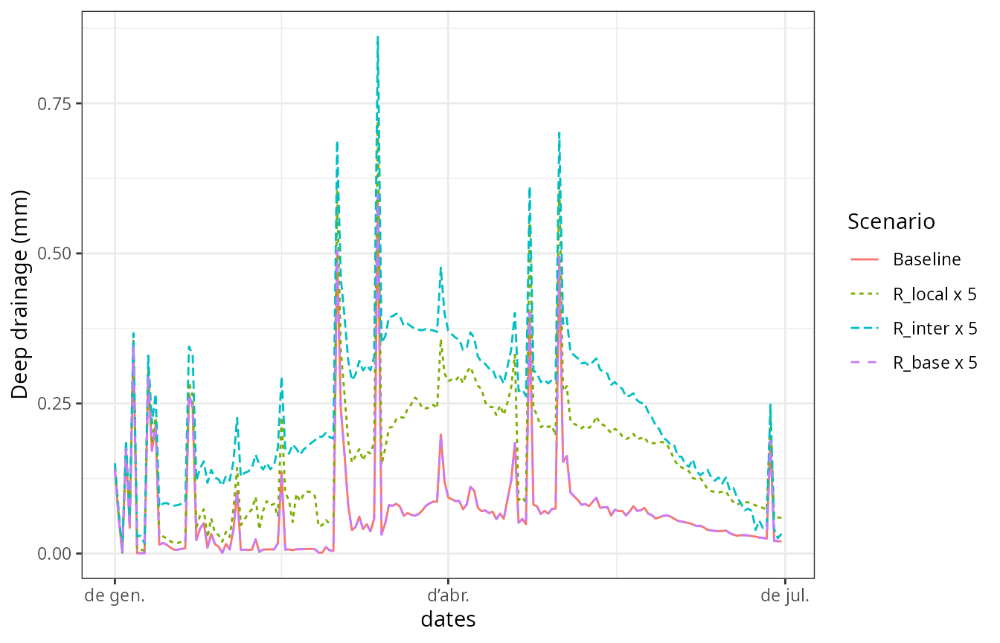
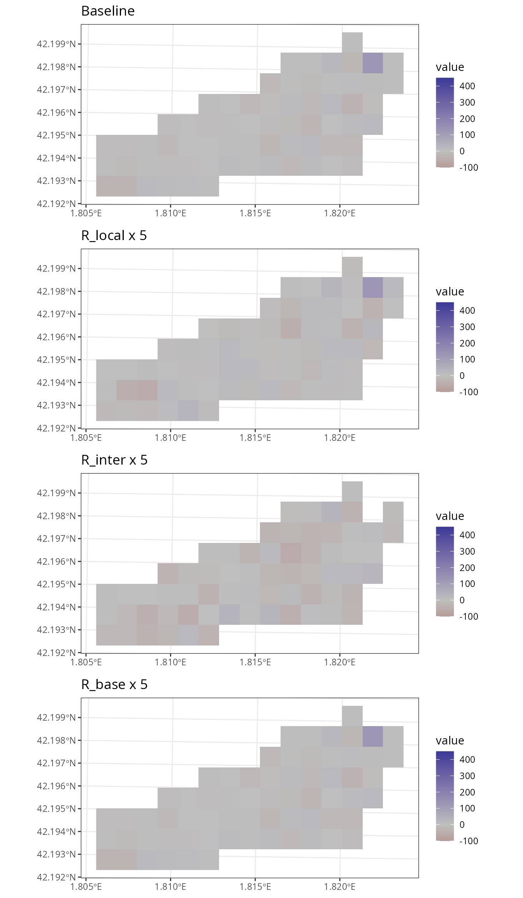
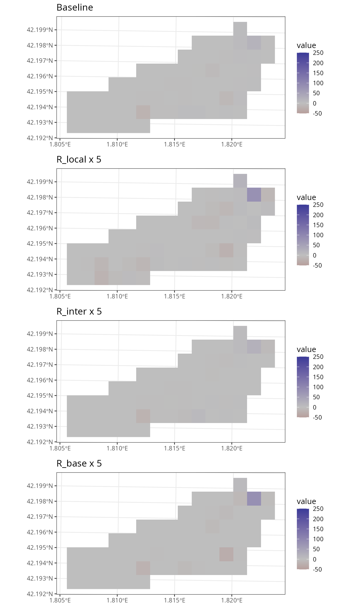

# Sensitivity to watershed parameters

## Introduction

The aim of this vignette is to illustrate the sensitivity of watershed
ecohydrological simulations (e.g. via
[`spwb_land()`](https://emf-creaf.github.io/medfateland/reference/spwb_land.md))
to variations in three watershed parameters for sub-model TETIS. These
parameters are scaling factors of hydraulic conductivities for soil
vertical fluxes, subsurface lateral fluxes and groundwater lateral
fluxes, respectively. They are referred to as `R_localflow`,
`R_interflow` and `R_baseflow`, respectively in the package.

## Preparation

Here we load a small example watershed included with the package, that
can be used to understand the inputs required:

``` r
data("example_watershed_burnin")
example_watershed_burnin
```

    ## Simple feature collection with 66 features and 15 fields
    ## Geometry type: POINT
    ## Dimension:     XY
    ## Bounding box:  xmin: 401430 ymin: 4671870 xmax: 402830 ymax: 4672570
    ## Projected CRS: WGS 84 / UTM zone 31N
    ## # A tibble: 66 × 16
    ##            geometry    id elevation slope aspect land_cover_type
    ##         <POINT [m]> <int>     <dbl> <dbl>  <dbl> <chr>          
    ##  1 (402630 4672570)     1      1162 11.3   79.2  wildland       
    ##  2 (402330 4672470)     2      1214 12.4   98.7  agriculture    
    ##  3 (402430 4672470)     3      1197 10.4  102.   wildland       
    ##  4 (402530 4672470)     4      1180  8.12  83.3  wildland       
    ##  5 (402630 4672470)     5      1164 13.9   96.8  wildland       
    ##  6 (402730 4672470)     6      1146 11.2    8.47 agriculture    
    ##  7 (402830 4672470)     7      1153  9.26 356.   agriculture    
    ##  8 (402230 4672370)     8      1237 14.5   75.1  wildland       
    ##  9 (402330 4672370)     9      1213 13.2   78.7  wildland       
    ## 10 (402430 4672370)    10      1198  8.56  75.6  agriculture    
    ## # ℹ 56 more rows
    ## # ℹ 10 more variables: forest <list>, soil <list>, state <list>,
    ## #   depth_to_bedrock <dbl>, bedrock_conductivity <dbl>, bedrock_porosity <dbl>,
    ## #   snowpack <dbl>, aquifer <dbl>, crop_factor <dbl>, outlet_backlog <dbl>

The watershed state is the result of a four-year burn-in period, in
order to have aquifer and soil moisture at a (dynamic) equilibrium.
Another spatial input is needed to describe the grid topology, which in
our case is an object of class `SpatRaster` from package **terra**:

``` r
r <-terra::rast(xmin = 401380, ymin = 4671820, xmax = 402880, ymax = 4672620, 
                nrow = 8, ncol = 15, crs = "epsg:32631")
r
```

    ## class       : SpatRaster 
    ## size        : 8, 15, 1  (nrow, ncol, nlyr)
    ## resolution  : 100, 100  (x, y)
    ## extent      : 401380, 402880, 4671820, 4672620  (xmin, xmax, ymin, ymax)
    ## coord. ref. : WGS 84 / UTM zone 31N (EPSG:32631)

Finally, we load an example weather data set to be used as climate
forcing, as well as the usual species parameter table:

``` r
# Load example weather dataset
data("examplemeteo")
# Set simulation period
dates <- seq(as.Date("2001-01-01"), as.Date("2001-06-30"), by="day")
# Load default medfate parameters
data("SpParamsMED")
```

## Initial values for scaling factors

Watershed simulations have overall control parameters. Notably, the user
needs to decide which sub-model will be used for lateral water transfer
processes, in this case:

``` r
ws_control <- default_watershed_control("tetis")
```

The default parameterization for the three scaling factors is:

``` r
ws_control$tetis_parameters
```

    ## $R_localflow
    ## [1] 1
    ## 
    ## $interflow
    ## [1] TRUE
    ## 
    ## $R_interflow
    ## [1] 50
    ## 
    ## $n_interflow
    ## [1] 1
    ## 
    ## $baseflow
    ## [1] TRUE
    ## 
    ## $R_baseflow
    ## [1] 5
    ## 
    ## $n_baseflow
    ## [1] 1
    ## 
    ## $free_drainage_outlets
    ## [1] TRUE
    ## 
    ## $num_daily_substeps
    ## [1] 1
    ## 
    ## $subwatersheds
    ## [1] FALSE
    ## 
    ## $max_overlap
    ## [1] 0.2
    ## 
    ## $rock_max_infiltration
    ## [1] 10
    ## 
    ## $deep_aquifer_loss
    ## [1] 0
    ## 
    ## $n_manning
    ## [1] 0.035

## Simulations

Since watershed simulations are time consuming, here we will only
perform four simulations, i.e. a baseline plus a modification of each of
the three scaling factors, one at a time.

**Baseline configuration** For the baseline configuration, we set the
three scaling factors to one:

``` r
ws_control$tetis_parameters$R_localflow <- 1
ws_control$tetis_parameters$R_interflow <- 1
ws_control$tetis_parameters$R_baseflow <- 1
```

Now we launch the simulation. Focus on the values (in mm) predicted for
aquifer exfiltration, saturation excess and, finally, the sum of the two
sources as export runoff.

``` r
res_0 <- spwb_land(r, example_watershed_burnin, SpParamsMED, examplemeteo, 
                   dates = dates, summary_frequency = "month", summary_blocks = "WaterBalance",
                   watershed_control = ws_control, progress = FALSE)
```

In the following we compare these values to those issued from
simulations with altered scaling factors.

**Increasing local vertical conductivity**

We begin our sensitivity analysis by increasing the vertical
conductivity five times:

``` r
ws_control$tetis_parameters$R_localflow <- 5
ws_control$tetis_parameters$R_interflow <- 1
ws_control$tetis_parameters$R_baseflow <- 1
res_L5 <- spwb_land(r, example_watershed_burnin, SpParamsMED, examplemeteo, 
                     dates = dates, summary_frequency = "month",summary_blocks = "WaterBalance",
                     watershed_control = ws_control, progress = FALSE)
```

Increasing `R_localflow` has the effect of increasing the drainage from
soils to the aquifer (hence, decreasing soil moisture). It also
increases capillarity rise due to the higher conductivity. Aquifer
exfiltration increases downslope as a consequence of the larger recharge
in upslope cells.

**Increasing subsurface lateral conductivity**

We now focus on the lateral conductivity of subsurface fluxes
(interflow):

``` r
ws_control$tetis_parameters$R_localflow <- 1
ws_control$tetis_parameters$R_interflow <- 5
ws_control$tetis_parameters$R_baseflow <- 1
res_I5 <- spwb_land(r, example_watershed_burnin, SpParamsMED, examplemeteo, 
                     dates = dates, summary_frequency = "month",summary_blocks = "WaterBalance",
                     watershed_control = ws_control, progress = FALSE)
```

Increasing lateral conductivity for subsurface fluxes increases the rate
of lateral exchange (i.e. the speed of the kinematic wave), resulting in
a much larger saturation excess. It also impacts the amount of aquifer
exfiltration.

**Increasing groundwater lateral conductivity** Let’s now perform a
simulation with an increased groundwater conductivity:

``` r
ws_control$tetis_parameters$R_localflow <- 1
ws_control$tetis_parameters$R_interflow <- 1
ws_control$tetis_parameters$R_baseflow <- 5
res_B5 <- spwb_land(r, example_watershed_burnin, SpParamsMED, examplemeteo, 
                     dates = dates, summary_frequency = "month",summary_blocks = "WaterBalance",
                     watershed_control = ws_control, progress = FALSE)
```

Increasing the speed of groundwater fluxes leads to a much shallower
water table downslope, significantly increasing the amount of
exfiltration.

## Comparing predicted fluxes

### Flux rate series

``` r
df1<- res_0$watershed_balance
df1$Scenario <- "Baseline"
df2<- res_L5$watershed_balance
df2$Scenario <- "R_local x 5"
df3<- res_I5$watershed_balance
df3$Scenario <- "R_inter x 5"
df4<- res_B5$watershed_balance
df4$Scenario <- "R_base x 5"
df<- rbind(df1,df2,df3, df4)
df$Scenario <- factor(df$Scenario, levels = c("Baseline", "R_local x 5", "R_inter x 5", "R_base x 5"))
```

**Drainage**

``` r
ggplot(df)+
  geom_line(aes(x=dates, y =DeepDrainage, col = Scenario, linetype = Scenario))+
  ylab("Deep drainage (mm)")+
  theme_bw()
```



**Aquifer exfiltration**

``` r
ggplot(df)+
  geom_line(aes(x=dates, y =AquiferExfiltration, col = Scenario, linetype = Scenario))+
  ylab("Aquifer exfiltration (mm)")+
  theme_bw()
```


### Flux rate maps

**Drainage to aquifer**

``` r
g1 <- plot_summary(res_0$sf, "DeepDrainage", date = "2001-04-01", r = r, limits = c(0, 100))+labs(title = "Baseline")
g2 <- plot_summary(res_L5$sf, "DeepDrainage", date = "2001-04-01", r = r, limits = c(0, 100))+labs(title = "R_local x 5")
g3 <- plot_summary(res_I5$sf, "DeepDrainage", date = "2001-04-01", r = r, limits = c(0, 100))+labs(title = "R_inter x 5")
g4 <- plot_summary(res_B5$sf, "DeepDrainage", date = "2001-04-01", r = r, limits = c(0, 100))+labs(title = "R_base x 5")
cowplot::plot_grid(g1, g2, g3, g4 , ncol = 1, nrow = 4)
```


**Sub-surface balance**

``` r
g1 <- plot_summary(res_0$sf, "InterflowBalance", date = "2001-04-01", r = r)+
  scale_fill_gradient2(limits = c(-100, 450), mid="gray", na.value = NA)+
  labs(title = "Baseline")
g2 <- plot_summary(res_L5$sf, "InterflowBalance", date = "2001-04-01", r = r)+
  scale_fill_gradient2(limits = c(-100, 450), mid="gray", na.value = NA)+
  labs(title = "R_local x 5")
g3 <- plot_summary(res_I5$sf, "InterflowBalance", date = "2001-04-01", r = r)+
  scale_fill_gradient2(limits = c(-100, 450), mid="gray", na.value = NA)+
  labs(title = "R_inter x 5")
g4 <- plot_summary(res_B5$sf, "InterflowBalance", date = "2001-04-01", r = r)+
  scale_fill_gradient2(limits = c(-100, 450), mid="gray", na.value = NA)+
  labs(title = "R_base x 5")
cowplot::plot_grid(g1, g2, g3, g4 , ncol = 1, nrow = 4)
```



**Groundwater balance**

``` r
g1 <- plot_summary(res_0$sf, "BaseflowBalance", date = "2001-04-01", r = r)+
  scale_fill_gradient2(mid="gray", limits = c(-50, 250), na.value = NA)+
  labs(title = "Baseline")
g2 <- plot_summary(res_L5$sf, "BaseflowBalance", date = "2001-04-01", r = r)+
  scale_fill_gradient2(mid="gray", limits = c(-50, 250), na.value = NA)+
  labs(title = "R_local x 5")
g3 <- plot_summary(res_I5$sf, "BaseflowBalance", date = "2001-04-01", r = r)+
  scale_fill_gradient2(mid="gray", limits = c(-50, 250), na.value = NA)+
  labs(title = "R_inter x 5")
g4 <- plot_summary(res_B5$sf, "BaseflowBalance", date = "2001-04-01", r = r)+
  scale_fill_gradient2(mid="gray", limits = c(-50, 250), na.value = NA)+
  labs(title = "R_base x 5")
cowplot::plot_grid(g1, g2, g3, g4 , ncol = 1, nrow = 4)
```


