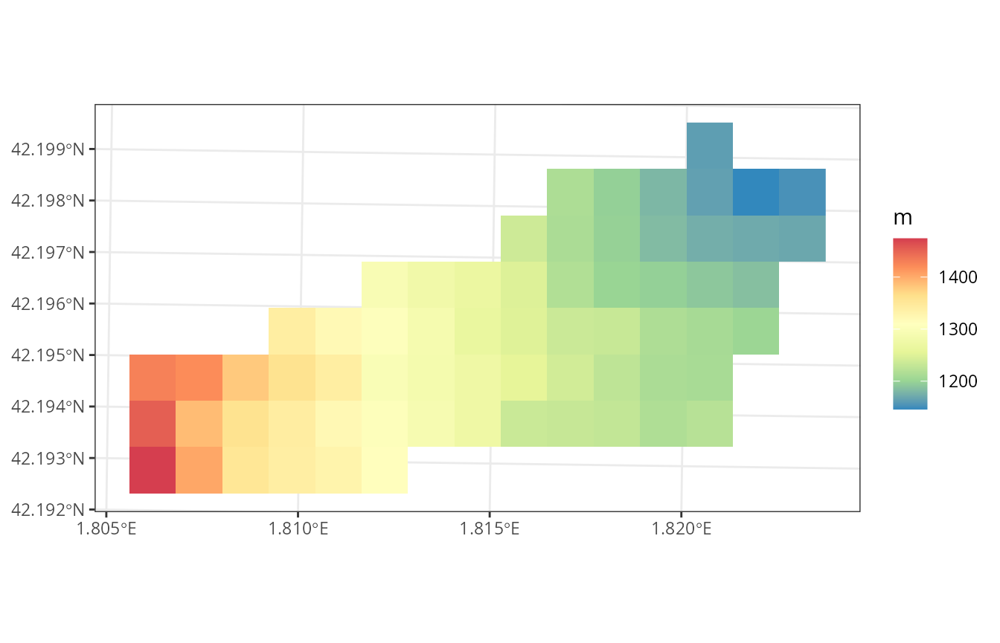
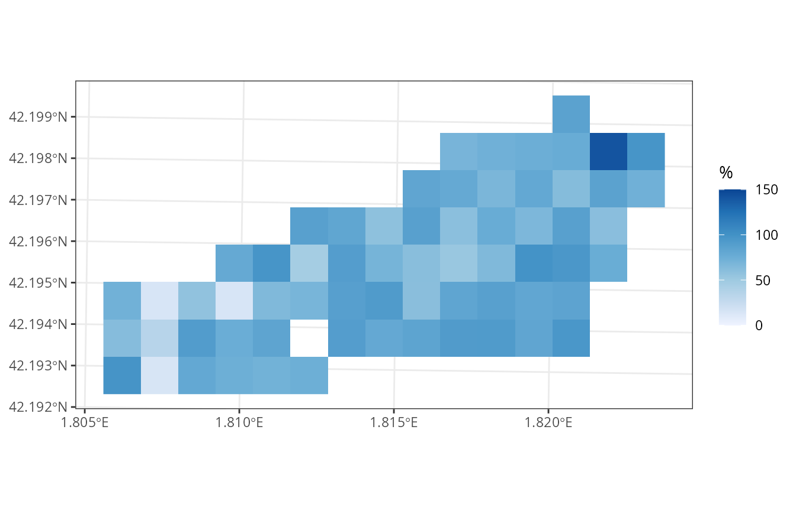
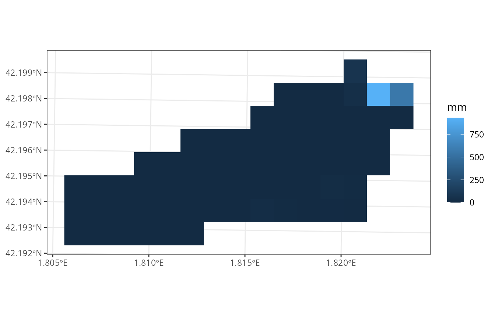
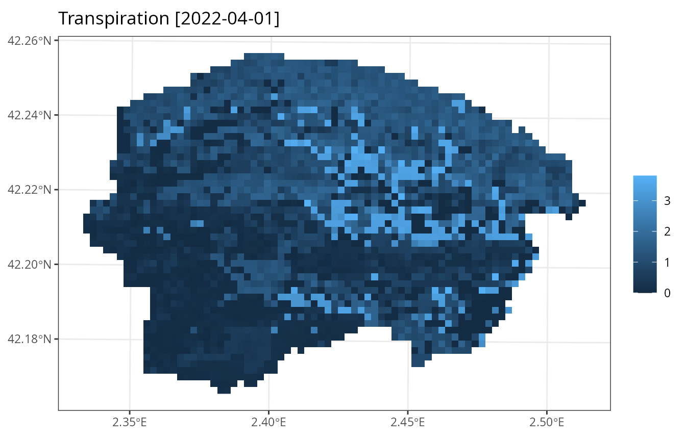

# Watershed simulations

## Aim

The aim of this vignette is to illustrate how to use **medfateland** (v.
2.8.3) to carry out simulations of forest function and dynamics on a set
of forest stands while including lateral water transfer processes. This
is done using functions
[`spwb_land()`](https://emf-creaf.github.io/medfateland/reference/spwb_land.md),
[`growth_land()`](https://emf-creaf.github.io/medfateland/reference/spwb_land.md)
and
[`fordyn_land()`](https://emf-creaf.github.io/medfateland/reference/spwb_land.md);
which are counterparts of functions
[`spwb()`](https://emf-creaf.github.io/medfate/reference/spwb.html),
[`growth()`](https://emf-creaf.github.io/medfate/reference/growth.html)
and
[`fordyn()`](https://emf-creaf.github.io/medfate/reference/fordyn.html)
in package **medfate**. We will focus here on function
[`spwb_land()`](https://emf-creaf.github.io/medfateland/reference/spwb_land.md),
but the other two functions would be used similarly. The same can be
said for functions
[`spwb_land_day()`](https://emf-creaf.github.io/medfateland/reference/spwb_land_day.md)
and
[`growth_land_day()`](https://emf-creaf.github.io/medfateland/reference/spwb_land_day.md),
which are counterparts of
[`spwb_day()`](https://emf-creaf.github.io/medfate/reference/spwb_day.html)
and
[`growth_day()`](https://emf-creaf.github.io/medfate/reference/spwb_day.html),
respectively.

## Preparation

Preparing inputs for watershed simulations can be tedious. Two main
inputs need to be assembled, described in the following two sections
(see also [Preparing inputs II: arbitrary
locations](https://emf-creaf.github.io/medfateland/articles/intro/PreparingInputs_II.html%5D)).

### Input sf objects

Here we load a small example watershed included with the package, that
can be used to understand the inputs required:

``` r
data("example_watershed")
example_watershed
```

    ## Simple feature collection with 66 features and 14 fields
    ## Geometry type: POINT
    ## Dimension:     XY
    ## Bounding box:  xmin: 401430 ymin: 4671870 xmax: 402830 ymax: 4672570
    ## Projected CRS: WGS 84 / UTM zone 31N
    ## # A tibble: 66 × 15
    ##            geometry    id elevation slope aspect land_cover_type
    ##  *      <POINT [m]> <int>     <dbl> <dbl>  <dbl> <chr>          
    ##  1 (402630 4672570)     1      1162 11.3   79.2  wildland       
    ##  2 (402330 4672470)     2      1214 12.4   98.7  agriculture    
    ##  3 (402430 4672470)     3      1197 10.4  102.   wildland       
    ##  4 (402530 4672470)     4      1180  8.12  83.3  wildland       
    ##  5 (402630 4672470)     5      1164 13.9   96.8  wildland       
    ##  6 (402730 4672470)     6      1146 11.2    8.47 agriculture    
    ##  7 (402830 4672470)     7      1153  9.26 356.   agriculture    
    ##  8 (402230 4672370)     8      1237 14.5   75.1  wildland       
    ##  9 (402330 4672370)     9      1213 13.2   78.7  wildland       
    ## 10 (402430 4672370)    10      1198  8.56  75.6  agriculture    
    ## # ℹ 56 more rows
    ## # ℹ 9 more variables: forest <list>, soil <list>, state <list>,
    ## #   depth_to_bedrock <dbl>, bedrock_conductivity <dbl>, bedrock_porosity <dbl>,
    ## #   snowpack <dbl>, aquifer <dbl>, crop_factor <dbl>

Some of the columns like `forest`, `soil`, `elevation`, or `state`, were
also present in the example for spatially-uncoupled simulations, so we
will not repeat them. The following describes additional columns that
are relevant here.

**Land cover type**

Simulations over watersheds normally include different land cover types.
These are described in column `land_cover_type`:

``` r
table(example_watershed$land_cover_type)
```

    ## 
    ## agriculture        rock    wildland 
    ##          17           1          48

Local and landscape processes will behave differently depending on the
land cover type.

**Aquifer and snowpack**

Columns `aquifer` and `snowpack` are used as state variables to store
the water content in the aquifer and snowpack, respectively.

**Crop factors**

Since the landscape contains agricultural lands, we need to define *crop
factors*, which will determine transpiration flow as a proportion of
potential evapotranspiration:

``` r
example_watershed$crop_factor = NA
example_watershed$crop_factor[example_watershed$land_cover_type=="agriculture"] = 0.75
```

**Channel network**

In large watersheds, the hydrological behavior of the model may not be
appropriate because water routing in the river channel is not
considered. If a binary column called `channel` is included in the
input, the model will use it to determine the river network, outlets and
the time in days to reach them (see function `overland_routing` for a
static analysis of channel routing).

### Grid topology

Note that the `sf` structure does not imply a grid *per se*. Point
geometry is used to describe the central coordinates of grid cells, but
does not describe the grid. This means that another spatial input is
needed to describe the grid topology, which in our case is an object of
class `SpatRaster` from package **terra**:

``` r
r <-terra::rast(xmin = 401380, ymin = 4671820, xmax = 402880, ymax = 4672620, 
                nrow = 8, ncol = 15, crs = "epsg:32631")
r
```

    ## class       : SpatRaster 
    ## size        : 8, 15, 1  (nrow, ncol, nlyr)
    ## resolution  : 100, 100  (x, y)
    ## extent      : 401380, 402880, 4671820, 4672620  (xmin, xmax, ymin, ymax)
    ## coord. ref. : WGS 84 / UTM zone 31N (EPSG:32631)

The `r` object must have the same coordinate reference system as the
`sf` object. Moreover, each grid cell can contain up to one point of the
`sf` (typically at the cell center). Some grid cells may be empty,
though, so that the actual simulations may be done on an incomplete
grid. Note that the raster does not contain data, only the topology is
needed (to define neighbors and cell sizes, for example). All relevant
attribute data is already included in the `sf` object.

Combining the `r` and `sf` objects allows drawing rasterized maps:

``` r
plot_variable(example_watershed, variable = "elevation", r = r)
```



### Watershed control options

Analogously to local-scale simulations with **medfate**, watershed
simulations have overall control parameters. Notably, the user needs to
decide which sub-model will be used for lateral water transfer processes
(a decision similar to choosing the plant transpiration sub-model in
**medfate**), by default “tetis”:

``` r
ws_control <- default_watershed_control("tetis")
```

## Initialization

Simulation model inputs need to be created for the target watershed
before launching simulations. This may be done automatically, though,
when calling watershed simulation functions, but in many occasions it is
practical to perform this step separately. If we plan to use function
[`spwb_land()`](https://emf-creaf.github.io/medfateland/reference/spwb_land.md),
watershed initialization would be as follows:

``` r
example_init <- initialize_landscape(example_watershed, SpParams = SpParamsMED,
                                     local_control = defaultControl(soilDomains = "buckets"))
```

    ## ℹ Creating 65 state objects for model 'spwb'.

    ## ✔ Creating 65 state objects for model 'spwb'. [17ms]

    ## 

    ## • Transpiration mode [Granier: 65, Sperry: 0, Sureau: 0]

    ## • Soil domains [buckets: 65, single: 0, dual: 0]

``` r
example_init
```

    ## Simple feature collection with 66 features and 14 fields
    ## Geometry type: POINT
    ## Dimension:     XY
    ## Bounding box:  xmin: 401430 ymin: 4671870 xmax: 402830 ymax: 4672570
    ## Projected CRS: WGS 84 / UTM zone 31N
    ## # A tibble: 66 × 15
    ##            geometry    id elevation slope aspect land_cover_type
    ##  *      <POINT [m]> <int>     <dbl> <dbl>  <dbl> <chr>          
    ##  1 (402630 4672570)     1      1162 11.3   79.2  wildland       
    ##  2 (402330 4672470)     2      1214 12.4   98.7  agriculture    
    ##  3 (402430 4672470)     3      1197 10.4  102.   wildland       
    ##  4 (402530 4672470)     4      1180  8.12  83.3  wildland       
    ##  5 (402630 4672470)     5      1164 13.9   96.8  wildland       
    ##  6 (402730 4672470)     6      1146 11.2    8.47 agriculture    
    ##  7 (402830 4672470)     7      1153  9.26 356.   agriculture    
    ##  8 (402230 4672370)     8      1237 14.5   75.1  wildland       
    ##  9 (402330 4672370)     9      1213 13.2   78.7  wildland       
    ## 10 (402430 4672370)    10      1198  8.56  75.6  agriculture    
    ## # ℹ 56 more rows
    ## # ℹ 9 more variables: forest <list>, soil <list>, state <list>,
    ## #   depth_to_bedrock <dbl>, bedrock_conductivity <dbl>, bedrock_porosity <dbl>,
    ## #   snowpack <dbl>, aquifer <dbl>, crop_factor <dbl>

Here we use function
[`defaultControl()`](https://emf-creaf.github.io/medfate/reference/defaultControl.html)
to specify the control parameters for local processes. Function
[`initialize_landscape()`](https://emf-creaf.github.io/medfateland/reference/initialize_landscape.md)
makes internal calls to
[`spwbInput()`](https://emf-creaf.github.io/medfate/reference/modelInput.html)
of **medfate** and defines a column `state` with the initialized inputs.

At this point is important to learn one option that may speed up
calculations. Initialization may be done while simplifying forest
structure to the dominant species (see function
[`forest_reduceToDominant()`](https://emf-creaf.github.io/medfate/reference/forest_simplification.html)
in package **medfate**). Hence, we can initialize using
`reduce_to_dominant = TRUE`:

``` r
example_simplified <- initialize_landscape(example_watershed, SpParams = SpParamsMED,
                                           local_control = defaultControl(soilDomains = "single"),
                                           reduce_to_dominant = TRUE)
```

    ## ℹ Creating 65 state objects for model 'spwb'.

    ## ✔ Creating 65 state objects for model 'spwb'. [7ms]

    ## 

    ## • Transpiration mode [Granier: 65, Sperry: 0, Sureau: 0]

    ## • Soil domains [buckets: 0, single: 65, dual: 0]

``` r
example_simplified
```

    ## Simple feature collection with 66 features and 14 fields
    ## Geometry type: POINT
    ## Dimension:     XY
    ## Bounding box:  xmin: 401430 ymin: 4671870 xmax: 402830 ymax: 4672570
    ## Projected CRS: WGS 84 / UTM zone 31N
    ## # A tibble: 66 × 15
    ##            geometry    id elevation slope aspect land_cover_type
    ##  *      <POINT [m]> <int>     <dbl> <dbl>  <dbl> <chr>          
    ##  1 (402630 4672570)     1      1162 11.3   79.2  wildland       
    ##  2 (402330 4672470)     2      1214 12.4   98.7  agriculture    
    ##  3 (402430 4672470)     3      1197 10.4  102.   wildland       
    ##  4 (402530 4672470)     4      1180  8.12  83.3  wildland       
    ##  5 (402630 4672470)     5      1164 13.9   96.8  wildland       
    ##  6 (402730 4672470)     6      1146 11.2    8.47 agriculture    
    ##  7 (402830 4672470)     7      1153  9.26 356.   agriculture    
    ##  8 (402230 4672370)     8      1237 14.5   75.1  wildland       
    ##  9 (402330 4672370)     9      1213 13.2   78.7  wildland       
    ## 10 (402430 4672370)    10      1198  8.56  75.6  agriculture    
    ## # ℹ 56 more rows
    ## # ℹ 9 more variables: forest <list>, soil <list>, state <list>,
    ## #   depth_to_bedrock <dbl>, bedrock_conductivity <dbl>, bedrock_porosity <dbl>,
    ## #   snowpack <dbl>, aquifer <dbl>, crop_factor <dbl>

For computational reasons, we will keep with this simplified
initialization in the next sections.

## Carrying out simulations

### Launching watershed simulations

To speed up calculations, we call function
[`spwb_land()`](https://emf-creaf.github.io/medfateland/reference/spwb_land.md)
for a single month:

``` r
dates <- seq(as.Date("2001-01-01"), as.Date("2001-01-31"), by="day")
res_ws1 <- spwb_land(r, example_simplified,
                    SpParamsMED, examplemeteo, dates = dates, summary_frequency = "month",
                    watershed_control = ws_control, progress = FALSE)
```

Although simulations are performed using daily temporal steps, parameter
`summary_frequency` allows storing cell-level results at coarser
temporal scales, to reduce the amount of memory in spatial results (see
also parameter `summary_blocks` to decide which outputs are to be kept
in summaries).

### Structure of simulation outputs

Function
[`spwb_land()`](https://emf-creaf.github.io/medfateland/reference/spwb_land.md)
and
[`growth_land()`](https://emf-creaf.github.io/medfateland/reference/spwb_land.md)
return a list with the following elements:

``` r
names(res_ws1)
```

    ## [1] "watershed_control"      "sf"                     "watershed_balance"     
    ## [4] "watershed_soil_balance" "channel_export_m3s"     "outlet_export_m3s"

Where `sf` is an object of class `sf`, analogous to those of functions
`*_spatial()`:

``` r
res_ws1$sf
```

    ## Simple feature collection with 66 features and 10 fields
    ## Geometry type: POINT
    ## Dimension:     XY
    ## Bounding box:  xmin: 401430 ymin: 4671870 xmax: 402830 ymax: 4672570
    ## Projected CRS: WGS 84 / UTM zone 31N
    ## # A tibble: 66 × 11
    ##            geometry state            aquifer snowpack summary  result outlet
    ##  *      <POINT [m]> <list>             <dbl>    <dbl> <list>   <list> <lgl> 
    ##  1 (402630 4672570) <spwbInpt [20]>   4.95       3.56 <dbl[…]> <NULL> FALSE 
    ##  2 (402330 4672470) <aspwbInp [4]>    0.0596     3.56 <dbl[…]> <NULL> FALSE 
    ##  3 (402430 4672470) <spwbInpt [20]>   0.299      3.56 <dbl[…]> <NULL> FALSE 
    ##  4 (402530 4672470) <spwbInpt [20]>   0.713      3.24 <dbl[…]> <NULL> FALSE 
    ##  5 (402630 4672470) <spwbInpt [20]>   8.75       3.56 <dbl[…]> <NULL> FALSE 
    ##  6 (402730 4672470) <aspwbInp [4]>  925.         3.56 <dbl[…]> <NULL> TRUE  
    ##  7 (402830 4672470) <aspwbInp [4]>  525.         3.56 <dbl[…]> <NULL> FALSE 
    ##  8 (402230 4672370) <spwbInpt [20]>   0.0672     3.56 <dbl[…]> <NULL> FALSE 
    ##  9 (402330 4672370) <spwbInpt [20]>   0.394      3.56 <dbl[…]> <NULL> FALSE 
    ## 10 (402430 4672370) <aspwbInp [4]>    1.04       3.56 <dbl[…]> <NULL> FALSE 
    ## # ℹ 56 more rows
    ## # ℹ 4 more variables: channel <lgl>, target_outlet <int>, outlet_backlog <dbl>,
    ## #   subwatershed <int>

Columns `state`, `aquifer` and `snowpack` contain state variables,
whereas `summary` contains temporal summaries for all cells. Column
`result` is empty in this case, but see below.

The next two elements of the simulation result list, namely
`watershed_balance` and `watershed_soil_balance`, refer to
watershed-level results. For example, `watershed_balance` contains the
daily elements of the water balance at the watershed level, including
the amount of water exported in mm in the last column.

``` r
head(res_ws1$watershed_balance)
```

    ##        dates       PET Precipitation      Rain Snow Snowmelt Interception
    ## 1 2001-01-01 0.9003872      4.869109  4.869109    0        0     1.524828
    ## 2 2001-01-02 1.5958674      2.498292  2.498292    0        0     1.210543
    ## 3 2001-01-03 1.3417718      0.000000  0.000000    0        0     0.000000
    ## 4 2001-01-04 0.6054039      5.796973  5.796973    0        0     1.515057
    ## 5 2001-01-05 1.6387324      1.884401  1.884401    0        0     1.016077
    ## 6 2001-01-06 1.2058183     13.359801 13.359801    0        0     1.704274
    ##      NetRain Infiltration InfiltrationExcess SaturationExcess  CellRunon
    ## 1  3.3442808    3.3442808         0.00000000                0 0.00000000
    ## 2  1.2877488    1.2877488         0.00000000                0 0.00000000
    ## 3  0.0000000    0.0000000         0.00000000                0 0.00000000
    ## 4  4.2819157    4.2819157         0.00000000                0 0.00000000
    ## 5  0.8683247    0.8683247         0.00000000                0 0.00000000
    ## 6 11.6555266   11.6555266         0.05090607                0 0.05090607
    ##   CellRunoff DeepDrainage CapillarityRise DeepAquiferLoss SoilEvaporation
    ## 1 0.00000000  0.077285504               0               0      0.26502076
    ## 2 0.00000000  0.041094767               0               0      0.16789385
    ## 3 0.00000000  0.002816163               0               0      0.18274377
    ## 4 0.00000000  0.091668854               0               0      0.09931928
    ## 5 0.00000000  0.031688356               0               0      0.14827048
    ## 6 0.05090607  0.157048292               0               0      0.11148804
    ##   Transpiration HerbTranspiration InterflowBalance BaseflowBalance
    ## 1     0.4309517                 0     0.000000e+00   -5.174601e-18
    ## 2     0.7632100                 0    -5.046468e-17    3.195111e-18
    ## 3     0.6410802                 0     8.915427e-17    7.454711e-18
    ## 4     0.2894745                 0     1.286849e-16    9.317568e-18
    ## 5     0.7836103                 0     1.648513e-16    7.030887e-18
    ## 6     0.5764833                 0    -1.366752e-17   -5.986110e-18
    ##   AquiferExfiltration ChannelExport WatershedExport NegativeAquiferCorrection
    ## 1                   0             0               0                         0
    ## 2                   0             0               0                         0
    ## 3                   0             0               0                         0
    ## 4                   0             0               0                         0
    ## 5                   0             0               0                         0
    ## 6                   0             0               0                         0

Values of this output data frame are averages across cells in the
landscape. Data frame `watershed_soil_balance` is similar to
`watershed_balance` but focusing on cells that have a soil
(i.e. excluding artificial, rock or water land cover). Finally,
`channel_export_m3s` contains the average river flow reaching each
channel cell each day and `outlet_export_m3s` contains the average river
flow reaching each outlet cell each day (both in units of cubic meters
per second):

``` r
head(res_ws1$outlet_export_m3s)
```

    ##            6
    ## 2001-01-01 0
    ## 2001-01-02 0
    ## 2001-01-03 0
    ## 2001-01-04 0
    ## 2001-01-05 0
    ## 2001-01-06 0

### Watershed-level summaries and plots

The components of watershed-level water balance can be displayed in the
console using a tailored
[`summary()`](https://rdrr.io/r/base/summary.html) function:

``` r
summary(res_ws1)
```

    ##   Snowpack water balance components:
    ##     Snow fall (mm) 16.65  Snow melt (mm) 13.1
    ##   Soil water balance components:
    ##     Infiltration (mm) 54.71  Saturation excess (mm) 0
    ##     Deep drainage (mm) 39.33  Capillarity rise (mm) 0
    ##     Soil evaporation (mm) 1.59  Plant transpiration (mm) 15.23
    ##     Interflow balance (mm) 0
    ##   Aquifer water balance components:
    ##     Deep drainage (mm) 39.76  Capillarity rise (mm) 0
    ##     Exfiltration (mm) 16.8  Deep aquifer loss (mm) 0
    ##     Negative aquifer correction (mm) 0
    ##   Watershed water balance components:
    ##     Precipitation (mm) 74.75
    ##     Interception (mm) 16.29  Soil evaporation (mm) 1.56
    ##     Plant transpiration (mm) 15
    ##     Subsurface flow balance (mm) 0
    ##     Groundwater flow balance (mm) 0
    ##     Export runoff (mm) 16.8

Analogously to plots available with package **medfate**, one can display
time series of watershed-level water balance components using function
[`plot()`](https://rdrr.io/r/graphics/plot.default.html), for example:

``` r
plot(res_ws1, type = "Export")
```


or the usual combination of hietograph and hydrograph using:

``` r
plot(res_ws1, type = "Hydrograph")
```


### Accessing and plotting cell summaries

Unlike
[`spwb_spatial()`](https://emf-creaf.github.io/medfateland/reference/spwb_spatial.md)
where summaries could be arbitrarily generated *a posteriori* from
simulation results, with
[`spwb_land()`](https://emf-creaf.github.io/medfateland/reference/spwb_land.md)
the summaries are always fixed and embedded with the simulation result.
For example, we can inspect the summaries for a given landscape cell
using:

``` r
res_ws1$sf$summary[[1]]
```

    ##            MinTemperature MaxTemperature      PET     Rain     Snow      SWE
    ## 2001-01-01      -3.203556       2.427977 31.14151 58.09884 16.65065 1.949332
    ##                 RWC SoilVol      WTD      DTA
    ## 2001-01-01 105.9293 570.065 3432.313 15.47638

Additional variables (water balance components, carbon balance
components, etc.) can be added to summaries via parameter
`summary_blocks`. Some of these summaries are temporal averages
(e.g. state variables), while others are temporal sums (e.g. water or
carbon balance components), depending on the variable.

Maps of variable summaries can be drawn from the result of function
[`spwb_land()`](https://emf-creaf.github.io/medfateland/reference/spwb_land.md)
in a similar way as done for
[`spwb_spatial()`](https://emf-creaf.github.io/medfateland/reference/spwb_spatial.md).
As an example we display a map of the average soil relative water
content during the simulated month:

``` r
plot_summary(res_ws1$sf, variable = "RWC", date = "2001-01-01", r = r)
```


As for uncoupled simulations, we can use function
[`unnest_summary()`](https://emf-creaf.github.io/medfateland/reference/unnest_summary.md)
to reformat all cell summaries and facilitate post-processing:

``` r
head(unnest_summary(res_ws1))
```

    ## Simple feature collection with 6 features and 11 fields
    ## Geometry type: POINT
    ## Dimension:     XY
    ## Bounding box:  xmin: 402330 ymin: 4672470 xmax: 402730 ymax: 4672570
    ## Projected CRS: WGS 84 / UTM zone 31N
    ## # A tibble: 6 × 12
    ##           geometry date       MinTemperature MaxTemperature   PET  Rain
    ##        <POINT [m]> <chr>               <dbl>          <dbl> <dbl> <dbl>
    ## 1 (402630 4672570) 2001-01-01          -3.20           2.43  31.1  58.1
    ## 2 (402330 4672470) 2001-01-01          -3.20           2.43  32.6  58.1
    ## 3 (402430 4672470) 2001-01-01          -3.20           2.43  32.7  58.1
    ## 4 (402530 4672470) 2001-01-01          -3.20           2.43  31.5  58.1
    ## 5 (402630 4672470) 2001-01-01          -3.20           2.43  32.5  58.1
    ## 6 (402730 4672470) 2001-01-01          -3.20           2.43  30.2  58.1
    ## # ℹ 6 more variables: Snow <dbl>, SWE <dbl>, RWC <dbl>, SoilVol <dbl>,
    ## #   WTD <dbl>, DTA <dbl>

### Full simulation results for specific cells

The idea of generating summaries arises from the fact that local models
can produce a large amount of results, of which only some are of
interest at the landscape level. Nevertheless, it is possible to specify
those cells for which full daily results are desired. This is done by
adding a column `result_cell` in the input `sf` object:

``` r
# Set request for daily model results in cells number 3 and 9
example_simplified$result_cell <- FALSE
example_simplified$result_cell[c(3,9)] <- TRUE
```

If we launch the simulations again (omitting progress information):

``` r
res_ws1 <- spwb_land(r, example_simplified,
                    SpParamsMED, examplemeteo, dates = dates, summary_frequency = "month",
                    watershed_control = ws_control, progress = FALSE)
```

We can now retrieve the results of the desired cell, e.g. the third one,
in column `result` of `sf`:

``` r
S <- res_ws1$sf$result[[3]]
class(S)
```

    ## [1] "spwb" "list"

This object has class `spwb` and the same structure returned by function
[`spwb()`](https://emf-creaf.github.io/medfate/reference/spwb.html) of
**medfate**. Hence, we can inspect daily results using functions
[`shinyplot()`](https://emf-creaf.github.io/medfate/reference/shinyplot.html)
or [`plot()`](https://rdrr.io/r/graphics/plot.default.html), for
example:

``` r
plot(S, "SoilRWC")
```



### Continuing a previous simulation

The result of a simulation includes an element `state`, which stores the
state of soil and stand variables at the end of the simulation. This
information can be used to perform a new simulation from the point where
the first one ended. In order to do so, we need to update the state
variables in spatial object with their values at the end of the
simulation, using function
[`update_landscape()`](https://emf-creaf.github.io/medfateland/reference/update_landscape.md):

``` r
example_watershed_mod <- update_landscape(example_watershed, res_ws1)
names(example_watershed_mod)
```

    ##  [1] "geometry"             "id"                   "elevation"           
    ##  [4] "slope"                "aspect"               "land_cover_type"     
    ##  [7] "forest"               "soil"                 "state"               
    ## [10] "depth_to_bedrock"     "bedrock_conductivity" "bedrock_porosity"    
    ## [13] "snowpack"             "aquifer"              "crop_factor"         
    ## [16] "outlet_backlog"

Note that a new column `state` appears in now in the **sf** object. We
can check the effect by drawing the relative water content:

``` r
plot_variable(example_watershed_mod, variable = "soil_rwc_curr", r = r)
```



Now we can continue our simulation, in this case adding an extra month:

``` r
dates <- seq(as.Date("2001-02-01"), as.Date("2001-02-28"), by="day")
res_ws3 <- spwb_land(r, example_watershed_mod,
                    SpParamsMED, examplemeteo, dates = dates, summary_frequency = "month",
                    watershed_control = ws_control, progress = FALSE)
```

The fact that no cell required initialization is an indication that we
used an already initialized landscape.

### Burn-in periods

Like other distributed hydrological models, watershed simulations with
**medfateland** will normally require a burn-in period to allow soil
moisture and aquifer levels to reach a dynamic equilibrium. We recommend
users to use at least one or two years of burn-in period, but this will
depend on the size of the watershed. In **medfate** we provide users
with a copy of the example watershed, where burn-in period has already
been simulated. This can be seen by inspecting the aquifer level:

``` r
data("example_watershed_burnin")
plot_variable(example_watershed_burnin, variable = "aquifer", r = r)
```


If we run a one-month simulation on this data set we can then compare
the output before and after the burn-in period to illustrate its
importance:

``` r
dates <- seq(as.Date("2001-01-01"), as.Date("2001-01-31"), by="day")
res_ws3 <- spwb_land(r, example_watershed_burnin,
                    SpParamsMED, examplemeteo, dates = dates, summary_frequency = "month",
                    watershed_control = ws_control, progress = FALSE)
data.frame("before" = res_ws1$watershed_balance$WatershedExport, 
           "after" = res_ws3$watershed_balance$WatershedExport)
```

    ##       before      after
    ## 1  0.0000000 0.12816556
    ## 2  0.0000000 0.09986587
    ## 3  0.0000000 0.07090369
    ## 4  0.0000000 0.17218497
    ## 5  0.0000000 0.12998927
    ## 6  0.0000000 0.33157200
    ## 7  0.0000000 0.21527091
    ## 8  0.0000000 0.24910774
    ## 9  0.0000000 0.24349869
    ## 10 0.0000000 0.40573446
    ## 11 0.0000000 0.40353996
    ## 12 0.0000000 0.52421850
    ## 13 0.0000000 0.52801014
    ## 14 0.0000000 0.60477634
    ## 15 0.0000000 0.62605392
    ## 16 0.0000000 0.63996737
    ## 17 0.0000000 0.63444712
    ## 18 0.0000000 0.62184369
    ## 19 0.3766724 0.60503029
    ## 20 0.7494492 0.58443928
    ## 21 0.9717337 0.69000921
    ## 22 1.1772553 0.71876789
    ## 23 1.2670371 0.70530849
    ## 24 1.3620809 0.75554198
    ## 25 1.4573525 0.76373163
    ## 26 1.5647762 0.74564720
    ## 27 1.6437539 0.72447288
    ## 28 1.6449920 0.71724418
    ## 29 1.5856965 0.68262892
    ## 30 1.5163174 0.64161090
    ## 31 1.4789010 0.61954667

### Simulations of watershed forest dynamics

Running
[`growth_land()`](https://emf-creaf.github.io/medfateland/reference/spwb_land.md)
is very similar to running
[`spwb_land()`](https://emf-creaf.github.io/medfateland/reference/spwb_land.md).
However, a few things change when we want to simulate forest dynamics
using
[`fordyn_land()`](https://emf-creaf.github.io/medfateland/reference/spwb_land.md).
Regarding the `sf` input, an additional column `management_arguments`
may be defined to specify the forest management arguments
(i.e. silviculture) of cells. Furthermore, the function does not allow
choosing the temporal scale of summaries. Strong simplification of
forest structure to dominant species will not normally make sense in
this kind of simulation, since the focus is on forest dynamics.

A call to
[`fordyn_land()`](https://emf-creaf.github.io/medfateland/reference/spwb_land.md)
for a single year is given here, as an example, starting from the
initial example watershed:

``` r
res_ws4 <- fordyn_land(r, example_watershed,
                       SpParamsMED, examplemeteo,
                       watershed_control = ws_control, progress = FALSE)
```

### Simulations using weather interpolation

Large watersheds will have spatial differences in climatic conditions
like temperature, precipitation. Specifying a single weather data frame
for all the watershed may be not suitable in this case. Specifying a
different weather data frame for each watershed cell can also be a
problem, if spatial resolution is high, due to the huge data
requirements. A solution for this can be using interpolation on the fly,
inside watershed simulations. This can be done by supplying an
**interpolator** object (or a list of them), as defined in package
**meteoland**. Here we use the example data provided in the package:

``` r
interpolator <- meteoland::with_meteo(meteoland_meteo_example, verbose = FALSE) |>
    meteoland::create_meteo_interpolator(params = defaultInterpolationParams())
```

    ## ℹ Creating interpolator...

    ##   • Calculating smoothed variables...

    ##   • Updating intial_Rp parameter with the actual stations mean distance...

    ## ✔ Interpolator created.

Once we have this object, using it is straightforward:

``` r
res_ws5 <- spwb_land(r, example_watershed_burnin, SpParamsMED, 
                     meteo = interpolator, summary_frequency = "month",
                     watershed_control = ws_control, progress = FALSE)
```

Note that we did not define dates, which are taken from the interpolator
data. If we plot the minimum temperature, we will appreciate the spatial
variation in climate:

``` r
plot_summary(res_ws5$sf, variable = "MinTemperature", date = "2022-04-01", r = r)
```


For large watersheds and fine spatial resolution interpolation can
become slow. One can then specify that interpolation is performed on a
coarser grid, by using a watershed control parameter, for example:

``` r
ws_control$weather_aggregation_factor <- 3
```

To illustrate its effect, we repeat the previous simulation and plot the
minimum temperature:

``` r
res_ws6 <- spwb_land(r, example_watershed_burnin, SpParamsMED, 
                     meteo = interpolator, summary_frequency = "month",
                     watershed_control = ws_control, progress = FALSE)
plot_summary(res_ws6$sf, variable = "MinTemperature", date = "2022-04-01", r = r)
```


## Parallel simulations using subwatersheds

Simulations can be rather slow even for moderately-sized watersheds. For
these reason, **medfateland** now incorporates the possibility to
perform parallel simulations in subwatersheds, and then aggregate the
results. To illustrate this feature we will use the data set of Bianya
watershed (see [Preparing inputs II: arbitrary
locations](https://emf-creaf.github.io/medfateland/articles/intro/PreparingInputs_II.html%5D);
you can find the dataset in the **medfateland** GitHub repository).

We begin by loading the raster and `sf` inputs for Bianya:

``` r
r <- terra::rast("../intro/bianya_raster.tif")
sf <- readRDS("../intro/bianya.rds")
```

If we draw the elevation map, we will visually identify two
subwatersheds:

``` r
plot_variable(sf, variable = "elevation", r = r)
```


Package **medfateland** includes function
[`overland_routing()`](https://emf-creaf.github.io/medfateland/reference/overland_routing.md)
to statically illustrate how overland runoff processes are dealt with
(i.e. distribution of runoff among neighbors, channel routing, etc.).

``` r
or <- overland_routing(r, sf)
head(or)
```

    ## Simple feature collection with 6 features and 12 fields
    ## Geometry type: POINT
    ## Dimension:     XY
    ## Bounding box:  xmin: 449799.3 ymin: 4678387 xmax: 450794.5 ymax: 4678387
    ## Projected CRS: ETRS89 / UTM zone 31N
    ## # A tibble: 6 × 13
    ##             geometry elevation slope waterRank waterOrder queenNeigh
    ##          <POINT [m]>     <dbl> <dbl>     <int>      <int> <list>    
    ## 1 (449799.3 4678387)      900.  24.5       401       2533 <int [4]> 
    ## 2 (449998.3 4678387)      901.  27.5       399       2455 <int [5]> 
    ## 3 (450197.4 4678387)      880.  23.2       446       2416 <int [5]> 
    ## 4 (450396.4 4678387)      843.  27.9       554       2487 <int [5]> 
    ## 5 (450595.5 4678387)      878.  16.9       454       2534 <int [5]> 
    ## 6 (450794.5 4678387)      860.  22.4       508       2511 <int [4]> 
    ## # ℹ 7 more variables: waterQ <list>, channel <lgl>, outlet <lgl>,
    ## #   target_outlet <int>, distance_to_outlet <dbl>, outlet_backlog <dbl>,
    ## #   subwatershed <int>

In this function we can specifically ask for sub-watersheds, as follows:

``` r
or <- overland_routing(r, sf, subwatersheds = TRUE,
                       max_overlap = 0.3)
```

In short, sub-watershed definition consists in: (a) finding the drainage
basin of each outlet or channel cell; (b) aggregating drainage basins
until the overlap is less than the specified parameter; and (c) deciding
to which sub-watershed each border cell belongs to. This function
identified three sub-watersheds, one of them being an isolated channel
cell:

``` r
plot(or[, "subwatershed"])
```



Let’s now illustrate how to perform watershed simulations with
parallelization and subwatersheds. We begin by initializing the input
(here we used a `"buckets"` soil hydrology to speed up calculations, but
`"single"` would be more appropriate).

``` r
sf_init <- initialize_landscape(sf, SpParams = SpParamsMED,
                                local_control = defaultControl(soilDomains = "buckets"),
                                progress = FALSE)
```

Subwatershed definition is controlled via watershed control options as
follows (simulation functions internally call
[`overland_routing()`](https://emf-creaf.github.io/medfateland/reference/overland_routing.md)):

``` r
ws_control <- default_watershed_control("tetis")
ws_control$tetis_parameters$subwatersheds <- TRUE
ws_control$tetis_parameters$max_overlap <- 0.3
```

Now, we are ready to launch the watershed simulation with
parallelization. This consists in performing simulations for each
subwatershed independently, aggregating the results and, finally,
performing channel routing.

For simplicity, we only simulate five days. We ask for console output to
see what the model is doing:

``` r
dates <- seq(as.Date("2022-04-01"), as.Date("2022-04-05"), by="day")
res_ws7 <- spwb_land(r, sf_init,
                    SpParamsMED, interpolator, dates = dates,
                    summary_frequency = "day", summary_blocks = "WaterBalance",
                    watershed_control = ws_control, progress = TRUE,
                    parallelize = TRUE)
```

    ## 

    ## ── Simulation of model 'spwb' over a watershed ─────────────────────────────────

    ## 

    ## ── INPUT CHECKING ──

    ## 

    ## ℹ Checking raster topology

    ## ✔ Checking raster topology [20ms]

    ## 

    ## ℹ Checking 'sf' data columns

    ## ℹ Column 'snowpack' was missing in 'sf'. Initializing empty snowpack.

    ## ℹ Checking 'sf' data columnsℹ Minimum bedrock porosity set to 0.1%.
    ## ℹ Checking 'sf' data columnsℹ Column 'aquifer' was missing in 'sf'. Initializing empty aquifer.
    ## ℹ Checking 'sf' data columns✔ Checking 'sf' data columns [5.1s]
    ## 
    ## ℹ Determining neighbors and overland routing for TETIS
    ## ✔ Determining neighbors and overland routing for TETIS [2.7s]
    ## 
    ## • Hydrological model: TETIS
    ## • Number of grid cells: 3825 Number of target cells: 2573
    ## • Average cell area: 39575 m2, Total area: 15138 ha, Target area: 10183 ha
    ## • Cell land use [wildland: 2161 agriculture: 331 artificial: 78 rock: 0 water:
    ## 3]
    ## • Cells with soil: 2492
    ## • Number of days to simulate: 5
    ## • Number of temporal cell summaries: 5
    ## • Number of cells with daily model results requested: 0
    ## • Number of channel cells: 158
    ## • Number of outlet cells: 28
    ## • Number of subwatersheds: 3
    ## • Weather interpolation factor: 1
    ## 
    ## ── INITIALISATION ──
    ## 
    ## ℹ All state objects are already available for 'spwb'.
    ## • Transpiration mode [Granier: 2492, Sperry: 0, Sureau: 0]
    ## • Soil domains [buckets: 2492, single: 0, dual: 0]
    ## 
    ## ── PARALLEL SIMULATION of 3 SUB-WATERSHEDS in 3 NODES ──
    ## 
    ## ── MERGING SUB-WATERSHED RESULTS ──
    ## 
    ## ── CHANNEL ROUTING ──
    ## 
    ## • Initial outlet backlog sum (m3): 0
    ## • Channel balance target (m3): 0 outlet change (m3): 0 backlog change (m3): 0
    ## • Final outlet backlog sum (m3): 0
    ## 
    ## ── FINAL BALANCE CHECK ──
    ## 
    ## • Final channel sum (m3): 0
    ## • Final outlet sum (m3): 0
    ## • Final watershed export sum (m3): 0

As an example of the output, we show a map of woody plant transpiration
(note that we asked for water balance components using
`summary_blocks = "WaterBalance"`:

``` r
plot_summary(res_ws7, variable = "Transpiration", date = "2022-04-01", r = r)
```


