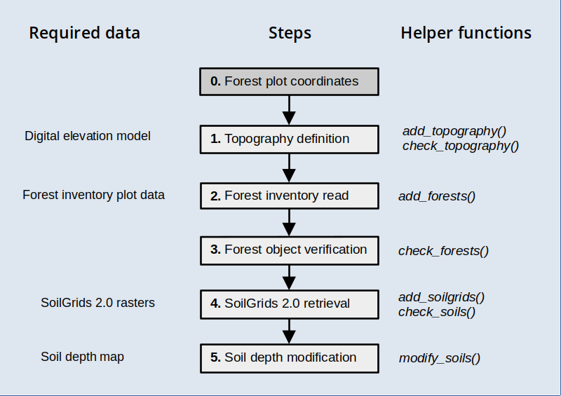

```{r setup, include=FALSE}
knitr::opts_chunk$set(echo = TRUE)
```

## Aim

This vignette has been created to illustrate the creation of spatial inputs to be used in model simulations with the package, starting **from forest inventory plot data**. 

Before reading this vignette, users should be familiar with *forest* and *soil* structures in package **medfate**. Moreover, a brief introduction to spatial structures used in **medfateland** package is given in  vignette [Package overview](https://emf-creaf.github.io/medfateland/articles/intro/PackageOverview.html) and examples are given in vignettes [Spatially-uncoupled simulations](https://emf-creaf.github.io/medfateland/articles/runmodels/SpatiallyUncoupledSimulations.html). 

Let's first load necessary libraries:

```{r, echo = TRUE, message= FALSE}
library(medfate)
library(medfateland)
library(ggplot2)
library(tidyterra)
```


The first section, **A**, shows how to create the spatial inputs from forest inventory data in tree lists, which will be the general case. The second section, **B**, shows the differences that occur when the starting point is a data structure issued from package **forestables**. For that part we need package **forestables** in our environment, because we will take an example data table from there. The package can be installed from GitHub:
```{r}
# remotes::install_github("emf-creaf/forestables")
library(forestables)
```

## A. General procedure

The functions introduced in this procedure are meant to be executed sequentially to progressively add spatial information, as illustrated in the workflow below, but users are free to use them in the most convenient way.

```{r, out.width='80%', fig.align="center", echo=FALSE, fig.alt="Initialization workflow for forest inventory data"}

```

### Target locations

Package **medfate** includes a small dataset of tree data, corresponding to a dense holm oak forest in Poblet (Catalonia, Spain). As a result of the abandonment of previous coppicing exploitation, there is a high density of stems per individual. The data set includes data from a control plot and managed plot, where for the second two inventories have been carried out, one before management (thinning operation) and another afterwards. Hence, there are three stand structures.

We begin by defining an `sf` object with the target locations and forest stand identifiers (column `id`):

```{r}
# Define sf with three stands
cc <- rbind(c(1.0215, 41.3432),
            c(1.0219, 41.3443), 
            c(1.0219, 41.3443))
d <- data.frame(lon = cc[,1], lat = cc[,2], 
                id = c("POBL_CTL", "POBL_THI_BEF", "POBL_THI_AFT"))
x <- sf::st_as_sf(d, coords = c("lon", "lat"), crs = 4326)
x
```

where `POBL_CTL` is the control forest plot, `POBL_THI_BEF` is the managed plot before thinning and `POBL_THI_AFT` is the managed plot after thinning.

### Topography

Once an object `sf` has been defined with target locations, we need to determine topographic features (elevation, slope, aspect) and land cover corresponding to those locations. You should have access to a Digital Elevation Model (DEM) at a desired resolution. Here we will use a DEM raster for Catalonia at 30 m resolution, which we load using package `terra`:

```{r}
dataset_path <- "~/OneDrive/EMF_datasets/"
dem <- terra::rast(paste0(dataset_path,"Topography/Products/Catalunya/MET30m_ETRS89_UTM31_ICGC.tif"))
dem
```

Having these inputs, we can use function `add_topography()` to add topographic features to our starting `sf`:
```{r}
y_1 <- add_topography(x, dem = dem, progress = FALSE)
y_1
```

We can check that there are no missing values in topographic features:

```{r}
check_topography(y_1)
```


### Forest inventory data parsing

The next step is to define `forest` objects for our simulations. Forests should be defined for all target locations whose land cover is defined as `wildland` (here, all three stands). In our case, we will define `forest` objects from tree records in Poblet. While at this point you would read your own data from a file or data base, here we simply load the data from **medfate**:

```{r}
data(poblet_trees)
head(poblet_trees)
```

There are only four columns in the data set. `Plot.Code` identifies the forest stand, `Indv.Ref` is the tree number,  `Species` is the scientific name of the tree species and `Diameter.cm` is the tree diameter in cm. To properly parse forest inventory data, we need to define a mapping from these variables into names meaningful for **medfate**. For this, we can check function `forest_mapTreeTable()` in the package. Furthermore, we need to map the forest stand identifier. If we exclude `Indv.Ref`, the other variables would be mapped using:

```{r}
mapping <- c("id" = "Plot.Code", "Species.name" = "Species", "DBH" = "Diameter.cm")
```

Now we are ready to call function `add_forests()`, which should facilitate the creation of forest objects:

```{r}
y_2 <- add_forests(y_1, tree_table = poblet_trees, tree_mapping = mapping, 
                   SpParams = SpParamsMED)
```

Note that two warnings were raised, informing us that *Quercus humilis* (downy oak) was not matched to any species name in `SpParamsMED` (that is the reason why we provided it as an input). We correct the scientific name for downy oak and repeat to avoid losing tree records:

```{r}
poblet_trees$Species[poblet_trees$Species=="Quercus humilis"] <- "Quercus pubescens"
y_2 <- add_forests(y_1, tree_table = poblet_trees, tree_mapping = mapping, 
                   SpParams = SpParamsMED)
y_2
```

The function has added a column `forest` with the tree data. We can check the metrics of the first forest stand using:

```{r}
summary(y_2$forest[[1]], SpParamsMED)
```

Both density and tree basal area seem unusually low. This is because we did not specify the sampled area, and tree data in `forest` objects require a density estimation. By default, each record (row in the input data frame) will count as a tree, but we can add the sampled plot surface to correct density per hectare. In a 15-m radius plot, the sampled surface is 706.86 m2. We add this information in the data table:

```{r}
poblet_trees$PlotSurface <- 706.86
```

and we can repeat the read of forest inventory data after adding a new element to the mapping vector:

```{r}
mapping <- c(mapping, "plot.size" = "PlotSurface")
y_2 <- add_forests(y_1, tree_table = poblet_trees, tree_mapping = mapping, SpParams = SpParamsMED)
```

If we check the forest again, we will see the change in density and basal area:
```{r}
summary(y_2$forest[[1]], SpParamsMED)
```

At this point, we may wonder whether we are finished. Function `check_forests()` can help detecting missing data:

```{r}
check_forests(y_2)
```

The function alerts us that height values are missing. Since they are required for simulations using **medfate**, we need to estimate them. While being overly simplistic, here we use one allometric equation for all species to estimate tree height in cm from diameter:

```{r}
poblet_trees$Height.cm <- 100 * 1.806*poblet_trees$Diameter.cm^0.518
```

Now we modify the mapping to include height and repeat the reading operation:
```{r}
mapping <- c(mapping, "Height" = "Height.cm")
y_2 <- add_forests(y_1, tree_table = poblet_trees, tree_mapping = mapping, SpParams = SpParamsMED)
```

If we check the forest data again, we should encounter no more issues:
```{r}
check_forests(y_2)
```

### Soil parameterization

Soil information is most usually lacking for the target locations. Regional maps of soil properties may be available in some cases. Here we assume this information is not available, so that we resort to global products. In particular, we will use information provided in [SoilGrids](https://soilgrids.org/) at 250 m resolution ([Hengl et al. (2017)](https://doi.org/10.1371/journal.pone.0169748); [Poggio et al. (2021)](https://doi.org/10.5194/soil-7-217-2021)). 

#### SoilGrids 2.0 data

Function `add_soilgrids()` can perform queries using the REST API of SoilGrids, but this becomes problematic for multiple sites. Hence, we recommend downloading SoilGrid rasters for the target region and storing them in a particular format, so that function `add_soilgrids()` can read them (check the details of the function documentation). The extraction of SoilGrids data for our target locations is fast using this approach: 

```{r}
soilgrids_path = paste0(dataset_path,"Soils/Sources/Global/SoilGrids/Spain/")
y_3 <- add_soilgrids(y_2, soilgrids_path = soilgrids_path, progress = FALSE)
```

And the result has an extra column `soil`:
```{r}
y_3
```

The elements of the list are the usual data frames of soil properties in **medfate**:
```{r}
y_3$soil[[1]]
```

We can use function `check_soils()` to detect whether there are missing values:

```{r}
check_soils(y_3)
```


#### Soil depth and rock content modification

SoilGrids 2.0 does not provide information on soil depth, and rock fragment content is normally underestimated, which leads to an overestimation of water holding capacity. Function `modify_soils()` allows modifying soil definitions, if information is available for soil depth, depth to the (unaltered) bedrock, or both. Soil depth maps are not common in many regions, so here we will resort on a global product at 250m-resolution by  [Shangguan et al. (2017)](https://doi.org/10.1002/2016MS000686), which consists on three rasters:

```{r}
# Censored soil depth (cm)
bdricm <- terra::rast(paste0(dataset_path, "Soils/Sources/Global/SoilDepth_Shangguan2017/BDRICM_M_250m_ll.tif"))
# Probability of bedrock within first 2m [0-100]
bdrlog <- terra::rast(paste0(dataset_path, "Soils/Sources/Global/SoilDepth_Shangguan2017/BDRLOG_M_250m_ll.tif"))
# Absolute depth to bedrock (cm)
bdticm <- terra::rast(paste0(dataset_path, "Soils/Sources/Global/SoilDepth_Shangguan2017/BDTICM_M_250m_ll.tif"))
```

In order to accelerate raster manipulations, we crop the global rasters to the extent of the target area:

```{r}
x_vect <- terra::vect(sf::st_transform(sf::st_geometry(x), terra::crs(bdricm)))
x_ext <- terra::ext(x_vect)
bdricm <- terra::crop(bdricm, x_ext, snap = "out")
bdrlog <- terra::crop(bdrlog, x_ext, snap = "out")
bdticm <- terra::crop(bdticm, x_ext, snap = "out")
```


Censored soil depth is a poor product of actual soil depth, but we have observed a fairly good correlation between soil depth values in Catalonia and the probability of finding the bedrock within the first two meters. Hence, we multiply the two layers and use it as a (crude) estimate of soil depth, expressing it in mm:

```{r}
soil_depth_mm <- (bdricm$BDRICM_M_250m_ll*10)*(1 - (bdrlog$BDRLOG_M_250m_ll/100))
```

and we take the depth to bedrock as appropriate, but change its units to mm as well:

```{r}
depth_to_bedrock_mm <- bdticm*10
```

We can now call function `modify_soils()` with the two rasters to perform the correction of soil characteristics:

```{r}
y_4 <- modify_soils(y_3, 
                    soil_depth_map = soil_depth_mm, 
                    depth_to_bedrock_map = depth_to_bedrock_mm,
                    progress = FALSE)
```

In this case, the depth to bedrock values were deeper than 2m, so that only the soil depth map had an effect on the correction procedure. After the correction, the rock fragment content of the soil has changed substantially:

```{r}
y_4$soil[[1]]
```

Finally, we can call again `check_soils()` to verify that everything is fine:

```{r}
check_soils(y_4)
```


### Initialization test

We can check whether the input data set is well formed by calling function  `initialize_landscape()`:

```{r}
z <- initialize_landscape(y_4, SpParamsMED, defaultControl(),
                          progress = FALSE)
```

```{r}
z
```

Everything seems fine for simulations!

## B. Procedure from forestables

R package [**forestables**](https://emf-creaf.github.io/forestables/) allows reading and harmonizing national forest inventory data from the FIA (USA forest inventory), FFI (France forest inventory) and IFN (Spain forest inventory). When an data issued from this package is the starting point to create spatial inputs for **medfateland**, the general procedure is simplified, as shown below:

### Example dataset

To illustrate this procedure, we first load an example data set given in the **forestables** package for the Spanish national forest inventory:

```{r}
data("ifn_output_example")
ifn_output_example
```

The dataset contains data from different forest inventory surveys:

```{r}
table(ifn_output_example$version)
```

Here we will use only data from the last survey (IFN4):

```{r}
ifn4_example <- ifn_output_example |>
  dplyr::filter(version == "ifn4")
ifn4_example
```

### Parsing forestable data

Function `parse_forestable()` allows parsing a data frame (or sf) issued from package **forestables** and reshaping it for **medfateland**. In this example we will only transform the first 100 rows:

```{r}
y_1 <- parse_forestable(ifn4_example[1:100,])
y_1
```

As can be seen from the output, the function parsed plot ids, plot coordinates,  and topography. Importantly, it defined a new column called `forest` and parsed tree and shrub data into it.

If we check the forest data, we may encounter issues to be solved:

```{r}
check_forests(y_1)
```

### Remaining steps

The remaining steps are similar to the general procedure, but are repeated here for completeness.

**Topography data**

Topographic information in national forest inventory data can contain a lot of missing values. It is normally preferrable to extract topographic features from a digital elevation model (although the error in plot coordinates adds uncertainty into the result):

```{r}
y_2 <- add_topography(y_1, dem = dem, progress = FALSE)
```

**Soil data**

Soil data is not normally sampled in national forest inventory data, or it is difficult to harmonize. Therefore, we will normally resort on SoilGrids as before:

```{r}
y_3 <- add_soilgrids(y_2, soilgrids_path = soilgrids_path, progress = FALSE)
```

We can now call function `modify_soils()` with the two rasters to perform the correction of soil characteristics:

```{r}
y_4 <- modify_soils(y_3, 
                    soil_depth_map = soil_depth_mm, 
                    depth_to_bedrock_map = depth_to_bedrock_mm,
                    progress = FALSE)
```

Finally, we can call `check_soils()` to verify that everything is fine:

```{r}
check_soils(y_4)
```

**Initialization test**

At this point we should test the initialization. Here, however, we should use an `SpParams` data frame having all the species mentioned in the forest inventory data.

