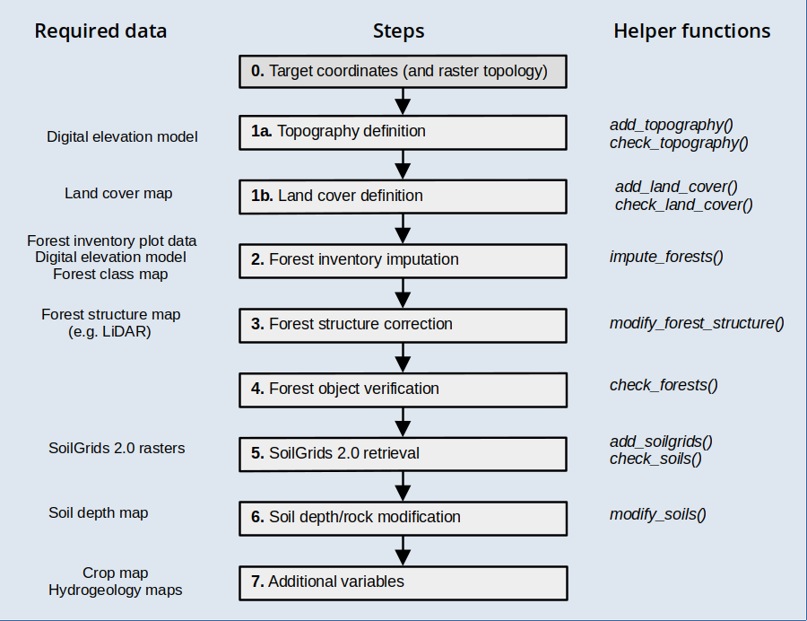

```{r setup, include=FALSE}
knitr::opts_chunk$set(echo = TRUE)
```

## Aim

This vignette has been created to illustrate the creation of spatial inputs to be used in model simulations with the package, starting **from a set of coordinates** corresponding to **arbitrary locations**. The functions introduced in this document are meant to be executed sequentially to progressively add spatial information, as illustrated in the workflow below, but users are free to use them in the most convenient way.

```{r, out.width='90%', fig.align="center", echo=FALSE, fig.alt = "Initialisation workflow for continuous landscapes"}

```


Before reading this vignette, users should be familiar with *forest* and *soil* structures in package **medfate**. Moreover, a brief introduction to spatial structures used in **medfateland** package is given in  vignette [Package overview](https://emf-creaf.github.io/medfateland/articles/intro/PackageOverview.html) and examples are given in vignettes [Spatially-uncoupled simulations](https://emf-creaf.github.io/medfateland/articles/runmodels/SpatiallyUncoupledSimulations.html) and [Watershed simulations](https://emf-creaf.github.io/medfateland/articles/runmodels/WatershedSimulations.html). 

Let's first load necessary libraries:

```{r, echo = TRUE, message= FALSE}
library(medfate)
library(medfateland)
library(ggplot2)
library(tidyterra)
```

## Target area

Any spatial data set should begin with the definition of spatial elements. Here we will use a watershed in Catalonia as example, which we will describe using cells of 200 m in EPSG:32631 (UTM for fuse 31) projection.

First we load a polygon data set describing watersheds in Spain and select our target watershed (Riera de Bianya [river code "2005528"]):
```{r}
dataset_path <- "~/OneDrive/EMF_datasets/"
scchh <- terra::vect(paste0(dataset_path, "Hydrography/Sources/Spain/CuencasMedNorte_Pfafs/M_cuencas_rios_Med_Norte.shp"))
watershed <-terra::project(scchh[scchh$pfafrio =="2005528",], "epsg:25831")
watershed
```

We can draw a map with the location of the watershed within Catalonia using:

```{r, fig.width=5, fig.height=5, fig.align="center", fig.alt="Location of the watershed within Catalonia"}
dataset_path <- "~/OneDrive/EMF_datasets/"
counties <- terra::vect(paste0(dataset_path, "PoliticalBoundaries/Sources/Catalunya/Comarques/comarques.shp"))
ggplot()+
  geom_spatvector(data = counties)+
  geom_spatvector(fill = "black", data = watershed)+
  theme_bw()
```


```{r, include = FALSE}
rm(scchh)
rm(counties)
gc()
```

Now we define a raster at 200 m resolution, including the target area. We intersect it with the watershed boundaries to keep the target locations:

```{r, warning = FALSE}
res <- 200
r <-terra::rast(terra::ext(watershed), resolution = c(res,res), crs = "epsg:25831")
v <- terra::intersect(terra::as.points(r), watershed)
```

And finally we transform the result into a `sf` object:
```{r}
x <- sf::st_as_sf(v)[,"geometry", drop = FALSE]
x
```

We will use the raster definition for plots.

```{r}
rm(v)
gc()
```

## Topography and land cover type

**Topography**

Once an object `sf` has been defined with target locations, we need to determine topographic features (elevation, slope, aspect) and land cover corresponding to those locations. You should have access to a Digital Elevation Model (DEM) at a desired resolution. Here we will use a DEM raster for Catalonia at 30 m resolution, which we load using package `terra`:

```{r}

dem <- terra::rast(paste0(dataset_path,"Topography/Products/Catalunya/MET30m_ETRS89_UTM31_ICGC.tif"))
dem
```


Having a digital elevation model, we can use function `add_topography()` to extract elevation and calculate aspect and slope:

```{r}
y_0 <- add_topography(x, dem = dem)
y_0
```

We can check that there are no missing values in topographic features using:

```{r}
check_topography(y_0)
```


We can now examine the elevation of the area, using the raster `r` to draw cells instead of points:

```{r, echo = FALSE, fig.width=6, fig.height=4.5, fig.alt = "Elevation map"}
plot_variable(y_0, "elevation", r = r)+
  scale_fill_distiller("m", palette="Spectral", na.value = NA)+
  theme_bw()
```

**Land cover type**

In addition to topography, users should have access to a land cover map, in this case we will use a land cover raster for Catalonia, issued in 2018:

```{r}
lcm <- terra::rast(paste0(dataset_path,"LandCover/Sources/Catalunya/cobertes-sol-v1r0-2018.tif"))
lcm
```

Users should examine the legend of their land cover map and decide how to map legend elements to the five land cover types used in **medfateland**. After inspecting our land cover map legend, we define the following vectors to perform the legend mapping:

```{r}
agriculture <- 1:6
wildland <- c(7:17,20)
rock <- 18:19
artificial <- 21:35
water <- 36:41
```

Having these inputs, we can use `add_land_cover()` to add land cover to our starting `sf`:
```{r}
y_1 <- add_land_cover(y_0, 
                      land_cover_map = lcm, 
                      wildland = wildland, 
                      agriculture = agriculture, 
                      rock = rock, 
                      artificial = artificial, 
                      water = water, progress = FALSE)
y_1
```

As before, we can check for missing data:
```{r}
check_land_cover(y_1)
```


```{r, echo = FALSE, include = FALSE}
rm(lcm)
gc()
```


We can examine the land cover types in our target area using:

```{r, echo = FALSE, fig.width=6, fig.height=4.5, fig.alt = "Land cover map"}
plot_variable(y_1, "land_cover_type", r = r, name = "")
```
```{r, include = FALSE}
rm(agriculture)
rm(artificial)
rm(rock)
rm(water)
rm(wildland)
```


## Forest parameterization

The next step is to define `forest` objects for our simulations. Forests should be defined for all target locations whose land cover is defined as `wildland`. When forest inventory plots are not be available for the target locations, one must resort on imputations. 

  1. Forest inventory data from nearby locations. National forest inventories are ideal in this respect.
  2. A forest map where polygons or raster cells describe the distribution of forest (or shrubland) types. 
  3. Raster source of vegetation structure (i.e. mean tree height or basal area), derived from aerial or satellite LiDAR missions.

Our task here will be to perform imputations of forest inventory plots to our target locations according to some criteria and, if possible, to correct the forest structure on those locations according to available data.

### Forest imputation

A map of forest types in the target area is important to determine dominant tree or shrub species. We start by loading the [Spanish Forest Map (1:25000)](https://www.miteco.gob.es/en/biodiversidad/temas/inventarios-nacionales/mapa-forestal-espana/mfe_25.html) for the region of Catalonia, which is in vector format, using package `terra`:
```{r}
forest_map <- terra::vect(paste0(dataset_path,"ForestMaps/Products/Catalunya/mfe25_cat_class.shp"))
forest_map
```

Second, we need forest inventory data for imputations. Arguably, this is the hardest part. Let's assume one has access to a such data already in format for package *medfateland* (how to build such data set will be illustrated in a different vignette). We also load an `sf_nfi` object that contains coordinates and forest objects corresponding to the [Fourth Spanish Forest Inventory](https://www.miteco.gob.es/es/biodiversidad/temas/inventarios-nacionales/inventario-forestal-nacional/cuarto_inventario.html) for Catalonia (5509 forest plots):
```{r}
nfi_path <- "/home/miquel/OneDrive/mcaceres_work/model_initialisation/medfate_initialisation/IFN2medfate/"
sf_nfi <- readRDS(paste0(nfi_path, "data/SpParamsMED/IFN4/Catalunya/IFN4_cat_final_ETRS89H31.rds"))
sf_nfi
```
Note that this is already an `sf` object suitable for simulations, but refers to the locations of the forest inventory plots, not to our target area.

Having these two inputs (forest map and forest inventory data), we can use function `impute_forests()` to perform the imputation for us (this normally takes some time):

```{r}
y_2 <- impute_forests(y_1, sf_fi = sf_nfi, dem = dem, 
                      forest_map = forest_map, progress = FALSE)
```

For each target location, the function selects forest inventory plots that correspond to the same forest class, defined in the forest map, and are geographically closer than a pre-specified maximum distance. Among the multiple plots that can fulfill this criterion, the function chooses the plot that has the most similar elevation and position in the N-to-S slopes (i.e. the product of the cosine of aspect and slope). More details can be found in the documentation of `impute_forests()`. 

The resulting `sf` has an extra column named `forest`:

```{r}
y_2
```

Only `wildland` locations will have a `forest` object, for example:

```{r}
y_2$forest[[1]]
```
It is important to know whether the forest inputs are complete and suitable for simulations. This can be done using function `check_forests()`:

```{r}
check_forests(y_2)
```

There are some *wildland* locations missing forest data. These correspond to shrublands or pastures, therefore not included in the forest inventory data. At this point, we could call again `impute_forests()` including the option `missing_class_imputation = TRUE`, which would force imputation of forest inventory plots on non-forest cells. The alternative is to provide more suitable data.

```{r, include = FALSE}
rm(sf_nfi)
rm(forest_map)
rm(nfi_path)
gc()
```


### Shrubland imputation

In this section we illustrate how to use function `impute_forest()` to impute `forest` objects in shrubland areas. To this aim, we use a vegetation map representing habitats of interest for the EU: [*Hàbitats d'interès comunitari*](https://agricultura.gencat.cat/ca/serveis/cartografia-sig/bases-cartografiques/habitats/habitats-catalunya/):

```{r}
veg_map <- terra::vect(paste0(dataset_path,"ForestMaps/Sources/Catalunya/Habitats_v2/Habitats_interes_com.shp"))
veg_map
```
In this case we use a database of 575 shrubland inventory plots in Catalonia described in [Casals et al. (2023)](https://doi.org/10.1186/s13595-023-01190-y):

```{r}
sfi_path <- "/home/miquel/OneDrive/mcaceres_work/model_initialisation/medfate_initialisation/Shrublands/Combuscat/"
sf_sfi <- readRDS(paste0(sfi_path, "Products/Combuscat_final.rds"))
sf_sfi
```

We now call again `impute_forests()` with this information. Unless we force it, the function will not overwrite those `forest` objects already present in `y_2`. On the other hand, we will assume that any wildland location not classified as forest or shrubland should correspond to pastures. Hence, in this case we will ask the function to make imputations in locations with missing vegetation class (`missing_class_imputation = TRUE`) and define a empty forest to be imputed in those (`missing_class_forest = emptyforest()`):

```{r}
y_3 <- impute_forests(y_2, sf_fi = sf_sfi, dem = dem, 
                      forest_map = veg_map, 
                      var_class = "TEXT_HIC1",
                      missing_class_imputation = TRUE,
                      missing_class_forest = emptyforest(),
                      progress = FALSE)
```

We call again function `check_forests()` to verify that there are no wildland cells without a `forest` object defined:

```{r}
check_forests(y_3)
```

```{r, include=FALSE}
rm(veg_map)
rm(sf_sfi)
rm(dem)
gc()
```


### Structure correction

The forests resulting from imputation are formally fine for simulations, but the forest structure in the target locations can be very different than that of the forest inventory used as reference, even if the forest  types are the same. Therefore, it is advisable to correct the forest structure with available information.

There are several global products made recently available, that combine satellite LiDAR observations with other information, such as [Simard et al. (2011)](https://doi.org/10.1029/2011JG001708), [Potapov et al. (2021)](https://doi.org/10.1016/j.rse.2020.112165) or [Lang et al. (2023)](https://doi.org/10.1038/s41559-023-02206-6). Alternatively, airborne LiDAR products are available for some countries and regions. Here we will use [biophysical structural maps](https://www.icgc.cat/ca/Geoinformacio-i-mapes/Mapes/Mapes-de-variables-biofisiques-de-larbrat-de-Catalunya) derived from LiDAR flights in Catalonia (years 2016-2017). First we will load a mean tree height raster at 20-m resolution:

```{r}
height_map <- terra::rast(paste0(dataset_path, "RemoteSensing/Sources/Catalunya/Lidar/VariablesBiofisiques/RastersComplets/2016-2017/variables-biofisiques-arbrat-v1r0-hmitjana-2016-2017.tif"))
height_map
```

This resolution is a bit finer than the size of forest inventory plots. Hence, we aggregate the raster to the 40m resolution, while we crop to the target area:

```{r}
height_map_40 <- terra::aggregate(terra::crop(height_map, r), 
                                  fact = 2, fun = "mean", na.rm = TRUE)
height_map_40
```

```{r, include = FALSE}
rm(height_map)
gc()
```

Mean tree height data has the following distribution:
```{r, fig.width=6, fig.height=4, fig.alt="Tree height map derived from LiDAR"}
names(height_map_40)<- "height"
ggplot()+
  geom_spatraster(aes(fill=height), data=height_map_40)+
  geom_spatvector(fill = NA, col = "black", linewidth = 0.5, data = watershed)+
  scale_fill_continuous("m", type = "viridis", na.value = NA)+
  theme_bw()
```

We now call function `modify_forest_structure()` to correct mean tree height according to the LiDAR data (Note the correction of units: tree heights are in cm in **medfate**):

```{r}
height_map_40_cm <- height_map_40*100
y_4 <- modify_forest_structure(y_3, height_map_40_cm, var = "mean_tree_height",
                               progress = FALSE)
```

Correction of tree heights also affects tree diameters, because the function assumes that the diameter-height relationship needs to be preserved. If we inspect the same `forest` object again, we will be able to note changes in height and diameter values:

```{r}
y_4$forest[[1]]
```

Additionally, one may have access to other maps of structural variables. In our case, we will use a raster of basal area, also derived from LiDAR flights:

```{r}
basal_area_map <- terra::rast(paste0(dataset_path, "RemoteSensing/Sources/Catalunya/Lidar/VariablesBiofisiques/RastersComplets/2016-2017/variables-biofisiques-arbrat-v1r0-ab-2016-2017.tif"))
basal_area_map
```

We perform the same aggregation done for heights:

```{r}
basal_area_map_40 <- terra::aggregate(terra::crop(basal_area_map, r), 
                                      fact = 2, fun = "mean", na.rm = TRUE)
basal_area_map_40
```


```{r, include = FALSE}
rm(basal_area_map)
gc()
```

Basal area geographic distribution looks as follows:

```{r, fig.width=6, fig.height=4, fig.alt = "Basal area map derived from LiDAR"}
names(basal_area_map_40)<- "basal_area"
ggplot()+
  geom_spatraster(aes(fill=basal_area), data=basal_area_map_40)+
  geom_spatvector(fill = NA, col = "black", linewidth = 0.5, data = watershed)+
  scale_fill_continuous("m2/ha", type = "viridis", na.value = NA, limits = c(0,70))+
  theme_bw()
```

We now use the same function to correct basal area values (no unit conversion is needed in this case): 

```{r}
y_5 <- modify_forest_structure(y_4, basal_area_map_40, var = "basal_area",
                               progress = FALSE)
```

Note that basal area (or tree density) corrections should be done after the height correction, because of the effect that height correction has on tree diameters. The correction of basal area operates on tree density values. As before, we can inspect changes in tree density:

```{r}
y_5$forest[[1]]
```


To finish this section, we will show the effect of imputation and correction on structural variables, compared with the LiDAR data. 

```{r, echo = TRUE, fig.width=8, fig.height=12, warning = FALSE, message = TRUE, fig.alt="Effect of imputation, height correction and basal area correction on basal area over the study area"}
p1 <- plot_variable(y_3, "basal_area", r = r)+
  geom_spatvector(fill = NA, col = "black", linewidth = 0.5, data = watershed)+
  scale_fill_continuous("m2/ha", limits = c(0,70), type = "viridis", na.value = NA)+
  labs(title = "a) Imputation")+theme_bw()
p2 <- plot_variable(y_4, "basal_area", r = r)+
  geom_spatvector(fill = NA, col = "black", linewidth = 0.5, data = watershed)+
  scale_fill_continuous("m2/ha", limits = c(0,70), type = "viridis", na.value = NA)+
  labs(title = "b) Imputation + H correction")+theme_bw()
p3 <- plot_variable(y_5, "basal_area", r = r)+
  geom_spatvector(fill = NA, col = "black", linewidth = 0.5, data = watershed)+
  scale_fill_continuous("m2/ha", limits = c(0,70), type = "viridis", na.value = NA)+
  labs(title = "c) Imputation + H/BA correction")+theme_bw()
x_vect <- terra::vect(sf::st_transform(sf::st_geometry(x), terra::crs(basal_area_map_40)))
x_vect$basal_area <- terra::extract(basal_area_map_40, x_vect)$basal_area
r_ba<-terra::rasterize(x_vect, r, field = "basal_area")
p4 <- ggplot()+
  geom_spatraster(aes(fill=last), data=r_ba)+
  geom_spatvector(fill = NA, col = "black", linewidth = 0.5, data = watershed)+
  scale_fill_continuous("m2/ha", limits = c(0,70), type = "viridis", na.value = NA)+
  labs(title = "d) Basal area from LiDAR")+
  theme_bw()
cowplot::plot_grid(p1, p2, p3, p4, nrow = 4, ncol = 1)
```

where it is apparent that both the height correction and the basal area correction have an effect in basal area. Correcting only for height is not satisfactory in terms of basal area, because of the modification of diameters (without correcting density). Note that the map after the two corrections differs from the LiDAR basal area in locations that have not been corrected because of missing LiDAR values (or missing tree data). We can quantitatively assess the relationship between predicted basal area and the observed one using:

```{r}
ba_5 <- extract_variables(y_5, "basal_area")$basal_area
cor.test(ba_5, x_vect$basal_area)
```

We can also see the effect of the imputation and correction on mean tree height:

```{r, echo = TRUE, fig.width=8, fig.height=12, warning = FALSE, message = TRUE, fig.alt = "Effect of imputation, mean tree height correction and basal area correction on mean tree height"}
p1 <- plot_variable(y_3, "mean_tree_height", r = r)+
  scale_fill_continuous("cm", limits = c(0,2600), type = "viridis", na.value = NA)+
  geom_spatvector(fill = NA, col = "black", linewidth = 0.5, data = watershed)+
  labs(title = "a) Imputation")+
  theme_bw()
p2 <- plot_variable(y_4, "mean_tree_height", r = r)+
  scale_fill_continuous("cm", limits = c(0,2600), type = "viridis", na.value = NA)+
  geom_spatvector(fill = NA, col = "black", linewidth = 0.5, data = watershed)+
  labs(title = "b) Imputation + H mean_tree_height")+
  theme_bw()
p3 <- plot_variable(y_5, "mean_tree_height", r = r)+
  scale_fill_continuous("cm", limits = c(0,2600), type = "viridis", na.value = NA)+
  geom_spatvector(fill = NA, col = "black", linewidth = 0.5, data = watershed)+
  labs(title = "c) Imputation + H/BA correction")+
  theme_bw()

x_vect <- terra::vect(sf::st_transform(sf::st_geometry(x), terra::crs(height_map_40_cm)))
x_vect$height <- terra::extract(height_map_40_cm, x_vect)$height
r_ba<-terra::rasterize(x_vect, r, field = "height")
p4 <- ggplot()+
  geom_spatraster(aes(fill=last), data=r_ba)+
  geom_spatvector(fill = NA, col = "black", linewidth = 0.5, data = watershed)+
  scale_fill_continuous("cm", limits = c(0,2600), type = "viridis", na.value = NA)+
  labs(title = "d) Mean tree height from LiDAR")+
  theme_bw()
cowplot::plot_grid(p1, p2, p3, p4, nrow = 4, ncol = 1)
```

Here the basal area correction did not have any effect on mean tree height. The relationship between estimated and predicted mean tree height is:

```{r}
mth_5 <- extract_variables(y_5, "mean_tree_height")$mean_tree_height
cor.test(mth_5, x_vect$height)
```

Finally, we check again that forests are well-defined, using function `check_forests()`:

```{r}
check_forests(y_5)
```

```{r, include = FALSE}
rm(basal_area_map_40)
rm(height_map_40)
rm(height_map_40_cm)
rm(mth_5)
rm(ba_5)
rm(r_ba)
gc()
```

## Soil parameterization

Soil information is most usually lacking for the target locations. Regional maps of soil properties may be available in some cases. Here we assume this information is not available, so that we resort to global products. In particular, we will use information provided in [SoilGrids](https://soilgrids.org/) at 250 m resolution ([Hengl et al. (2017)](https://doi.org/10.1371/journal.pone.0169748); [Poggio et al. (2021)](https://doi.org/10.5194/soil-7-217-2021)). 

### SoilGrids 2.0 data

Function `add_soilgrids()` can perform queries using the REST API of SoilGrids, but this becomes problematic for multiple sites. Hence, we recommend downloading SoilGrid rasters for the target region and storing them in a particular format, so that function `add_soilgrids()` can read them (check the details of the function documentation). The extraction of SoilGrids data for our target cells is rather fast using this approach: 

```{r}
soilgrids_path = paste0(dataset_path,"Soils/Sources/Global/SoilGrids/Spain/")
y_6 <- add_soilgrids(y_5, soilgrids_path = soilgrids_path, progress = FALSE)
```

And the result has an extra column `soil`:
```{r}
y_6
```

The elements of the list are the usual data frames of soil properties in **medfate**:
```{r}
y_6$soil[[1]]
```

During data retrieval, there might be some locations where SoilGrids 2.0 data was missing. We can use function `check_soils()` to detect those cases and fill them with default values:

```{r}
y_7 <- check_soils(y_6, missing_action = "default")
```


### Soil depth and rock content modification

SoilGrids 2.0 does not provide information on soil depth, and rock fragment content is normally underestimated, which leads to an overestimation of water holding capacity. Function `modify_soils()` allows modifying soil definitions, if information is available for soil depth, depth to the (unaltered) bedrock, or both. Soil depth maps are not common in many regions, so here we will resort on a global product at 250m-resolution by  [Shangguan et al. (2017)](https://doi.org/10.1002/2016MS000686), which consists on three rasters:

```{r}
# Censored soil depth (cm)
bdricm <- terra::rast(paste0(dataset_path, "Soils/Sources/Global/SoilDepth_Shangguan2017/BDRICM_M_250m_ll.tif"))
# Probability of bedrock within first 2m [0-100]
bdrlog <- terra::rast(paste0(dataset_path, "Soils/Sources/Global/SoilDepth_Shangguan2017/BDRLOG_M_250m_ll.tif"))
# Absolute depth to bedrock (cm)
bdticm <- terra::rast(paste0(dataset_path, "Soils/Sources/Global/SoilDepth_Shangguan2017/BDTICM_M_250m_ll.tif"))
```

In order to accelerate raster manipulations, we crop the global rasters to the extent of the target area:

```{r}
x_vect <- terra::vect(sf::st_transform(sf::st_geometry(x), terra::crs(bdricm)))
x_ext <- terra::ext(x_vect)
bdricm <- terra::crop(bdricm, x_ext, snap = "out")
bdrlog <- terra::crop(bdrlog, x_ext, snap = "out")
bdticm <- terra::crop(bdticm, x_ext, snap = "out")
```


Censored soil depth is a poor product of actual soil depth, but we have observed a fairly good correlation between soil depth values in Catalonia and the probability of finding the bedrock within the first two meters. Hence, we multiply the two layers and use it as a (crude) estimate of soil depth, expressing it in mm:

```{r}
soil_depth_mm <- (bdricm$BDRICM_M_250m_ll*10)*(1 - (bdrlog$BDRLOG_M_250m_ll/100))
```

and we take the depth to bedrock as appropriate, but change its units to mm as well:

```{r}
depth_to_bedrock_mm <- bdticm*10
```

We can now call function `modify_soils()` with the two rasters to perform the correction of soil characteristics:

```{r}
y_8 <- modify_soils(y_7, 
                    soil_depth_map = soil_depth_mm, 
                    depth_to_bedrock_map = depth_to_bedrock_mm,
                    progress = FALSE)
```

In this case, the depth to bedrock values were deeper than 2m, so that only the soil depth map had an effect on the correction procedure. After the correction, the rock fragment content of the soil has changed substantially:

```{r}
y_8$soil[[1]]
```

We can compare the effect of the correction on the soil water capacity (in mm) by inspecting the following plots (note the change in magnitude and spatial pattern):


```{r, echo = TRUE, warning = FALSE, message = FALSE, fig.width=7, fig.height=8, fig.alt = "Extractable soil water volume before and after correcting SoilGrids data"}
p1 <- plot_variable(y_7, "soil_vol_extract", r = r)+ 
  geom_spatvector(fill = NA, col = "black", linewidth = 0.5, data = watershed)+
  scale_fill_distiller("mm", type = "seq", palette = "YlGnBu", direction = 1, na.value = NA)+
  labs(title="SoilGrids alone")+
  theme_bw()
p2 <- plot_variable(y_8, "soil_vol_extract", r = r)+ 
  geom_spatvector(fill = NA, col = "black", linewidth = 0.5, data = watershed)+
  scale_fill_distiller("mm", type = "seq", palette = "YlGnBu", direction = 1, na.value = NA)+
  labs(title="SoilGrids + depth correction")+
  theme_bw()
cowplot::plot_grid(p1, p2, ncol =1, nrow=2)
```


Finally, we can call again `check_soils()` to verify that everything is fine:

```{r}
check_soils(y_8)
```

```{r, include = FALSE}
rm(bdricm)
rm(bdrlog)
rm(bdticm)
gc()
```


## Additional variables

In this section we illustrate the estimation of additional variables that are needed in some occasions, particularly in watershed-level simulations. At present, there are no specific functions in **medfateland** for these variables. 

### Crop factors for agricultural areas

If there are target locations whose land cover type is *agriculture* we should supply a column called `crop_factor` in our `sf` input object, so that soil water balance can be conducted in agriculture locations. Crop maps for Europe can be found, for example in [d'Andrimont et al. (2021)](https://doi.org/10.1016/j.rse.2021.112708). In our case we will use regional data from the Catalan administration ([Mapa de cultius](https://agricultura.gencat.cat/ca/ambits/desenvolupament-rural/sigpac/mapa-cultius/index.html) from 2018). We start by reading the crop map and subsetting it to the target area: 

```{r}
file_crop_map <- paste0(dataset_path,"Agriculture/Sources/Catalunya/Cultius_DUN2018/Cultius_DUN2018.shp")
crop_map <- sf::st_read(file_crop_map, options = "ENCODING=UTF-8")
crop_map <- terra::crop(terra::vect(crop_map[,"Cultiu"]), r)
```

```{r, include = FALSE}
gc()
```

Crops in the target watershed, occupy valley bottoms as expected:

```{r, fig.width=6, fig.height=4, fig.alt="Crop distribution in the study area"}
ggplot()+
  geom_spatvector(aes(fill=Cultiu), data=crop_map)+
  geom_spatvector(fill = NA, col = "black", linewidth = 0.5, data = watershed)+
  theme_bw()+theme(legend.position = "none")
```

To obtain our crop factors, we first extract the crop name corresponding to *agriculture* locations:
```{r}
sel_agr <- y_1$land_cover_type=="agriculture"
x_agr <- sf::st_transform(sf::st_geometry(x)[sel_agr], terra::crs(crop_map))
x_agr_crop <- terra::extract(crop_map, 
                             terra::vect(x_agr))
```

Some cells may have missing values, specially if the land cover map and the crop map are not consistent:
```{r}
df_agr_crop <- as.data.frame(x_agr_crop)
table(is.na(df_agr_crop$Cultiu))
```

For simplicity we will assume the missing values correspond to Ray-grass, the most common crop in the area:
```{r}
df_agr_crop$Cultiu[is.na(df_agr_crop$Cultiu)] <- "RAY-GRASS"
```

In order to transform crop names into crop factors, we need a look-up table, which we prepared for Catalonia
```{r}
crop_lookup_table <- readxl::read_xlsx(paste0(dataset_path, "Agriculture/Sources/Catalunya/Kc_CAT_MOD.xlsx"))
head(crop_lookup_table)
```

We join the two tables by the crop name column and get the crop factor (column `Kc`):
```{r}
df_agr_crop <- df_agr_crop |>
  left_join(crop_lookup_table, by=c("Cultiu"="Cultiu_map"))
y_8$crop_factor <- NA
y_8$crop_factor[sel_agr] <- df_agr_crop$Kc
summary(y_8$crop_factor[sel_agr])
```

```{r, include = FALSE}
rm(sel_agr)
rm(file_crop_map)
rm(crop_map)
rm(df_agr_crop)
rm(crop_table)
rm(x_agr)
rm(x_agr_crop)
gc()
```

### Hydrogeology

Watershed simulations with `watershed_model = "tetis"` require defining spatial variables necessary for the simulation of groundwater flows and aquifer dynamics: 

 + *Depth to bedrock* [`depth_to_bedrock`] - Depth to unweathered bedrock, in mm.
 + *Bedrock hydraulic conductivity* [`bedrock_conductivity`] - Hydraulic conductivity of the bedrock, in m·day-1.
 + *Bedrock porosity* [`bedrock_porosity`] - Bedrock porosity (as proportion of volume).

As estimate of depth to bedrock, one can use the same variable from [Shangguan et al. (2017)](https://doi.org/10.1002/2016MS000686), that we already transformed to mm:

```{r}
x_vect <- terra::vect(sf::st_transform(sf::st_geometry(y_8), 
                                       terra::crs(depth_to_bedrock_mm)))
y_8$depth_to_bedrock <-terra::extract(depth_to_bedrock_mm, x_vect)[,2, drop = TRUE]
```

which we can plot using:

```{r, echo = FALSE, fig.width=6, fig.height=4.5, fig.alt="Depth to bedrock from GLHYMPS 2.0"}
plot_variable(y_8, "depth_to_bedrock", r = r)
```

If regional maps are not available to inform about permeability and conductivity, we suggest using the GLobal HYdrogeology MaPS, GLHYMPS 2.0 ([Huscroft et al. 2021](https://doi.org/10.1002/2017GL075860)):

```{r}
glhymps_map <- terra::vect(paste0(dataset_path,"Soils/Sources/Global/GLHYMPS2/GLHYMPS_Spain.shp"))
glhymps_map
```

We first extract the GLHYMPS 2.0 data on the target locations:

```{r}
x_vect <- terra::vect(sf::st_transform(sf::st_geometry(y_8), 
                                       terra::crs(glhymps_map)))
x_glhymps <- terra::extract(glhymps_map, x_vect)
head(x_glhymps)
```

```{r, include = FALSE}
rm(glhymps_map)
gc()
```

For porosity we simply divide the GLHYMPS 2.0 value by 100 to find the proportion:

```{r}
y_8$bedrock_porosity <- x_glhymps[,"Porosity_x", drop = TRUE]/100
```

Its geographic distribution is quite simple:

```{r, fig.width=6, fig.height=4.5, fig.alt="Bedrock porosity from GLHYMPS 2.0"}
plot_variable(y_8, "bedrock_porosity", r = r)
```

GLHYMPS 2.0 provides permeability in the log scale, and the following operations are needed to obtain hydraulic conductivity in m/day:

```{r}
# Permeability m2
k <- 10^(x_glhymps[,"logK_Ferr_", drop = TRUE]/100)
# Water density kg·m-3
rho <- 999.97 
# Gravity m·s-2
g <- 9.8
# Viscosity of water
mu <- 1e-3
# Conductivity m/s
K <- k*rho*g/mu
# Daily conductivity m/day
K_day <- K*3600*24
```

Finally, we assign the conductivity values to the `sf` object:

```{r}
y_8$bedrock_conductivity <- K_day
```

Its geographic distribution is very simple, again:

```{r, fig.width=6, fig.height=4.5, fig.alt ="Bedrock conductivity from GLHYMPS 2.0"}
plot_variable(y_8, "bedrock_conductivity", r = r)
```

```{r, include = FALSE}
rm(x_glhymps)
gc()
```

### River network

For large watersheds it is advisable to specify a river channel network, so that the model can include channel water routing explicitly. This is done by adding a logical column `channel` indicating cells that are part of the channel network. We start by loading the river network from Catalonia (source: *Agència Catalana de l'Aigua*):

```{r}
rivers <-terra::vect(paste0(dataset_path, "Hydrography/Sources/Catalunya/Rius/Rius_CARACT.shp"))
```

Then, we rasterize it using the target area raster definition. We use the `is.na()` function to distinguish river from other cells, independently of the river order:
```{r}
rivers_rast <- !is.na(terra::rasterize(rivers, r, field = "OBJECTID"))
```

Once we have this raster, we perform the extraction to fill column `channel`:

```{r}
y_8$channel <- terra::extract(rivers_rast, y_8, ID = FALSE)$OBJECTID
```

Similarly to other variables, the river network can be visualized using:

```{r, fig.width=6, fig.height=4.5, fig.alt ="River channel network"}
plot_variable(y_8, "channel", r = r)
```

```{r, include = FALSE}
rm(rivers)
rm(rivers_rast)
gc()
```

### Other variables

Simulation of management scenarios requires defining additional variables in the `sf` object, concerning the area represented by each location and the management unit to which it belongs. This is illustrated in vignette [Management scenarios](https://emf-creaf.github.io/medfateland/articles/runmodels/ManagementScenarios.html).


## Storing 

At the end of the process of building spatial inputs, we should store the result as an RDS file, to be loaded at the time of performing simulations, e.g.

```{r, eval = FALSE}
saveRDS(y_8, "bianya.rds")
```

Since the data set corresponds to a watershed, we should also store the raster:

```{r}
r$value <- TRUE
terra::writeRaster(r, "bianya_raster.tif", overwrite=TRUE)
```


## Initialization test

We can check whether the input data set is well formed by calling function  `initialize_landscape()`:

```{r}
z <- initialize_landscape(y_8, SpParamsMED, defaultControl(),
                          progress = FALSE)
```


